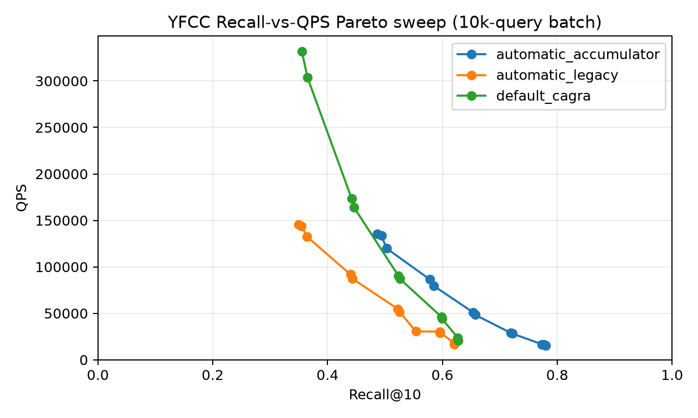

#+title: YFCC-10M SINGLE_CTA UDF Filtering Report

* Scope

This report contains only the GPU results produced by =benchmarks/favor/yfcc_udf=.  The predicate
is exact contains-all semantics: every query tag must occur in the candidate image's tag row.
Search never receives precomputed or exact selectivity; FAVOR samples the predicate on GPU.

* Correctness and sweep results

- Verdict: =target_not_reached=.
- Best default CAGRA (any max_iterations): recall 0.5415 at L=512, W=4, i=0.
- Best default CAGRA + passing-accumulator: recall 0.5415 at L=512, W=4, i=0.
- Best automatic legacy: recall 0.5389 at L=512, W=4, i=0.
- Best automatic accumulator: recall 0.6663 at L=512, W=4, i=0.
- All reported runs have zero filter violations and zero invalid-sentinel errors (the analyzer fails otherwise).

| Method | L | W | Max iterations | Recall@10 | QPS | Underfilled queries |
|-
| default_cagra | 512 | 4 | 0 | 0.5415 | 35393.0 | 0.550 |
| default_accumulator | 512 | 4 | 0 | 0.5415 | 34796.2 | 0.550 |
| automatic_legacy | 512 | 4 | 0 | 0.5389 | 19494.9 | 0.558 |
| automatic_accumulator | 512 | 4 | 0 | 0.6663 | 17334.0 | 0.361 |

[[file:benchmarks/favor/yfcc_udf/results/plots/b0_recall_qps.png]]

* Sampling

The systematic sample evaluates 10,000 base rows per query. Offset-zero samples had a 23.3% zero-hit/underresolved rate. Exact counts are used only here, after search, to measure estimator error; they are never loaded by cuVS.
Focused paired sampling-overhead sweep in `throughput_sampling.json` reports direct traversal vs end-to-end comparisons at matching (L, W, i) settings. Batch size was 10000.

The sample-hit distribution is min/median/p95/max = 0/
6/953/1878.
Post-hoc mean absolute selectivity error is
0.000569909, p95 absolute error is 0.0027312, and the median estimate/exact ratio
is 1.068.  Shifting the systematic schedule by 499 rows changes estimated
selectivity by 0.0008141 on average.

* Sampling overhead (traversal vs end-to-end)

Paired FAVOR runs from =throughput_sampling.json= compare the same (L, W, i) point with and without
selectivity sampling. Δ values report the end-to-end penalty relative to pure traversal.

| Method | L | W | I | Recall (traversal) | Recall (end-to-end) | QPS (traversal) | QPS (end-to-end) | Sampling ΔQPS % | Δms/query | Δms/10000 queries |
|-
| automatic_accumulator | 64 | 1 | 0 | 0.4862 | 0.4862 | 172969.0 | 131727.8 | 23.84 | 0.002 | 18.1 |
| automatic_accumulator | 64 | 2 | 0 | 0.4938 | 0.4938 | 174547.0 | 131902.2 | 24.43 | 0.002 | 18.5 |
| automatic_accumulator | 128 | 4 | 0 | 0.5845 | 0.5845 | 89704.6 | 78940.9 | 12.00 | 0.002 | 15.2 |
| automatic_accumulator | 256 | 2 | 0 | 0.6537 | 0.6537 | 54440.7 | 49855.1 | 8.42 | 0.002 | 16.9 |
| automatic_accumulator | 512 | 2 | 0 | 0.7179 | 0.7179 | 28446.0 | 27377.0 | 3.76 | 0.001 | 13.7 |
| automatic_accumulator | 512 | 2 | 522 | 0.7732 | 0.7732 | 16840.6 | 16411.1 | 2.55 | 0.002 | 15.5 |
| automatic_legacy | 64 | 1 | 0 | 0.3496 | 0.3496 | 190032.5 | 143217.7 | 24.64 | 0.002 | 17.2 |
| automatic_legacy | 64 | 2 | 0 | 0.3548 | 0.3548 | 188367.4 | 140726.1 | 25.29 | 0.002 | 18.0 |
| automatic_legacy | 128 | 4 | 0 | 0.4436 | 0.4436 | 100650.7 | 84904.0 | 15.64 | 0.002 | 18.4 |
| automatic_legacy | 256 | 2 | 0 | 0.5226 | 0.5225 | 58698.9 | 53043.3 | 9.63 | 0.002 | 18.2 |
| automatic_legacy | 512 | 2 | 0 | 0.5951 | 0.5951 | 30694.3 | 29607.6 | 3.54 | 0.001 | 12.0 |
| automatic_legacy | 512 | 2 | 522 | 0.6210 | 0.6210 | 18205.6 | 17615.1 | 3.24 | 0.002 | 18.4 |

| Method | Samples | Mean ΔQPS % | Median ΔQPS % | Mean Δms/query | Mean Δms/10000 queries |
|-
| automatic_accumulator | 6 | 12.50 | 10.21 | 0.002 | 16.3 |
| automatic_legacy | 6 | 13.67 | 12.64 | 0.002 | 17.0 |

* Diagnostics

| Variant | Recall | GT seen | Passing discoveries | Mean exact distance evaluations | Underfilled | Frontier exhaustion |
|-
| accumulator_b0 | 0.6645 | 0.6645 | 219.3 | 8404 | 0.363 | 0.197 |
| accumulator_i1044 | 0.7904 | 0.7904 | 329.0 | 26435 | 0.232 | 0.207 |
| accumulator_i2088 | 0.8496 | 0.8496 | 439.0 | 51119 | 0.175 | 0.213 |
| accumulator_i4176 | 0.8953 | 0.8953 | 593.1 | 97325 | 0.115 | 0.218 |
| accumulator_i522 | 0.7264 | 0.7264 | 259.1 | 14002 | 0.309 | 0.204 |
| accumulator_i7569 | 0.9285 | 0.9285 | 775.1 | 167009 | 0.077 | 0.231 |
| legacy_b0 | 0.5384 | 0.6645 | 219.3 | 8404 | 0.564 | 0.197 |
| legacy_i7569 | 0.6385 | 0.9287 | 775.0 | 167007 | 0.335 | 0.231 |

The B0 accumulator-minus-legacy mean distance-work delta is 0.000 and the GT-seen delta is 0.000000; output recall can differ because passing neighbors are no longer evicted by the mixed traversal queue.

At L=512, W=2, k=10 the accumulator adds 84 bytes of dynamic shared memory (5717 to 5801 bytes). Both kernels use 64 threads; measured CUDA occupancy is 62.5% legacy and 58.3% with the accumulator (15 versus 14 active CTAs/SM).

* Arity and selectivity deciles

Deciles are post-hoc workload labels and are not passed to search.

[[file:benchmarks/favor/yfcc_udf/results/plots/recall_by_arity_decile.png]]

The diagnostic companion records passing discoveries, GT-seen rate, underfill, frontier
exhaustion, and exact distance work for every arity/decile cell in
=arity_decile_diagnostic_summary.csv=.

[[file:benchmarks/favor/yfcc_udf/results/plots/distance_work_by_arity_decile.png]]

* Throughput

For the throughput sweep, all rows for FAVOR variants include end-to-end sampling.

| Method | Recall@10 | QPS | Batch latency (ms) |
|-
| automatic_accumulator | 0.4938 | 131440.4 | 76.081 |
| automatic_legacy | 0.3496 | 141730.4 | 70.559 |
| default_accumulator | 0.3554 | 328952.2 | 30.400 |
| default_cagra | 0.3554 | 328892.9 | 30.406 |

* Reproduction

The timed runs use one repetition after warmup on an NVIDIA L4.  JIT compilation, index loading,
and metadata upload are outside the timed search; the end-to-end FAVOR row includes sampling.

#+begin_src sh
benchmarks/favor/yfcc_udf/prepare_workloads.py --source /home/ubuntu/big-ann-benchmarks/data/yfcc100M --index /home/ubuntu/FAVOR/.artifacts/yfcc/yfcc10m.cagra_g32_ig64.index --delta-d /home/ubuntu/FAVOR/.artifacts/yfcc/yfcc10m.cagra_g32_ig64.index.delta_d --selection-json /home/ubuntu/FAVOR/.artifacts/yfcc/raw/automatic_retention_accumulator_L512_W2_accumulator.json --output datasets/yfcc-10M
benchmarks/favor/yfcc_udf/run_experiment.sh all
python benchmarks/favor/yfcc_udf/analyze.py --result-root benchmarks/favor/yfcc_udf/results --data-root datasets --selection-json /home/ubuntu/FAVOR/.artifacts/yfcc/raw/automatic_retention_accumulator_L512_W2_accumulator.json --report YFCC_SINGLE_CTA_UDF_REPORT.org
#+end_src
