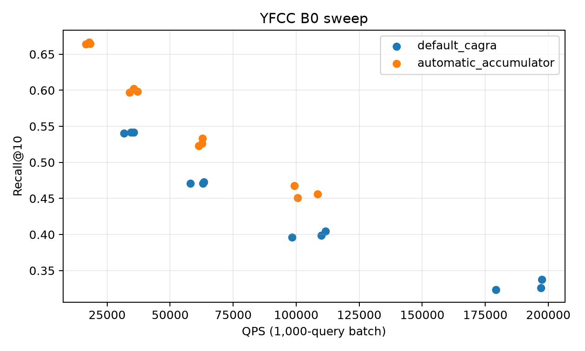
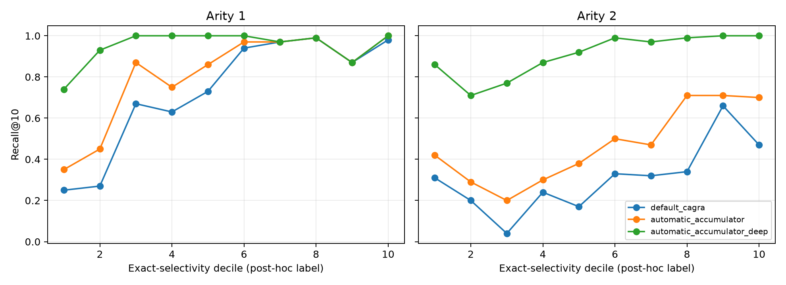
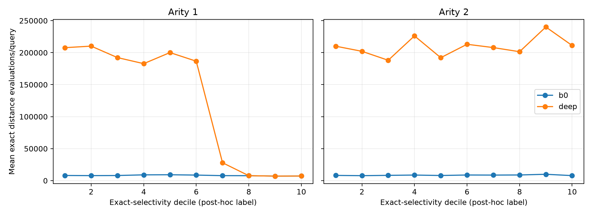

#+title: YFCC-10M SINGLE_CTA UDF Filtering Report

* Scope

This report contains only the GPU results produced by =benchmarks/favor/yfcc_udf=.  The predicate
is exact contains-all semantics: every query tag must occur in the candidate image's tag row.
Search never receives precomputed or exact selectivity; FAVOR samples the predicate on GPU.

* Correctness and B0 result

- Verdict: =budget_opportunity=.  B0 is insufficient, while preserved SINGLE_CTA traversal reaches
  recall 0.9286 at 7569 iterations.
- Best default CAGRA B0: recall 0.5415 at L=512, W=4.
- Best sampled automatic-retention B0: recall 0.6663 at L=512, W=4.
- All reported runs have zero filter violations and zero invalid-sentinel errors (the analyzer fails otherwise).

| Method | L | W | Max iterations | Recall@10 | QPS | Underfilled queries |
|-
| default_cagra | 512 | 4 | 0 | 0.5415 | 35479.5 | 0.550 |
| automatic_accumulator | 512 | 2 | 0 | 0.6645 | 18202.2 | 0.363 |
| automatic_legacy | 512 | 2 | 0 | 0.5384 | 20177.9 | 0.564 |
| automatic_accumulator | 512 | 2 | 522 | 0.7264 | 10659.3 | 0.309 |
| automatic_accumulator | 512 | 2 | 1044 | 0.7904 | 6099.3 | 0.232 |
| automatic_accumulator | 512 | 2 | 2088 | 0.8496 | 3551.1 | 0.175 |
| automatic_accumulator | 512 | 2 | 4176 | 0.8953 | 1983.8 | 0.114 |
| automatic_accumulator | 512 | 2 | 7569 | 0.9286 | 1200.4 | 0.077 |

* Sampling

The systematic sample evaluates 10,000 base rows per query.  Offset-zero samples had a
23.3% zero-hit/underresolved rate.  Exact counts are used only here, after search, to
measure estimator error; they are never loaded by cuVS.  The measured end-to-end minus
traversal-only cost is approximately 17.298 ms per 10,000-query batch.

The sample-hit distribution is min/median/p95/max = 0/
6/953/1878.
Post-hoc mean absolute selectivity error is
0.000569909, p95 absolute error is 0.0027312, and the median estimate/exact ratio
is 1.068.  Shifting the systematic schedule by 499 rows changes estimated
selectivity by 0.0008141 on average.

* Diagnostics

| Variant | Recall | GT seen | Passing discoveries | Mean exact distance evaluations | Underfilled | Frontier exhaustion |
|-
| accumulator_b0 | 0.6645 | 0.6645 | 219.3 | 8404 | 0.363 | 0.197 |
| accumulator_i1044 | 0.7904 | 0.7904 | 329.0 | 26435 | 0.232 | 0.207 |
| accumulator_i2088 | 0.8496 | 0.8496 | 439.0 | 51119 | 0.175 | 0.213 |
| accumulator_i4176 | 0.8953 | 0.8953 | 593.1 | 97325 | 0.115 | 0.218 |
| accumulator_i522 | 0.7264 | 0.7264 | 259.1 | 14002 | 0.309 | 0.204 |
| accumulator_i7569 | 0.9287 | 0.9287 | 775.3 | 167023 | 0.077 | 0.231 |
| legacy_b0 | 0.5384 | 0.6645 | 219.3 | 8404 | 0.564 | 0.197 |
| legacy_i7569 | 0.6385 | 0.9287 | 775.0 | 167008 | 0.334 | 0.231 |

The B0 accumulator-minus-legacy mean distance-work delta is 0.000 and the GT-seen delta is 0.000000; output recall can differ because passing neighbors are no longer evicted by the mixed traversal queue.

At L=512, W=2, k=10 the accumulator adds 84 bytes of dynamic shared memory (5717 to 5801 bytes). Both kernels use 64 threads; measured CUDA occupancy is 62.5% legacy and 58.3% with the accumulator (15 versus 14 active CTAs/SM).

* Arity and selectivity deciles

Deciles are post-hoc workload labels and are not passed to search.

The diagnostic companion records passing discoveries, GT-seen rate, underfill, frontier
exhaustion, and exact distance work for every arity/decile cell in
=arity_decile_diagnostic_summary.csv=.

* Throughput

Traversal-only QPS for sampled automatic retention is 29574.5; sampling-inclusive
QPS is 28135.1.  See =throughput_summary.csv= for default, legacy-output, shifted-
sample, and accumulator rows.

| Method | Recall@10 | QPS | Batch latency (ms) |
|-
| default_cagra | 0.5993 | 44690.5 | 223.766 |
| automatic_legacy | 0.5951 | 31913.9 | 313.349 |
| automatic_accumulator | 0.7179 | 29574.5 | 338.146 |
| automatic_accumulator_end_to_end | 0.7179 | 28135.1 | 355.435 |
| automatic_accumulator_shifted | 0.7179 | 29480.9 | 339.210 |

* Reproduction

The timed runs use one repetition after warmup on an NVIDIA L4.  JIT compilation, index loading,
and metadata upload are outside the timed search; the end-to-end FAVOR row includes sampling.

#+begin_src sh
benchmarks/favor/yfcc_udf/prepare_workloads.py --source /home/ubuntu/big-ann-benchmarks/data/yfcc100M --index /home/ubuntu/FAVOR/.artifacts/yfcc/yfcc10m.cagra_g32_ig64.index --delta-d /home/ubuntu/FAVOR/.artifacts/yfcc/yfcc10m.cagra_g32_ig64.index.delta_d --selection-json /home/ubuntu/FAVOR/.artifacts/yfcc/raw/automatic_retention_accumulator_L512_W2_accumulator.json --output datasets/yfcc-10M
benchmarks/favor/yfcc_udf/run_experiment.sh all
python benchmarks/favor/yfcc_udf/analyze.py --result-root benchmarks/favor/yfcc_udf/results --data-root datasets --selection-json /home/ubuntu/FAVOR/.artifacts/yfcc/raw/automatic_retention_accumulator_L512_W2_accumulator.json --report YFCC_SINGLE_CTA_UDF_REPORT.org
#+end_src
