#+TITLE: Automatic-Retention FAVOR for CAGRA
#+SUBTITLE: SINGLE_CTA and MULTI_CTA Performance Evaluation
#+AUTHOR: Nam Anh Dang
#+DATE: 2026-08-02
#+OPTIONS: toc:2 num:t

* Scope

This report compares default CAGRA, fixed-retention FAVOR with =lambda=1 and
=rho=0.5=, and automatic-retention FAVOR with =lambda=1 and =rho=auto= in both
=SINGLE_CTA= and =MULTI_CTA=.  It reports measured QPS--recall and latency--recall
curves for six dataset/scale combinations at 1%, 10%, 50%, and 90% passing
selectivity.  The document describes the methods and measurements only; it does not
make a deployment recommendation.

* Methods

** Default filtered CAGRA

Default CAGRA tests the bitset during traversal and invalidates a node that does not
pass.  A rejected node therefore cannot remain in the candidate set as a route to
other nodes.

** Shared FAVOR penalty

Both FAVOR variants keep rejected nodes available for traversal and add a penalty to
their raw distance.  The batch-level reference penalty is

#+begin_example
C(s,B) = (1 - s)(B - s) / (2sB)
D_reference = C(s,B) * delta_d
#+end_example

where =s= is passing selectivity, =B= is CAGRA's configured internal top-k size, and
=delta_d= is the graph-specific distance-spacing statistic loaded from the index
sidecar.  The query-local penalty is

#+begin_example
D_query = min(D_reference, lambda * g_q)
#+end_example

where =lambda= is 1 in this evaluation and =g_q= is the average gap across the
interquartile span of the CTA's sorted, finite initial candidate distances.  For a
rejected candidate with raw distance =d=, let =tau= be the worst finite distance
currently retained and =h=max(tau-d,0)= be its retention headroom.  Both variants use

#+begin_example
D_effective = min(D_query, rho * h)
score = d + D_effective
#+end_example

while passing candidates retain =score=d=.  Because =rho<1=, the penalty alone cannot
move a rejected candidate beyond the current retention boundary.

** Fixed retention

The fixed method uses =rho=0.5= for every query, selectivity, and traversal size.

** Automatic retention

The automatic method derives =rho= once on the host from expected passing capacity:

#+begin_example
E = sB
x = E / k
P_short = clamp(2(1 - x), 0, 1)
S(P_short) = P_short^2 * (3 - 2P_short)
rho = 0.5 + 0.4 * S(P_short)
#+end_example

Here =k= is the requested result count (10).  The rule gives =rho=0.5= when =E>=k=
and increases it smoothly toward 0.9 when expected passing capacity falls to =k/2= or
below.  =SINGLE_CTA= uses its internal top-k for =B=.  =MULTI_CTA= uses the
user-configured global =itopk=, matching its reference-penalty convention; the
selectivity-inflated number of physical CTA result slots does not redefine this policy.

** Control-region interpretation

Whenever =sB>=k=, automatic retention resolves exactly to =rho=0.5= and therefore
passes the same kernel policy parameter as fixed retention.  In the =MULTI_CTA= grid
this control region includes =itopk>=1024= at 1%, =itopk>=128= at 10%, and every
cell at 50% and 90%.  The configuration and plot label remain =rho=auto= because zero
is the host-side selector, even though the resolved kernel value is 0.5.

Batch-size-1 Google Benchmark rows may execute different iteration counts and query
samples.  Small fixed-versus-automatic differences in recall, QPS, latency, or apparent
Pareto crossover within this control region are sampling noise, not an automatic-policy
effect.  Those cells are equivalence controls and must not be used to claim a win or loss.

** GPU path

The filter check and penalty are fused into neighbor-distance computation, so each
candidate is written once.  The automatic rule changes only the scalar =rho= passed to
the existing retention-safe kernel.  It adds no candidate buffer and no per-candidate
calculation beyond the fixed-retention path.  A zero public retention fraction selects
the automatic host rule in either CTA mode; default CAGRA remains unchanged.

* SINGLE_CTA cutoff-indexing caveat

The archived =SINGLE_CTA= measurements preserve the implementation under test.  Its query-gap and
retention-cutoff helpers index the bitonic result buffer as though physical positions
were logical sorted ranks, but CAGRA's bitonic layout is swizzled.  In the hard
=SINGLE_CTA= =itopk=512= cells, physical tail slot 511 is logical rank 496 rather than
rank 511; the sampled quartile positions likewise correspond to logical ranks 124 and
372 rather than 127 and 383.  The resulting =D_query= and =tau= therefore differ from
the intended logical-rank formula.  Fixed and automatic curves remain a controlled
comparison because both use the same helper, but this report does not present either
curve as a corrected-cutoff result.  =MULTI_CTA= uses a linear sorted CTA-local
buffer and is not affected by this indexing caveat.

* SINGLE_CTA results

Throughput uses 10,000 queries per batch and latency uses 10 queries per batch.
Recall is Recall@10.  Target values at 0.90 use interpolation only when the measured
Pareto frontier brackets 0.90; otherwise the fastest measured feasible point is used.
=N/A= means the measured frontier did not reach the target.  No extrapolation is used.

** Maximum measured recall (throughput sweep)

| Dataset | Selectivity | Default | Fixed rho=0.5 | Automatic rho |
|---------+-------------+---------+---------------+---------------|
| SIFT-1M | 1% | 0.784 | 0.938 | 0.948 |
| SIFT-1M | 10% | 0.971 | 0.962 | 0.962 |
| SIFT-1M | 50% | 0.923 | 0.914 | 0.914 |
| SIFT-1M | 90% | 0.940 | 0.936 | 0.936 |
| GIST-1M | 1% | 0.762 | 0.804 | 0.827 |
| GIST-1M | 10% | 0.912 | 0.905 | 0.905 |
| GIST-1M | 50% | 0.950 | 0.948 | 0.948 |
| GIST-1M | 90% | 0.960 | 0.958 | 0.958 |
| BIGANN-1M | 1% | 0.772 | 0.826 | 0.922 |
| BIGANN-1M | 10% | 0.970 | 0.958 | 0.958 |
| BIGANN-1M | 50% | 0.927 | 0.916 | 0.916 |
| BIGANN-1M | 90% | 0.943 | 0.938 | 0.938 |
| BIGANN-10M | 1% | 0.786 | 0.863 | 0.919 |
| BIGANN-10M | 10% | 0.936 | 0.926 | 0.926 |
| BIGANN-10M | 50% | 0.939 | 0.933 | 0.933 |
| BIGANN-10M | 90% | 0.954 | 0.949 | 0.949 |
| MSTuring-1M | 1% | 0.703 | 0.660 | 0.692 |
| MSTuring-1M | 10% | 0.923 | 0.916 | 0.916 |
| MSTuring-1M | 50% | 0.930 | 0.928 | 0.928 |
| MSTuring-1M | 90% | 0.946 | 0.945 | 0.945 |
| MSTuring-10M | 1% | 0.676 | 0.634 | 0.662 |
| MSTuring-10M | 10% | 0.919 | 0.910 | 0.910 |
| MSTuring-10M | 50% | 0.931 | 0.930 | 0.930 |
| MSTuring-10M | 90% | 0.945 | 0.945 | 0.945 |

** Throughput at Recall@10 = 0.90 (QPS)

| Dataset | Selectivity | Default | Fixed rho=0.5 | Automatic rho |
|---------+-------------+---------+---------------+---------------|
| SIFT-1M | 1% | N/A | 112,883 | 116,245 |
| SIFT-1M | 10% | 498,582 | 482,481 | 517,017 |
| SIFT-1M | 50% | 1,107,547 | 1,077,846 | 1,077,707 |
| SIFT-1M | 90% | 1,249,974 | 1,207,791 | 1,197,802 |
| GIST-1M | 1% | N/A | N/A | N/A |
| GIST-1M | 10% | 32,132 | 31,529 | 31,451 |
| GIST-1M | 50% | 49,053 | 49,907 | 49,798 |
| GIST-1M | 90% | 57,100 | 58,151 | 57,935 |
| BIGANN-1M | 1% | N/A | N/A | 117,083 |
| BIGANN-1M | 10% | 816,962 | 790,456 | 790,646 |
| BIGANN-1M | 50% | 1,524,968 | 1,458,952 | 1,459,509 |
| BIGANN-1M | 90% | 1,736,913 | 1,635,115 | 1,635,682 |
| BIGANN-10M | 1% | N/A | N/A | 118,462 |
| BIGANN-10M | 10% | 551,683 | 546,505 | 546,414 |
| BIGANN-10M | 50% | 1,020,813 | 993,484 | 993,830 |
| BIGANN-10M | 90% | 1,159,382 | 1,102,104 | 1,102,516 |
| MSTuring-1M | 1% | N/A | N/A | N/A |
| MSTuring-1M | 10% | 100,204 | 94,511 | 94,399 |
| MSTuring-1M | 50% | 226,902 | 227,894 | 227,645 |
| MSTuring-1M | 90% | 280,800 | 279,614 | 279,310 |
| MSTuring-10M | 1% | N/A | N/A | N/A |
| MSTuring-10M | 10% | 101,224 | 91,609 | 91,428 |
| MSTuring-10M | 50% | 240,175 | 238,233 | 237,810 |
| MSTuring-10M | 90% | 291,110 | 289,106 | 288,511 |

** Batch-10 latency at Recall@10 = 0.90 (ms)

| Dataset | Selectivity | Default | Fixed rho=0.5 | Automatic rho |
|---------+-------------+---------+---------------+---------------|
| SIFT-1M | 1% | N/A | 1.313 | 1.308 |
| SIFT-1M | 10% | 0.524 | 0.376 | 0.351 |
| SIFT-1M | 50% | 0.263 | 0.192 | 0.193 |
| SIFT-1M | 90% | 0.234 | 0.177 | 0.176 |
| GIST-1M | 1% | N/A | N/A | N/A |
| GIST-1M | 10% | 1.858 | 1.807 | 1.806 |
| GIST-1M | 50% | 1.198 | 1.197 | 1.197 |
| GIST-1M | 90% | 1.006 | 0.975 | 0.977 |
| BIGANN-1M | 1% | N/A | N/A | 1.742 |
| BIGANN-1M | 10% | 0.519 | 0.389 | 0.365 |
| BIGANN-1M | 50% | 0.239 | 0.191 | 0.193 |
| BIGANN-1M | 90% | 0.227 | 0.169 | 0.170 |
| BIGANN-10M | 1% | N/A | N/A | 1.760 |
| BIGANN-10M | 10% | 0.659 | 0.443 | 0.438 |
| BIGANN-10M | 50% | 0.398 | 0.265 | 0.265 |
| BIGANN-10M | 90% | 0.330 | 0.241 | 0.240 |
| MSTuring-1M | 1% | N/A | N/A | N/A |
| MSTuring-1M | 10% | 1.870 | 1.761 | 1.760 |
| MSTuring-1M | 50% | 1.095 | 0.753 | 0.752 |
| MSTuring-1M | 90% | 0.823 | 0.585 | 0.585 |
| MSTuring-10M | 1% | N/A | N/A | N/A |
| MSTuring-10M | 10% | 1.919 | 1.740 | 1.741 |
| MSTuring-10M | 50% | 0.902 | 0.720 | 0.720 |
| MSTuring-10M | 90% | 0.667 | 0.534 | 0.536 |

** Complete Pareto figures

Each figure contains a batch-10,000 QPS panel and a batch-10 latency panel for all
three methods.  Both y-axes begin at zero.

*** SIFT-1M

#+CAPTION: SINGLE_CTA on SIFT-1M at 1% passing selectivity.
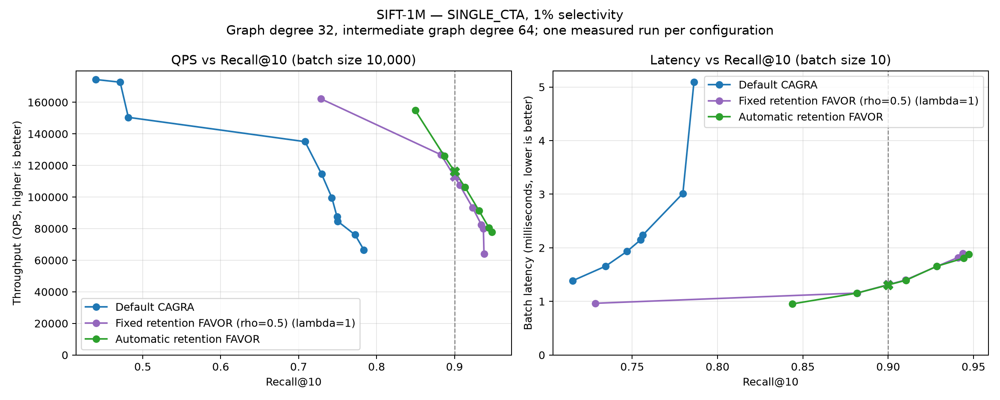

#+CAPTION: SINGLE_CTA on SIFT-1M at 10% passing selectivity.
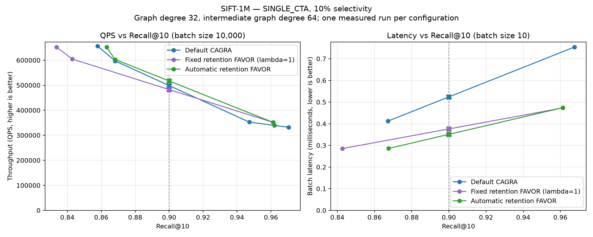

#+CAPTION: SINGLE_CTA on SIFT-1M at 50% passing selectivity.
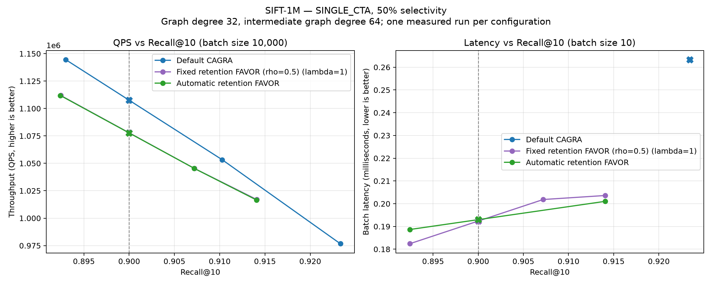

#+CAPTION: SINGLE_CTA on SIFT-1M at 90% passing selectivity.
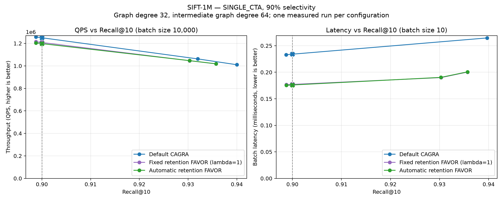

*** GIST-1M

#+CAPTION: SINGLE_CTA on GIST-1M at 1% passing selectivity.
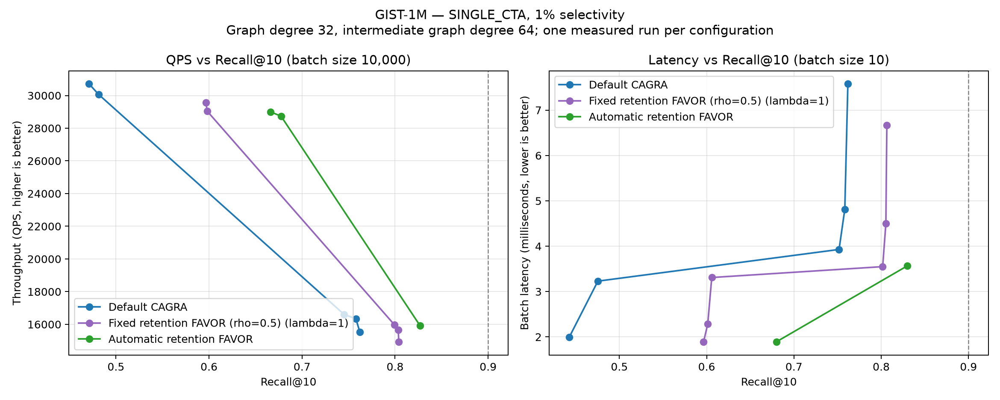

#+CAPTION: SINGLE_CTA on GIST-1M at 10% passing selectivity.
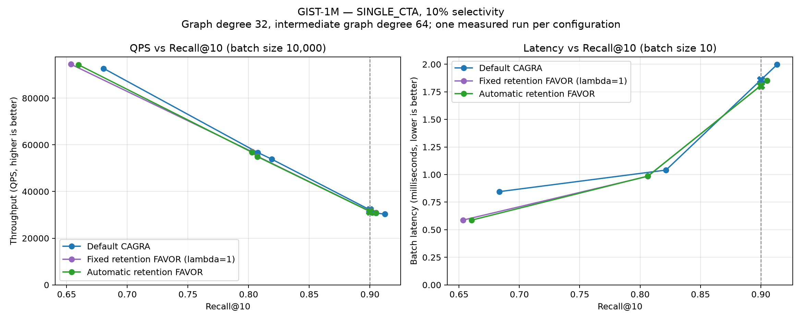

#+CAPTION: SINGLE_CTA on GIST-1M at 50% passing selectivity.
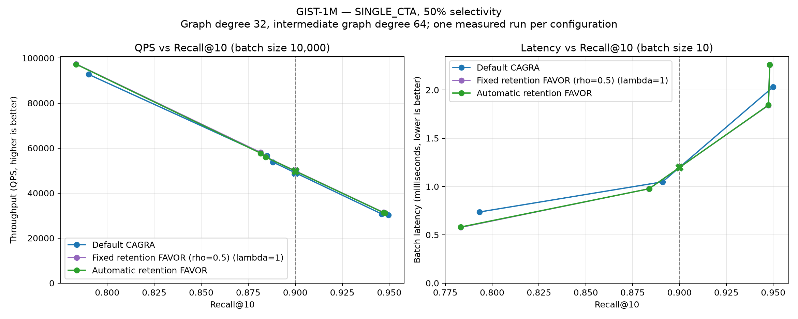

#+CAPTION: SINGLE_CTA on GIST-1M at 90% passing selectivity.
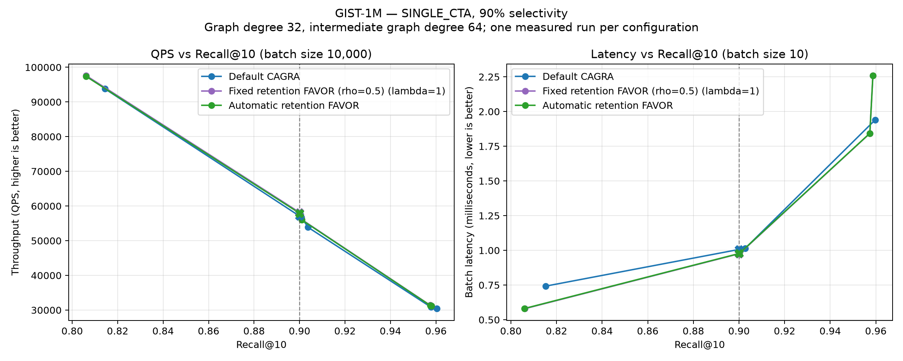

*** BIGANN-1M

#+CAPTION: SINGLE_CTA on BIGANN-1M at 1% passing selectivity.
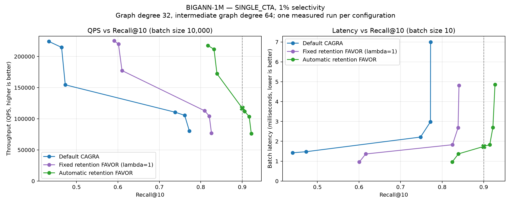

#+CAPTION: SINGLE_CTA on BIGANN-1M at 10% passing selectivity.
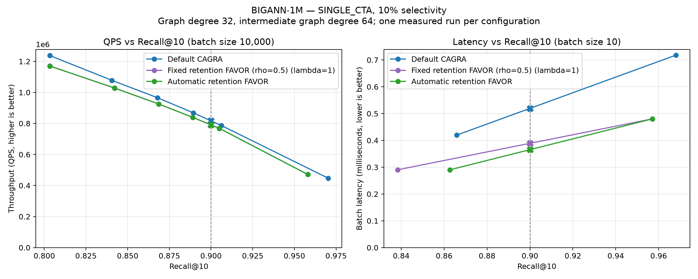

#+CAPTION: SINGLE_CTA on BIGANN-1M at 50% passing selectivity.
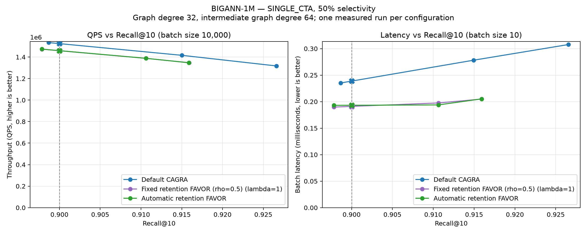

#+CAPTION: SINGLE_CTA on BIGANN-1M at 90% passing selectivity.
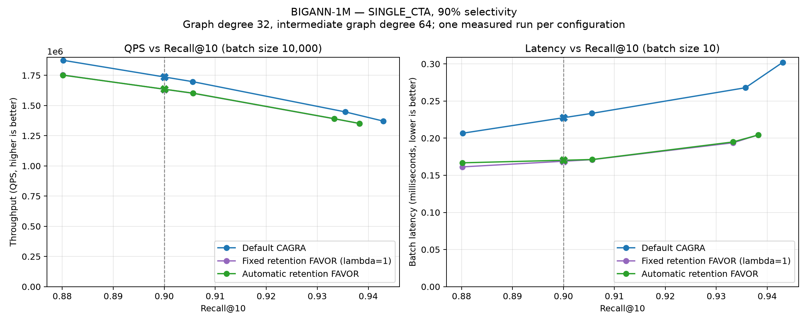

*** BIGANN-10M

#+CAPTION: SINGLE_CTA on BIGANN-10M at 1% passing selectivity.
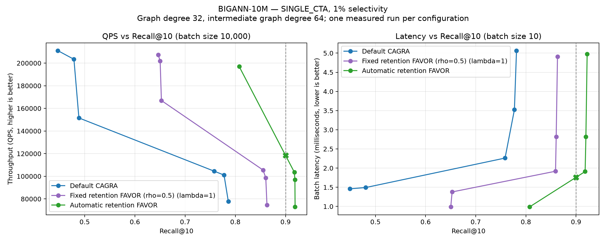

#+CAPTION: SINGLE_CTA on BIGANN-10M at 10% passing selectivity.
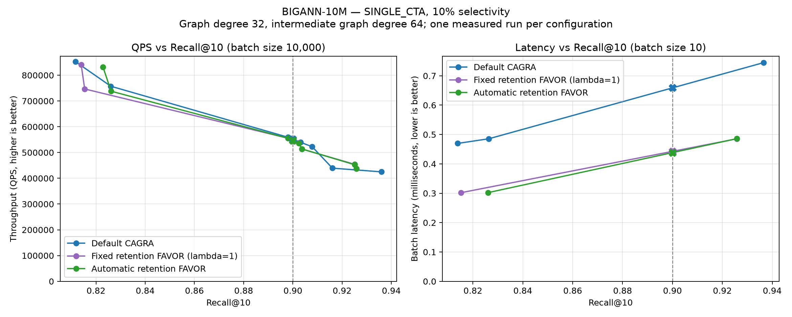

#+CAPTION: SINGLE_CTA on BIGANN-10M at 50% passing selectivity.
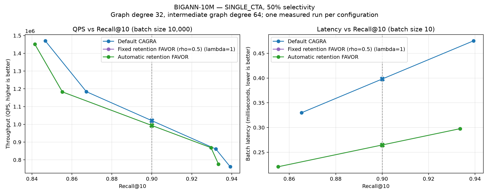

#+CAPTION: SINGLE_CTA on BIGANN-10M at 90% passing selectivity.
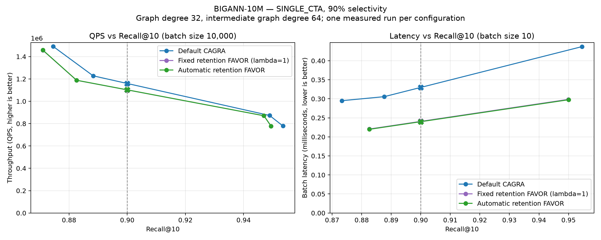

*** MSTuring-1M

#+CAPTION: SINGLE_CTA on MSTuring-1M at 1% passing selectivity.
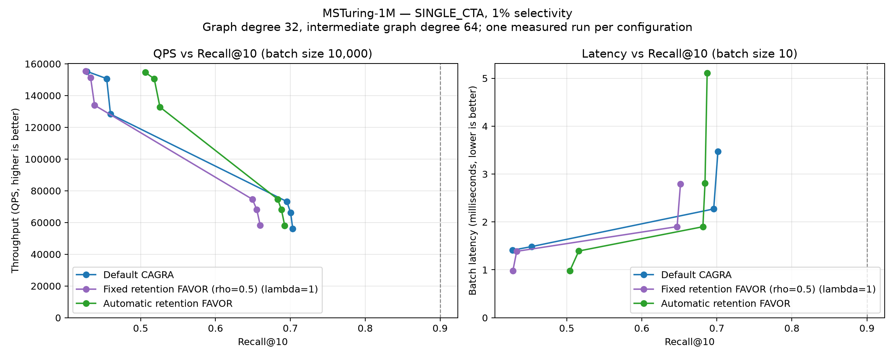

#+CAPTION: SINGLE_CTA on MSTuring-1M at 10% passing selectivity.
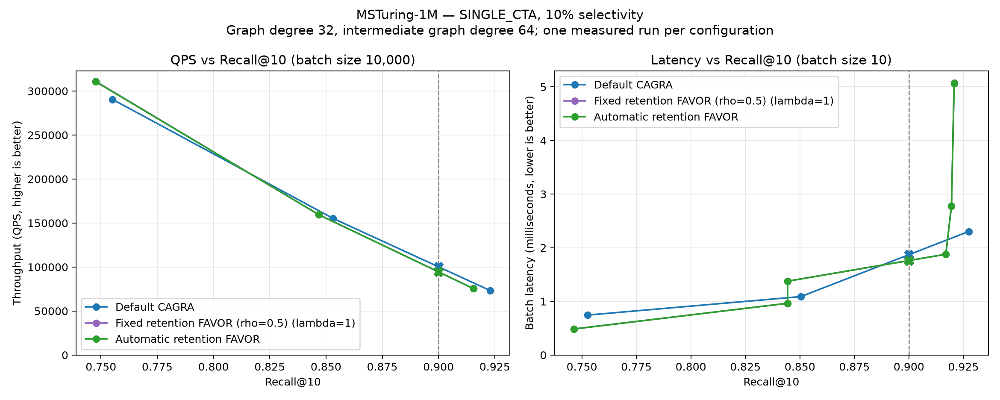

#+CAPTION: SINGLE_CTA on MSTuring-1M at 50% passing selectivity.
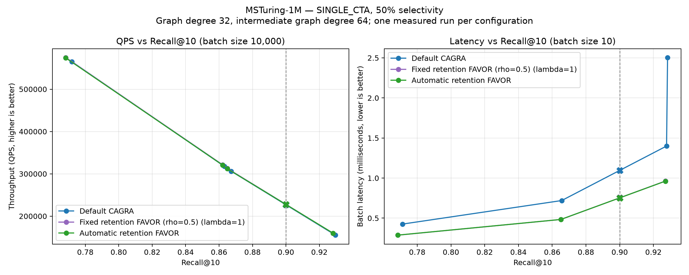

#+CAPTION: SINGLE_CTA on MSTuring-1M at 90% passing selectivity.
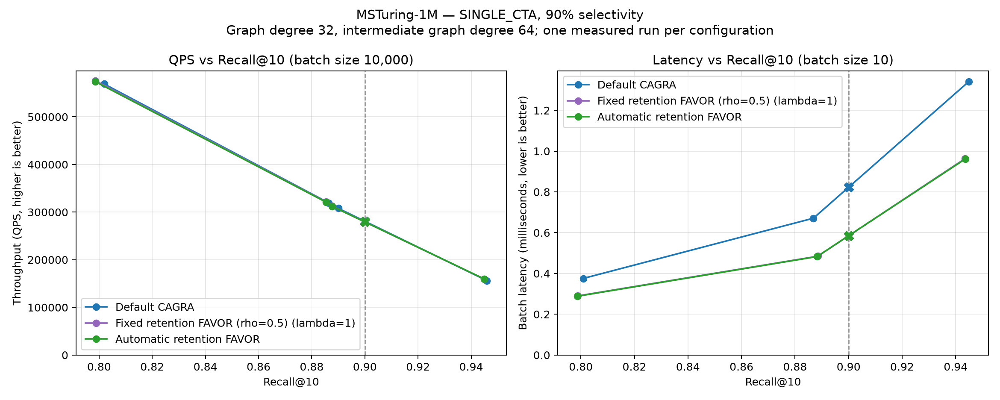

*** MSTuring-10M

#+CAPTION: SINGLE_CTA on MSTuring-10M at 1% passing selectivity.
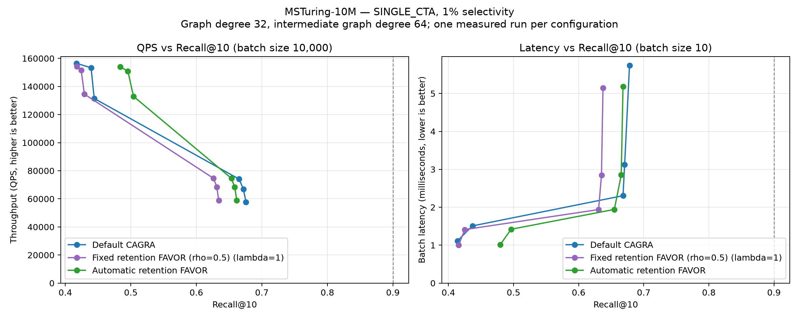

#+CAPTION: SINGLE_CTA on MSTuring-10M at 10% passing selectivity.
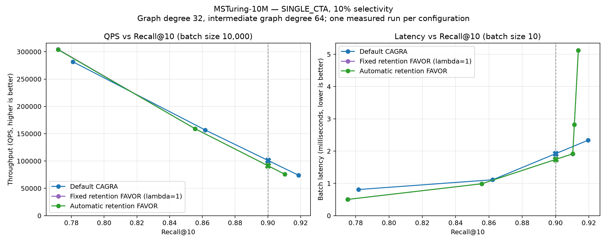

#+CAPTION: SINGLE_CTA on MSTuring-10M at 50% passing selectivity.
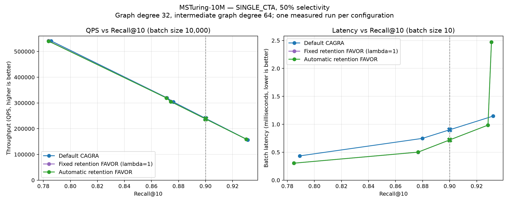

#+CAPTION: SINGLE_CTA on MSTuring-10M at 90% passing selectivity.
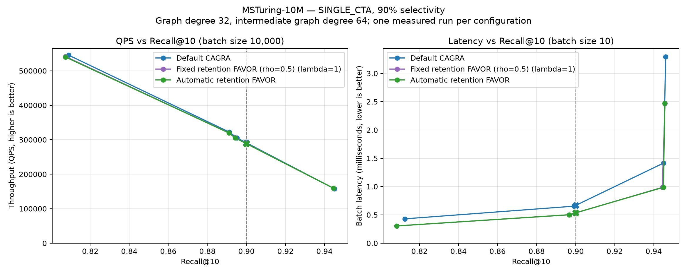

* MULTI_CTA results

=MULTI_CTA= uses a one-query batch.  Reported QPS is the reciprocal of
single-query latency and is not saturated large-batch throughput.  Target values
at Recall@10 = 0.99 follow the same measured-feasible/bracketed-interpolation rule
as =SINGLE_CTA=, with no extrapolation.

** Maximum measured recall (batch-size-1 sweep)

| Dataset | Selectivity | Default | Fixed rho=0.5 | Automatic rho |
|---------+-------------+---------+---------------+---------------|
| SIFT-1M | 1% | 1.000 | 1.000 | 1.000 |
| SIFT-1M | 10% | 1.000 | 1.000 | 1.000 |
| SIFT-1M | 50% | 1.000 | 1.000 | 1.000 |
| SIFT-1M | 90% | 0.999 | 0.999 | 1.000 |
| GIST-1M | 1% | 1.000 | 1.000 | 1.000 |
| GIST-1M | 10% | 0.999 | 0.999 | 0.999 |
| GIST-1M | 50% | 0.997 | 0.997 | 0.996 |
| GIST-1M | 90% | 0.996 | 0.996 | 0.995 |
| BIGANN-1M | 1% | 1.000 | 1.000 | 1.000 |
| BIGANN-1M | 10% | 1.000 | 1.000 | 1.000 |
| BIGANN-1M | 50% | 1.000 | 1.000 | 1.000 |
| BIGANN-1M | 90% | 1.000 | 1.000 | 1.000 |
| BIGANN-10M | 1% | 1.000 | 1.000 | 1.000 |
| BIGANN-10M | 10% | 1.000 | 1.000 | 1.000 |
| BIGANN-10M | 50% | 1.000 | 1.000 | 1.000 |
| BIGANN-10M | 90% | 1.000 | 1.000 | 1.000 |
| MSTuring-1M | 1% | 0.999 | 0.998 | 0.998 |
| MSTuring-1M | 10% | 0.997 | 0.996 | 0.996 |
| MSTuring-1M | 50% | 0.994 | 0.994 | 0.993 |
| MSTuring-1M | 90% | 0.992 | 0.992 | 0.991 |
| MSTuring-10M | 1% | 0.997 | 0.994 | 0.995 |
| MSTuring-10M | 10% | 0.995 | 0.995 | 0.994 |
| MSTuring-10M | 50% | 0.995 | 0.995 | 0.994 |
| MSTuring-10M | 90% | 0.995 | 0.995 | 0.996 |

** Batch-size-1 QPS at Recall@10 = 0.99

| Dataset | Selectivity | Default | Fixed rho=0.5 | Automatic rho |
|---------+-------------+---------+---------------+---------------|
| SIFT-1M | 1% | 3,054 | 3,264 | 3,463 |
| SIFT-1M | 10% | 3,538 | 3,640 | 3,652 |
| SIFT-1M | 50% | 3,670 | 3,745 | 3,731 |
| SIFT-1M | 90% | 3,770 | 3,806 | 3,805 |
| GIST-1M | 1% | 893 | 735 | 399 |
| GIST-1M | 10% | 1,840 | 1,854 | 1,870 |
| GIST-1M | 50% | 2,246 | 2,304 | 2,274 |
| GIST-1M | 90% | 2,376 | 2,323 | 2,296 |
| BIGANN-1M | 1% | 2,978 | 3,194 | 3,310 |
| BIGANN-1M | 10% | 3,566 | 3,668 | 3,666 |
| BIGANN-1M | 50% | 3,721 | 3,746 | 3,746 |
| BIGANN-1M | 90% | 3,831 | 3,815 | 3,837 |
| BIGANN-10M | 1% | 3,034 | 3,276 | 3,082 |
| BIGANN-10M | 10% | 3,344 | 3,502 | 3,502 |
| BIGANN-10M | 50% | 3,572 | 3,619 | 3,629 |
| BIGANN-10M | 90% | 3,641 | 3,647 | 3,622 |
| MSTuring-1M | 1% | 2,634 | 2,629 | 2,316 |
| MSTuring-1M | 10% | 3,181 | 3,315 | 3,315 |
| MSTuring-1M | 50% | 3,243 | 3,331 | 3,319 |
| MSTuring-1M | 90% | 3,301 | 3,283 | 3,280 |
| MSTuring-10M | 1% | 1,651 | 1,341 | 1,383 |
| MSTuring-10M | 10% | 2,720 | 2,826 | 2,806 |
| MSTuring-10M | 50% | 3,009 | 3,140 | 3,137 |
| MSTuring-10M | 90% | 3,149 | 3,157 | 3,148 |

** Single-query latency at Recall@10 = 0.99 (microseconds)

| Dataset | Selectivity | Default | Fixed rho=0.5 | Automatic rho |
|---------+-------------+---------+---------------+---------------|
| SIFT-1M | 1% | 327.449 | 306.434 | 288.859 |
| SIFT-1M | 10% | 282.700 | 274.773 | 273.844 |
| SIFT-1M | 50% | 272.689 | 267.159 | 268.226 |
| SIFT-1M | 90% | 265.286 | 262.805 | 262.891 |
| GIST-1M | 1% | 1158.312 | 1422.631 | 2521.289 |
| GIST-1M | 10% | 567.982 | 565.357 | 559.986 |
| GIST-1M | 50% | 445.405 | 434.356 | 440.200 |
| GIST-1M | 90% | 421.520 | 430.560 | 436.275 |
| BIGANN-1M | 1% | 335.801 | 313.206 | 302.148 |
| BIGANN-1M | 10% | 280.470 | 272.638 | 272.783 |
| BIGANN-1M | 50% | 268.941 | 267.142 | 267.147 |
| BIGANN-1M | 90% | 261.005 | 262.167 | 260.654 |
| BIGANN-10M | 1% | 329.614 | 305.302 | 324.614 |
| BIGANN-10M | 10% | 299.397 | 285.542 | 285.532 |
| BIGANN-10M | 50% | 280.075 | 276.472 | 275.674 |
| BIGANN-10M | 90% | 274.807 | 274.337 | 276.169 |
| MSTuring-1M | 1% | 380.090 | 380.485 | 432.205 |
| MSTuring-1M | 10% | 314.549 | 301.687 | 301.656 |
| MSTuring-1M | 50% | 308.393 | 300.259 | 301.273 |
| MSTuring-1M | 90% | 302.969 | 304.616 | 304.877 |
| MSTuring-10M | 1% | 606.634 | 765.647 | 743.711 |
| MSTuring-10M | 10% | 367.696 | 354.021 | 356.603 |
| MSTuring-10M | 50% | 332.709 | 318.504 | 318.837 |
| MSTuring-10M | 90% | 317.627 | 316.883 | 317.771 |

** Complete Pareto figures

Each figure contains batch-size-1 reciprocal QPS and latency panels for all three
methods.  Both y-axes begin at zero.

*** SIFT-1M

#+CAPTION: MULTI_CTA on SIFT-1M at 1% passing selectivity.
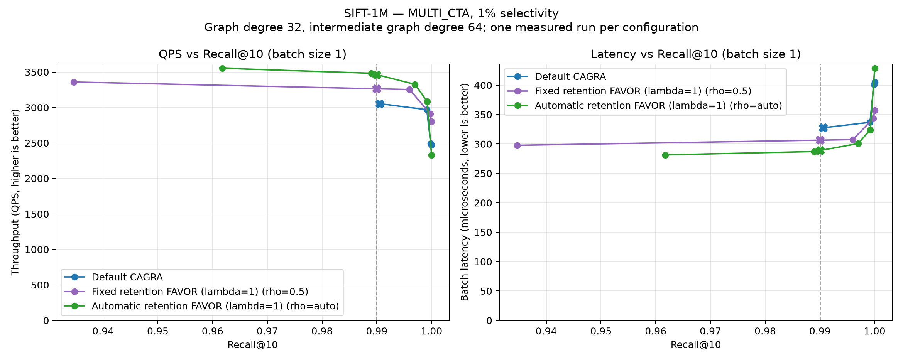

#+CAPTION: MULTI_CTA on SIFT-1M at 10% passing selectivity.
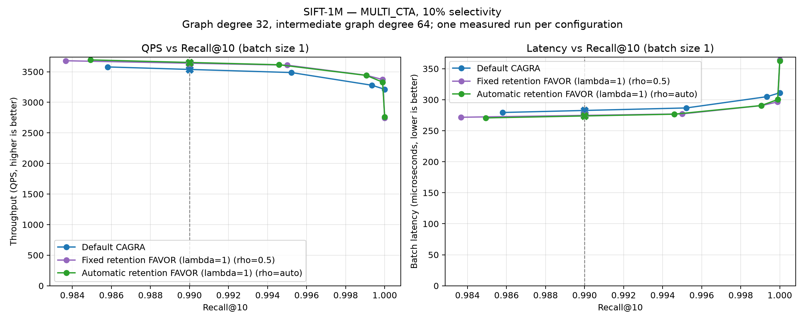

#+CAPTION: MULTI_CTA on SIFT-1M at 50% passing selectivity.
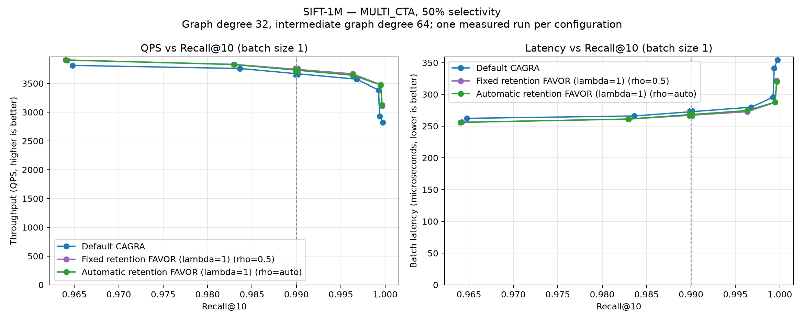

#+CAPTION: MULTI_CTA on SIFT-1M at 90% passing selectivity.
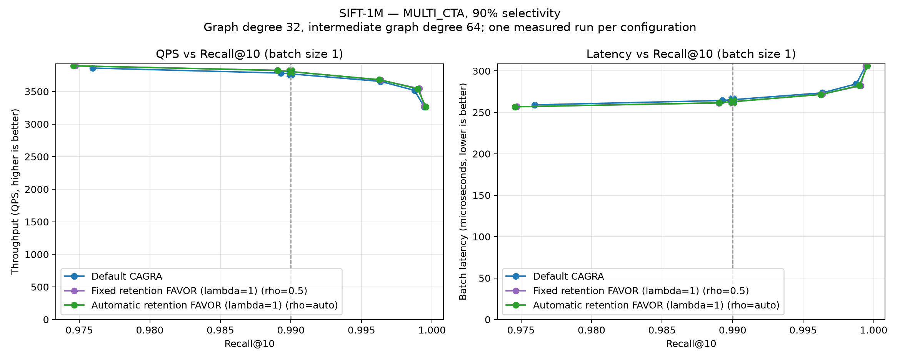

*** GIST-1M

#+CAPTION: MULTI_CTA on GIST-1M at 1% passing selectivity.
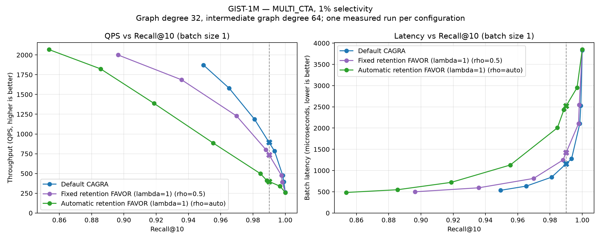

#+CAPTION: MULTI_CTA on GIST-1M at 10% passing selectivity.
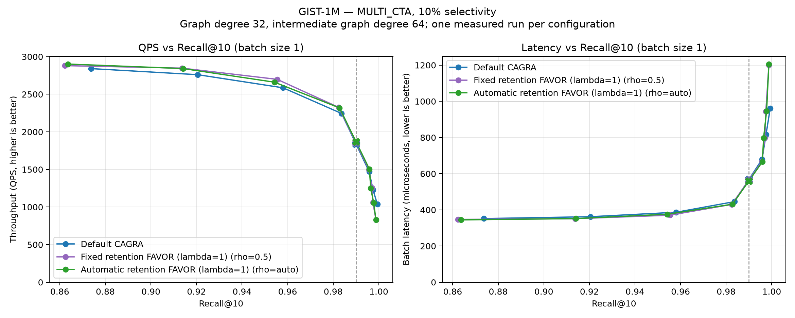

#+CAPTION: MULTI_CTA on GIST-1M at 50% passing selectivity.
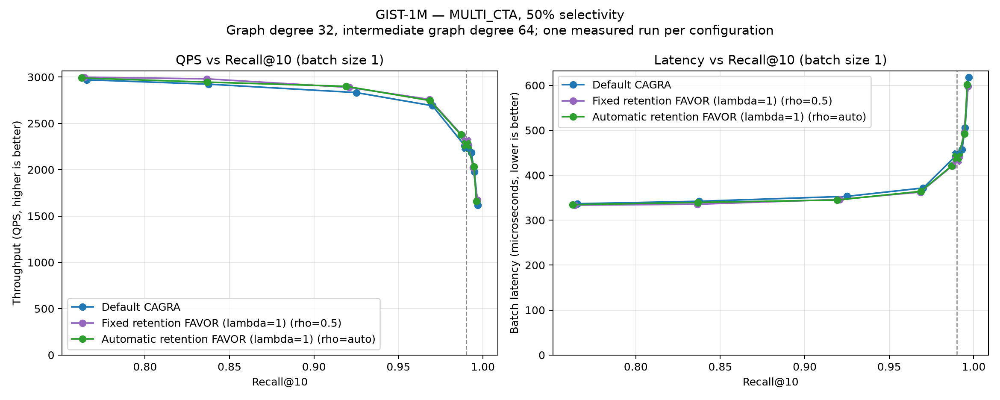

#+CAPTION: MULTI_CTA on GIST-1M at 90% passing selectivity.
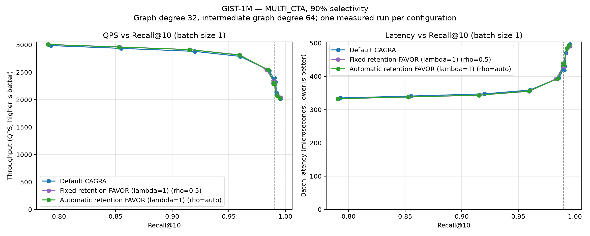

*** BIGANN-1M

#+CAPTION: MULTI_CTA on BIGANN-1M at 1% passing selectivity.
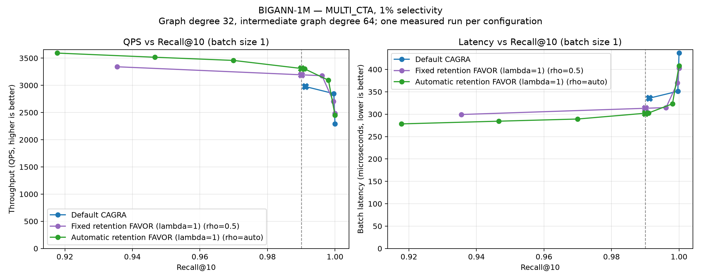

#+CAPTION: MULTI_CTA on BIGANN-1M at 10% passing selectivity.
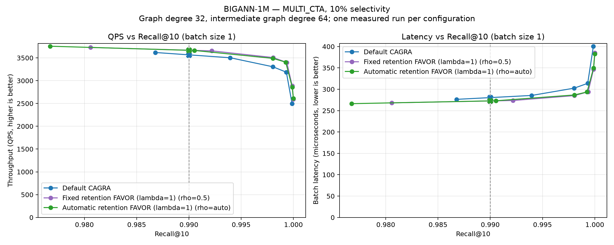

#+CAPTION: MULTI_CTA on BIGANN-1M at 50% passing selectivity.
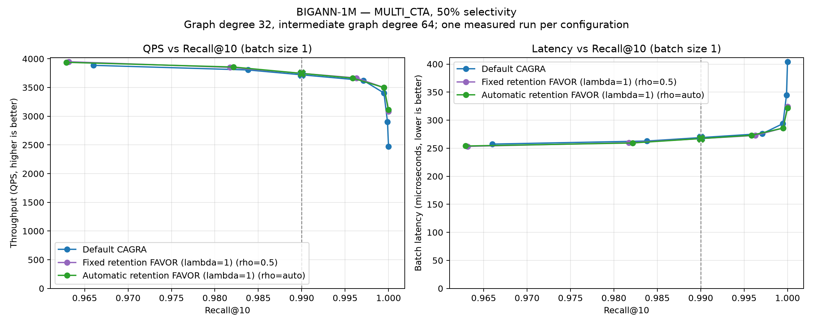

#+CAPTION: MULTI_CTA on BIGANN-1M at 90% passing selectivity.
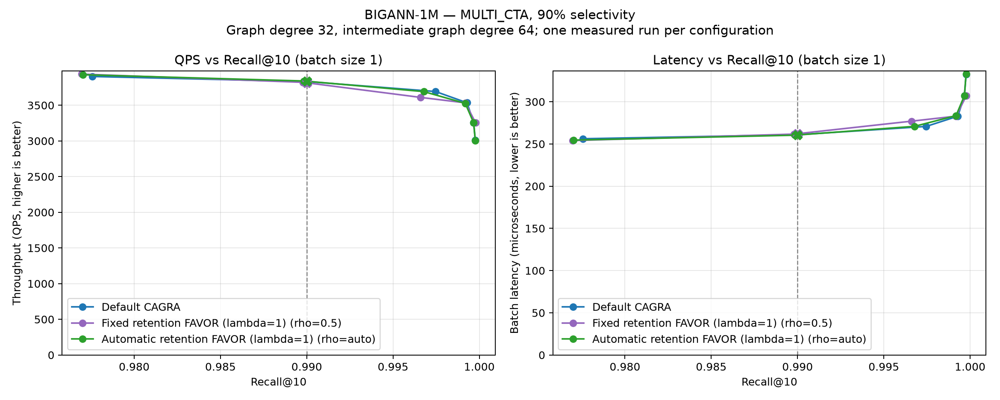

*** BIGANN-10M

#+CAPTION: MULTI_CTA on BIGANN-10M at 1% passing selectivity.
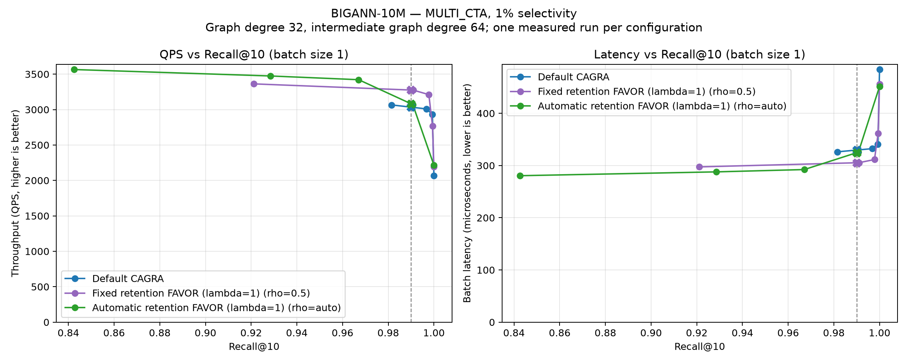

#+CAPTION: MULTI_CTA on BIGANN-10M at 10% passing selectivity.
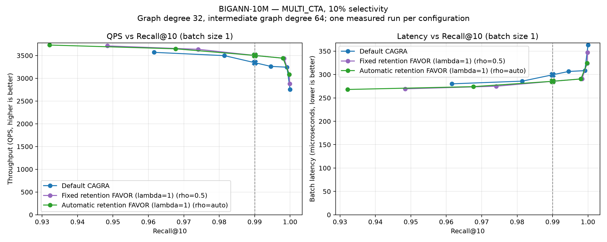

#+CAPTION: MULTI_CTA on BIGANN-10M at 50% passing selectivity.
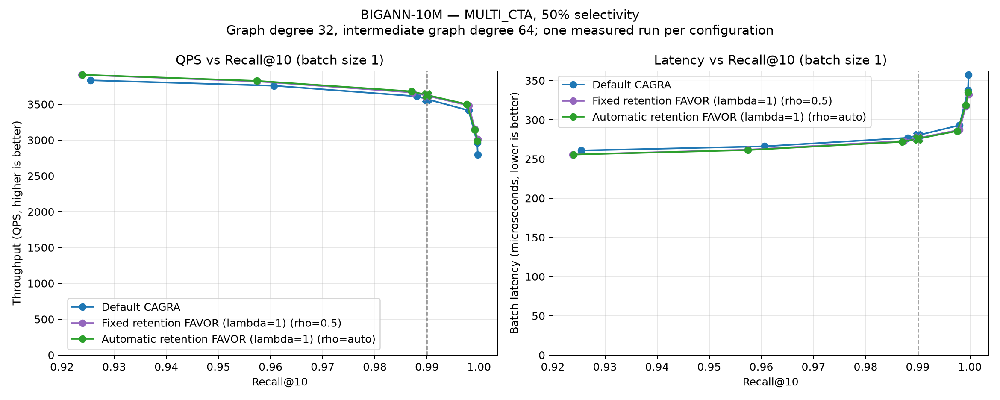

#+CAPTION: MULTI_CTA on BIGANN-10M at 90% passing selectivity.
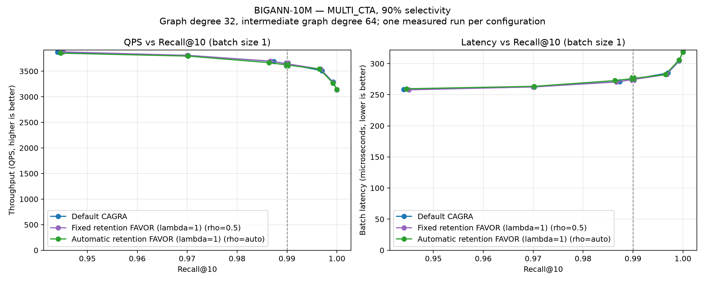

*** MSTuring-1M

#+CAPTION: MULTI_CTA on MSTuring-1M at 1% passing selectivity.
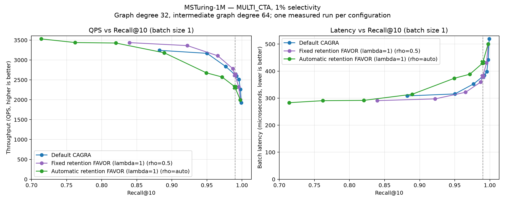

#+CAPTION: MULTI_CTA on MSTuring-1M at 10% passing selectivity.
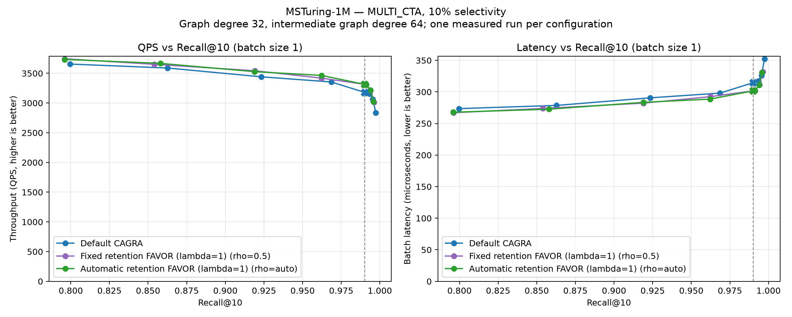

#+CAPTION: MULTI_CTA on MSTuring-1M at 50% passing selectivity.
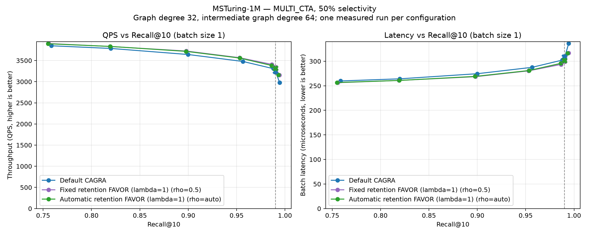

#+CAPTION: MULTI_CTA on MSTuring-1M at 90% passing selectivity.
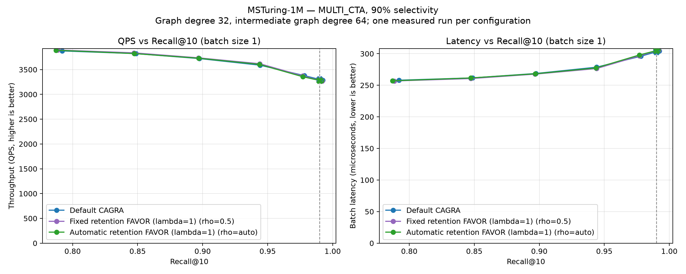

*** MSTuring-10M

#+CAPTION: MULTI_CTA on MSTuring-10M at 1% passing selectivity.
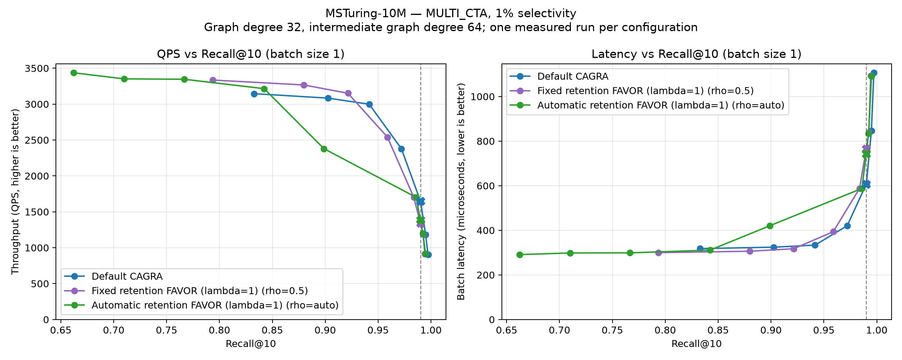

#+CAPTION: MULTI_CTA on MSTuring-10M at 10% passing selectivity.
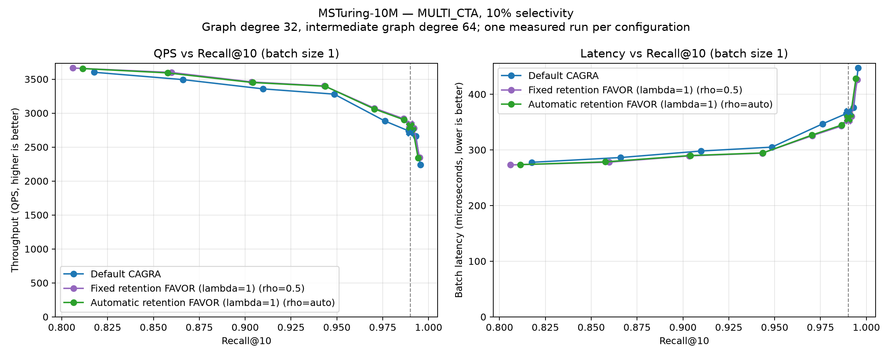

#+CAPTION: MULTI_CTA on MSTuring-10M at 50% passing selectivity.
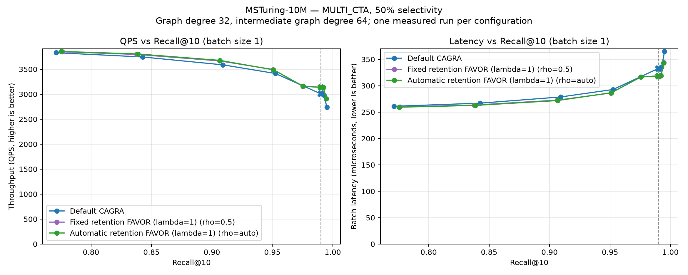

#+CAPTION: MULTI_CTA on MSTuring-10M at 90% passing selectivity.
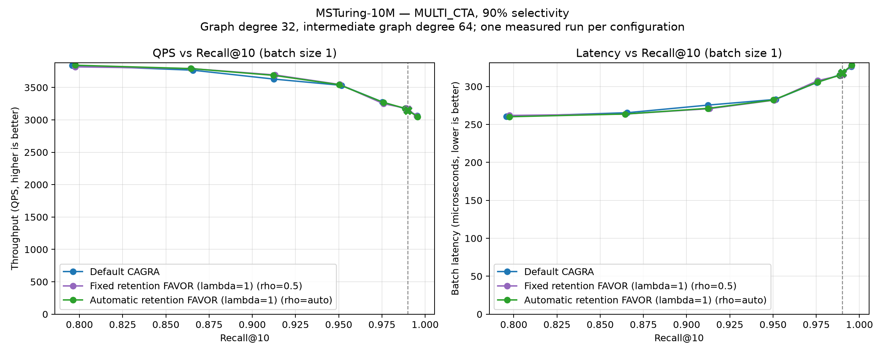

* Appendix: benchmark parameters

** Dataset and index inputs

| Dataset | Rows | Dim | Type | Query file | Subset |
|---------+------+-----+------+------------+--------|
| SIFT-1M | 1,000,000 | 128 | float32 | query.fbin | none |
| GIST-1M | 1,000,000 | 960 | float32 | query_10000.fbin | none |
| BIGANN-1M | 1,000,000 | 128 | uint8 | query.public.10K.u8bin | first 1M |
| BIGANN-10M | 10,000,000 | 128 | uint8 | query.public.10K.u8bin | none |
| MSTuring-1M | 1,000,000 | 100 | float32 | query.fbin | none |
| MSTuring-10M | 10,000,000 | 100 | float32 | query.fbin | none |

Every dataset uses =cagra_g32_ig64.index= and its matching =.delta_d= sidecar.
Exact bitsets and precomputed exact filtered ground truth are used throughout.
All experiments use =k=10=, one benchmark repetition, minimum measured time 0.2 s,
and warm-up 0.1 s.  FAVOR runs use =cagra_retention_safe= and =lambda=1=;
default CAGRA has no FAVOR penalty.  The archived
=SINGLE_CTA= curves were measured on NVIDIA A30; the new =MULTI_CTA=
default, fixed, and automatic curves were all measured on NVIDIA L4.
Absolute timing is compared only within a CTA mode, never between these GPUs.

** SINGLE_CTA search cells

Each tuple is =(itopk, search_width, max_iterations, thread_block_size)=.  Zero
requests existing planner/default behavior.  Default, fixed, and automatic
retention use the same cells for batch 10 and batch 10,000.

| Dataset | Selectivity | Cells |
|---------+-------------+-------|
| SIFT-1M | 1% | (256,1,0,0); (256,2,0,0); (256,4,0,0); (512,1,0,0); (512,2,0,0); (512,4,0,0); (512,4,80,0); (512,4,96,0); (512,4,112,0); (512,4,128,0) |
| SIFT-1M | 10% | (64,2,0,0); (64,4,0,0); (128,1,0,0); (128,2,0,0); (128,4,0,0) |
| SIFT-1M | 50% | (32,4,0,0); (32,4,11,0); (32,4,12,0) |
| SIFT-1M | 90% | (32,4,0,0); (32,4,10,0); (32,4,12,0) |
| GIST-1M | 1% | (256,1,0,0); (256,2,0,0); (256,4,0,0); (512,1,0,0); (512,2,0,0); (512,4,0,0) |
| GIST-1M | 10% | (64,4,0,0); (128,2,0,0); (128,4,0,0); (256,1,0,0); (256,2,0,0); (256,4,0,0) |
| GIST-1M | 50% | (64,4,0,0); (128,2,0,0); (128,4,0,0); (256,1,0,0); (256,2,0,0); (256,4,0,0) |
| GIST-1M | 90% | (64,4,0,0); (128,2,0,0); (128,4,0,0); (256,1,0,0); (256,2,0,0); (256,4,0,0) |
| BIGANN-1M | 1% | (256,1,0,0); (256,2,0,0); (256,4,0,0); (512,1,0,0); (512,2,0,0); (512,4,0,0) |
| BIGANN-1M | 10% | (64,4,0,0); (128,4,0,0); (128,4,12,64); (128,4,14,64); (128,4,16,64); (128,4,18,64); (128,4,20,64) |
| BIGANN-1M | 50% | (32,4,0,0); (32,4,11,0); (32,4,12,0) |
| BIGANN-1M | 90% | (32,4,0,0); (32,4,9,0); (32,4,10,0); (32,4,12,0) |
| BIGANN-10M | 1% | (256,1,0,0); (256,2,0,0); (256,4,0,0); (512,1,0,0); (512,2,0,0); (512,4,0,0) |
| BIGANN-10M | 10% | (64,2,0,0); (64,4,0,0); (128,1,0,0); (128,2,0,0); (128,2,54,64); (128,2,55,64); (128,2,56,64); (128,4,0,0); (128,4,28,64); (128,4,29,64); (128,4,30,64) |
| BIGANN-10M | 50% | (32,1,0,0); (32,2,0,0); (32,4,0,0); (64,1,0,0); (64,2,0,0); (64,4,0,0) |
| BIGANN-10M | 90% | (32,1,0,0); (32,2,0,0); (32,4,0,0); (64,1,0,0); (64,2,0,0); (64,4,0,0) |
| MSTuring-1M | 1% | (256,1,0,0); (256,2,0,0); (256,4,0,0); (512,1,0,0); (512,2,0,0); (512,4,0,0) |
| MSTuring-1M | 10% | (128,4,0,0); (256,2,0,0); (256,4,0,0); (512,1,0,0); (512,2,0,0); (512,4,0,0) |
| MSTuring-1M | 50% | (64,4,0,0); (128,2,0,0); (128,4,0,0); (256,1,0,0); (256,2,0,0); (256,4,0,0) |
| MSTuring-1M | 90% | (64,4,0,0); (128,2,0,0); (128,4,0,0); (256,1,0,0); (256,2,0,0); (256,4,0,0) |
| MSTuring-10M | 1% | (256,1,0,0); (256,2,0,0); (256,4,0,0); (512,1,0,0); (512,2,0,0); (512,4,0,0) |
| MSTuring-10M | 10% | (128,4,0,0); (256,2,0,0); (256,4,0,0); (512,1,0,0); (512,2,0,0); (512,4,0,0) |
| MSTuring-10M | 50% | (64,4,0,0); (128,2,0,0); (128,4,0,0); (256,1,0,0); (256,2,0,0); (256,4,0,0) |
| MSTuring-10M | 90% | (64,4,0,0); (128,2,0,0); (128,4,0,0); (256,1,0,0); (256,2,0,0); (256,4,0,0) |

** MULTI_CTA search cells

The tuple schema is identical.  Default, fixed, and automatic retention use the
same batch-size-1 cells, including MSTuring-10M values through =itopk=2048=.

| Dataset | Selectivity | Cells |
|---------+-------------+-------|
| SIFT-1M | 1% | (32,1,0,0); (64,1,0,0); (128,1,0,0); (256,1,0,0); (512,1,0,0); (1024,1,0,0) |
| SIFT-1M | 10% | (32,1,0,0); (64,1,0,0); (128,1,0,0); (256,1,0,0); (512,1,0,0); (1024,1,0,0) |
| SIFT-1M | 50% | (32,1,0,0); (64,1,0,0); (128,1,0,0); (256,1,0,0); (512,1,0,0); (1024,1,0,0) |
| SIFT-1M | 90% | (32,1,0,0); (64,1,0,0); (128,1,0,0); (256,1,0,0); (512,1,0,0); (1024,1,0,0) |
| GIST-1M | 1% | (32,1,0,0); (64,1,0,0); (128,1,0,0); (256,1,0,0); (512,1,0,0); (640,1,0,0); (768,1,0,0); (1024,1,0,0) |
| GIST-1M | 10% | (32,1,0,0); (64,1,0,0); (128,1,0,0); (256,1,0,0); (512,1,0,0); (640,1,0,0); (768,1,0,0); (1024,1,0,0) |
| GIST-1M | 50% | (32,1,0,0); (64,1,0,0); (128,1,0,0); (256,1,0,0); (512,1,0,0); (640,1,0,0); (768,1,0,0); (1024,1,0,0) |
| GIST-1M | 90% | (32,1,0,0); (64,1,0,0); (128,1,0,0); (256,1,0,0); (512,1,0,0); (640,1,0,0); (768,1,0,0); (1024,1,0,0) |
| BIGANN-1M | 1% | (32,1,0,0); (64,1,0,0); (128,1,0,0); (256,1,0,0); (512,1,0,0); (1024,1,0,0) |
| BIGANN-1M | 10% | (32,1,0,0); (64,1,0,0); (128,1,0,0); (256,1,0,0); (512,1,0,0); (1024,1,0,0) |
| BIGANN-1M | 50% | (32,1,0,0); (64,1,0,0); (128,1,0,0); (256,1,0,0); (512,1,0,0); (1024,1,0,0) |
| BIGANN-1M | 90% | (32,1,0,0); (64,1,0,0); (128,1,0,0); (256,1,0,0); (512,1,0,0); (1024,1,0,0) |
| BIGANN-10M | 1% | (32,1,0,0); (64,1,0,0); (128,1,0,0); (256,1,0,0); (512,1,0,0); (1024,1,0,0) |
| BIGANN-10M | 10% | (32,1,0,0); (64,1,0,0); (128,1,0,0); (256,1,0,0); (512,1,0,0); (1024,1,0,0) |
| BIGANN-10M | 50% | (32,1,0,0); (64,1,0,0); (128,1,0,0); (256,1,0,0); (512,1,0,0); (1024,1,0,0) |
| BIGANN-10M | 90% | (32,1,0,0); (64,1,0,0); (128,1,0,0); (256,1,0,0); (512,1,0,0); (1024,1,0,0) |
| MSTuring-1M | 1% | (32,1,0,0); (64,1,0,0); (128,1,0,0); (256,1,0,0); (512,1,0,0); (640,1,0,0); (768,1,0,0); (1024,1,0,0) |
| MSTuring-1M | 10% | (32,1,0,0); (64,1,0,0); (128,1,0,0); (256,1,0,0); (512,1,0,0); (640,1,0,0); (768,1,0,0); (1024,1,0,0) |
| MSTuring-1M | 50% | (32,1,0,0); (64,1,0,0); (128,1,0,0); (256,1,0,0); (512,1,0,0); (640,1,0,0); (768,1,0,0); (1024,1,0,0) |
| MSTuring-1M | 90% | (32,1,0,0); (64,1,0,0); (128,1,0,0); (256,1,0,0); (512,1,0,0); (640,1,0,0); (768,1,0,0); (1024,1,0,0) |
| MSTuring-10M | 1% | (32,1,0,0); (64,1,0,0); (128,1,0,0); (256,1,0,0); (512,1,0,0); (1024,1,0,0); (1536,1,0,0); (2048,1,0,0) |
| MSTuring-10M | 10% | (32,1,0,0); (64,1,0,0); (128,1,0,0); (256,1,0,0); (512,1,0,0); (1024,1,0,0); (1536,1,0,0); (2048,1,0,0) |
| MSTuring-10M | 50% | (32,1,0,0); (64,1,0,0); (128,1,0,0); (256,1,0,0); (512,1,0,0); (1024,1,0,0); (1536,1,0,0); (2048,1,0,0) |
| MSTuring-10M | 90% | (32,1,0,0); (64,1,0,0); (128,1,0,0); (256,1,0,0); (512,1,0,0); (1024,1,0,0); (1536,1,0,0); (2048,1,0,0) |

** Artifact locations and reproduction

=SINGLE_CTA= fixed/default data is in =results_retention_safe_single_full=; its
automatic data and combined outputs are in =results_automatic_retention_single_full=
and =results_automatic_retention_single_comparison=.  All three fresh =MULTI_CTA=
series are in =results_automatic_retention_multi_full=; processed tables and
plots are in
=results_automatic_retention_multi_comparison=.

#+begin_src sh
benchmarks/favor/run_automatic_retention_single_full.sh
benchmarks/favor/run_automatic_retention_multi_full.sh
python benchmarks/favor/generate_automatic_retention_report.py
cd benchmarks/favor
pandoc -f org -t docx --standalone \
  -o AUTOMATIC_RETENTION_FAVOR_SINGLE_MULTI_CTA_REPORT.docx \
  AUTOMATIC_RETENTION_FAVOR_SINGLE_MULTI_CTA_REPORT.org
#+end_src
