#+TITLE: Performance of Committed FAVOR-Style Filtering for CAGRA
#+SUBTITLE: Commit d29e68c1 across SIFT, GIST, BIGANN, and MSTuring
#+AUTHOR: Nam Anh Dang
#+DATE: 2026-07-27
#+OPTIONS: toc:3 num:t

* Executive summary

This report evaluates the static FAVOR-style bitset-filtering implementation
committed as =d29e68c158062dd49fbc06316c1c0bad218e662d= ("Basic FAVOR
kernel working for bitset filters, works best at 1-2% selectivity"). It compares
that implementation with default CAGRA filtering on six dataset/scale
combinations:

- SIFT-1M and GIST-1M;
- BIGANN-1M and BIGANN-10M;
- MSTuring-1M and MSTuring-10M.

The main conclusions are:

1. *SIFT-1M:* FAVOR is clearly better for a 1% filter. Its maximum
   throughput-run recall is 0.95473 versus 0.78369 for default CAGRA. At 10%
   and above both methods reach high recall; FAVOR is competitive but generally
   gives slightly lower large-batch throughput at 50% and 90%.
2. *GIST-1M:* FAVOR improves maximum recall at 1% from 0.76210 to 0.82210,
   although neither method reaches 0.90. From 10% onward the methods have
   similar Pareto frontiers, with small FAVOR latency advantages.
3. *BIGANN:* FAVOR is strong at 1-2%, but its static penalty becomes badly
   miscalibrated above that range. At 10%, maximum recall is only 0.82615 on
   BIGANN-1M and 0.70444 on BIGANN-10M, compared with 0.99827 and 0.99452 for
   default CAGRA. The failure is more severe at 10M scale.
4. *MSTuring:* FAVOR does not collapse, but it also provides no sparse-filter
   recall advantage. At 1%, its recall is approximately equal to or below
   default. At 10-90%, FAVOR is often 4-6% faster at a 0.90-recall operating
   point and has lower low-batch latency, while its maximum recall remains
   slightly lower.
5. *Overall:* the committed method is useful for highly selective filters on
   some datasets, but is not a universally safe replacement for default CAGRA.
   Across all measured datasets, =selectivity <= 2%= is the conservative range
   in which FAVOR can be selected without encountering the BIGANN failure.

* Version and result provenance

The report covers only the committed static FAVOR method and default CAGRA.
It does not include the later passing-result accumulator or experimental static
penalty multipliers.

The cross-dataset measurements were collected using the implementation that
became commit =d29e68c1=. A subsequent matched rebuild compared the current
static path with an isolated build of that exact commit on BIGANN-10M. Across
nine configurations, the maximum recall difference was 0.00009 and the maximum
throughput difference was approximately 0.33%. The 4% recall collapse was
identical in both builds. This rules out the later accumulator refactor as the
source of the reported behavior.

All numbers below are recomputed from the raw Google Benchmark JSON files. No
value is extrapolated. =N/A= means that no measured configuration reached the
specified recall target.

* Experimental setup

| Property                       | Value                                      |
|--------------------------------+--------------------------------------------|
| GPU                            | NVIDIA A30, 24 GB                           |
| CUDA driver/runtime reported   | 13.0 / 13.3                                |
| Host                           | 64 logical CPUs                             |
| CAGRA graph degree             | 32                                         |
| Intermediate graph degree      | 64                                         |
| Search algorithm               | =SINGLE_CTA=                               |
| Requested result count         | Recall@10                                  |
| Internal top-k sweep           | 32, 64, 128, 256, 512                      |
| Search-width sweep             | 1, 2, 4                                    |
| Throughput workload            | One batch of 10,000 queries; QPS           |
| Low-batch workload             | One batch of 10 queries; batch latency     |
| Repetitions                    | One measured run per configuration         |
| Core selectivities             | 1%, 10%, 50%, 90%                          |
| Threshold selectivities        | Every integer percentage from 1% through 8% |

Each dataset uses one attribute-independent CAGRA graph. Default and FAVOR
search use the same graph, query rows, exact bitset, filtered ground truth, and
parameter grid. The bitsets are deterministic and nested in the 1-8% study.

The dataset-specific delta-d sidecars are:

| Dataset       | Storage   | Rows | Dimensions | Delta-d    |
|---------------+-----------+------+------------+------------|
| SIFT-1M       | =float32= |   1M |        128 | 1087.32    |
| GIST-1M       | =float32= |   1M |        960 | 0.0144914  |
| BIGANN-1M     | =uint8=   |   1M |        128 | 1376.73    |
| BIGANN-10M    | =uint8=   |  10M |        128 | 1078.06    |
| MSTuring-1M   | =float32= |   1M |        100 | 0.0142445  |
| MSTuring-10M  | =float32= |  10M |        100 | 0.0129972  |

GIST provides only 1,000 distinct benchmark queries. Its 10,000-query
throughput batch repeats those queries ten times, so its absolute QPS may
benefit from query-cache reuse. Default and FAVOR are affected equally, so the
within-GIST comparison remains matched.

* Aggregate throughput results

The QPS columns contain the fastest measured point whose recall is at least the
stated target. Maximum recall and QPS are taken from the 10,000-query workload.

| Dataset       | Sel. | Default max R | FAVOR max R | Default QPS@0.90 | FAVOR QPS@0.90 | Default QPS@0.95 | FAVOR QPS@0.95 |
|---------------+------+---------------+-------------+------------------+----------------+------------------+----------------|
| SIFT-1M       |   1% |       0.78369 |     0.95473 |              N/A |         87,222 |              N/A |         87,222 |
| SIFT-1M       |  10% |       0.99874 |     0.98981 |          352,117 |        347,459 |          334,612 |        347,459 |
| SIFT-1M       |  50% |       0.99950 |     0.99940 |        1,202,377 |      1,168,359 |          656,644 |        642,403 |
| SIFT-1M       |  90% |       0.99938 |     0.99939 |        1,205,468 |      1,168,697 |          659,594 |        642,726 |
| GIST-1M       |   1% |       0.76210 |     0.82210 |              N/A |            N/A |              N/A |            N/A |
| GIST-1M       |  10% |       0.96290 |     0.95650 |           30,750 |         31,218 |           16,555 |         16,710 |
| GIST-1M       |  50% |       0.98090 |     0.98070 |           30,784 |         31,392 |           16,546 |         16,821 |
| GIST-1M       |  90% |       0.98551 |     0.98500 |           56,826 |         57,318 |           30,813 |         31,363 |
| BIGANN-1M     |   1% |       0.77246 |     0.95282 |              N/A |        109,974 |              N/A |        109,974 |
| BIGANN-1M     |  10% |       0.99827 |     0.82615 |          459,041 |            N/A |          448,678 |            N/A |
| BIGANN-1M     |  50% |       0.99977 |     0.99884 |        1,589,556 |        813,642 |          906,091 |        412,082 |
| BIGANN-1M     |  90% |       0.99988 |     0.99977 |        1,614,011 |      1,485,800 |          918,283 |        831,575 |
| BIGANN-10M    |   1% |       0.78604 |     0.91130 |              N/A |        103,758 |              N/A |            N/A |
| BIGANN-10M    |  10% |       0.99452 |     0.70444 |          439,213 |            N/A |          211,375 |            N/A |
| BIGANN-10M    |  50% |       0.99883 |     0.99395 |          860,168 |        407,585 |          441,151 |        206,395 |
| BIGANN-10M    |  90% |       0.99915 |     0.99883 |          871,994 |        782,788 |          777,153 |        413,203 |
| MSTuring-1M   |   1% |       0.70319 |     0.68618 |              N/A |            N/A |              N/A |            N/A |
| MSTuring-1M   |  10% |       0.92300 |     0.91353 |           73,302 |         77,332 |              N/A |            N/A |
| MSTuring-1M   |  50% |       0.96788 |     0.96687 |          155,124 |        163,340 |           73,175 |         77,443 |
| MSTuring-1M   |  90% |       0.97642 |     0.97597 |          156,360 |        163,247 |           73,884 |         77,478 |
| MSTuring-10M  |   1% |       0.67580 |     0.67602 |              N/A |            N/A |              N/A |            N/A |
| MSTuring-10M  |  10% |       0.91871 |     0.90886 |           73,961 |         77,049 |              N/A |            N/A |
| MSTuring-10M  |  50% |       0.96372 |     0.96280 |          156,397 |        162,099 |           73,810 |         77,212 |
| MSTuring-10M  |  90% |       0.97246 |     0.97202 |          157,551 |        162,335 |           74,627 |         77,165 |

* Aggregate low-batch latency results

Latency is whole-batch latency in milliseconds for ten queries. Lower is
better.

| Dataset       | Sel. | Default max R | FAVOR max R | Default ms@0.90 | FAVOR ms@0.90 | Default ms@0.95 | FAVOR ms@0.95 |
|---------------+------+---------------+-------------+-----------------+---------------+-----------------+---------------|
| SIFT-1M       |   1% |       0.78618 |     0.95567 |             N/A |         1.785 |             N/A |         1.785 |
| SIFT-1M       |  10% |       0.99821 |     0.98913 |           0.682 |         0.452 |           0.682 |         0.452 |
| SIFT-1M       |  50% |       0.99933 |     0.99952 |           0.274 |         0.205 |           0.402 |         0.270 |
| SIFT-1M       |  90% |       0.99960 |     0.99937 |           0.289 |         0.195 |           0.426 |         0.270 |
| GIST-1M       |   1% |       0.76179 |     0.82548 |             N/A |           N/A |             N/A |           N/A |
| GIST-1M       |  10% |       0.96169 |     0.95377 |           1.998 |         1.875 |           3.964 |         3.621 |
| GIST-1M       |  50% |       0.98146 |     0.98095 |           2.032 |         1.873 |           2.032 |         3.619 |
| GIST-1M       |  90% |       0.98527 |     0.98474 |           1.161 |         0.996 |           1.939 |         1.876 |
| BIGANN-1M     |   1% |       0.77216 |     0.95417 |             N/A |         1.757 |             N/A |         1.757 |
| BIGANN-1M     |  10% |       0.99840 |     0.82671 |           0.777 |           N/A |           0.777 |           N/A |
| BIGANN-1M     |  50% |       0.99983 |     0.99932 |           0.283 |         0.279 |           0.433 |         0.490 |
| BIGANN-1M     |  90% |       0.99990 |     0.99950 |           0.280 |         0.200 |           0.391 |         0.277 |
| BIGANN-10M    |   1% |       0.78127 |     0.91339 |             N/A |         1.783 |             N/A |           N/A |
| BIGANN-10M    |  10% |       0.99439 |     0.72175 |           0.778 |           N/A |           1.440 |           N/A |
| BIGANN-10M    |  50% |       0.99861 |     0.99356 |           0.418 |         0.479 |           0.735 |         0.936 |
| BIGANN-10M    |  90% |       0.99887 |     0.99885 |           0.398 |         0.288 |           0.398 |         0.469 |
| MSTuring-1M   |   1% |       0.70144 |     0.68382 |             N/A |           N/A |             N/A |           N/A |
| MSTuring-1M   |  10% |       0.92742 |     0.91851 |           2.302 |         1.831 |             N/A |           N/A |
| MSTuring-1M   |  50% |       0.96944 |     0.96709 |           1.124 |         0.916 |           2.440 |         1.830 |
| MSTuring-1M   |  90% |       0.97550 |     0.97516 |           1.036 |         0.920 |           2.141 |         1.830 |
| MSTuring-10M  |   1% |       0.68283 |     0.67622 |             N/A |           N/A |             N/A |           N/A |
| MSTuring-10M  |  10% |       0.91992 |     0.90959 |           2.338 |         1.893 |             N/A |           N/A |
| MSTuring-10M  |  50% |       0.96660 |     0.96593 |           1.495 |         0.948 |           2.471 |         1.890 |
| MSTuring-10M  |  90% |       0.97463 |     0.97463 |           1.055 |         0.947 |           2.170 |         1.889 |

* Pareto frontiers by dataset and scale

Each figure contains two independently computed Pareto frontiers. The left
panel shows QPS versus recall for 10,000 queries; the right panel shows
ten-query batch latency versus recall.

** SIFT-1M

FAVOR has the strongest result at 1%, where it reaches recall unavailable to
default filtered CAGRA. At 10%, FAVOR has similar QPS at the 0.90/0.95 targets
and lower latency. At 50% and 90%, both methods reach approximately 0.999
recall, while default has about 3% more throughput and FAVOR retains a latency
advantage.

#+CAPTION: SIFT-1M Pareto frontier at 1% selectivity.
#+ATTR_ORG: :width 1200
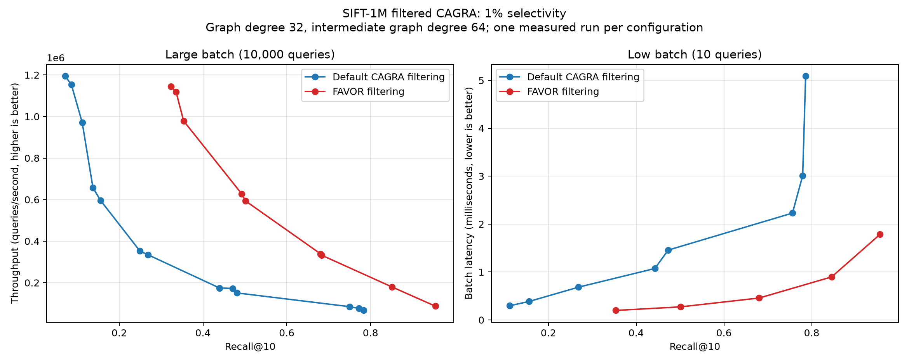

#+CAPTION: SIFT-1M Pareto frontier at 10% selectivity.
#+ATTR_ORG: :width 1200
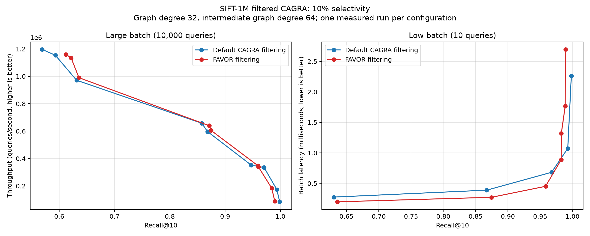

#+CAPTION: SIFT-1M Pareto frontier at 50% selectivity.
#+ATTR_ORG: :width 1200
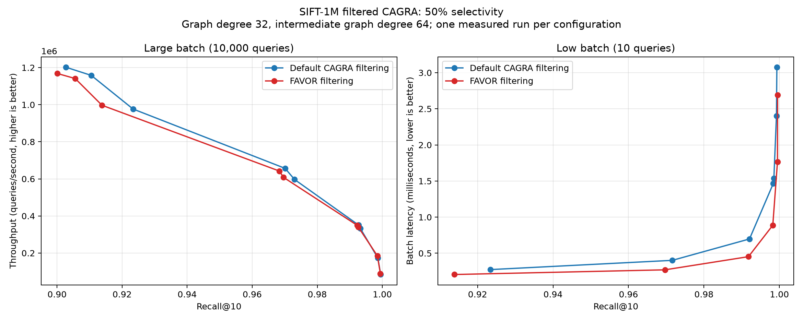

#+CAPTION: SIFT-1M Pareto frontier at 90% selectivity.
#+ATTR_ORG: :width 1200
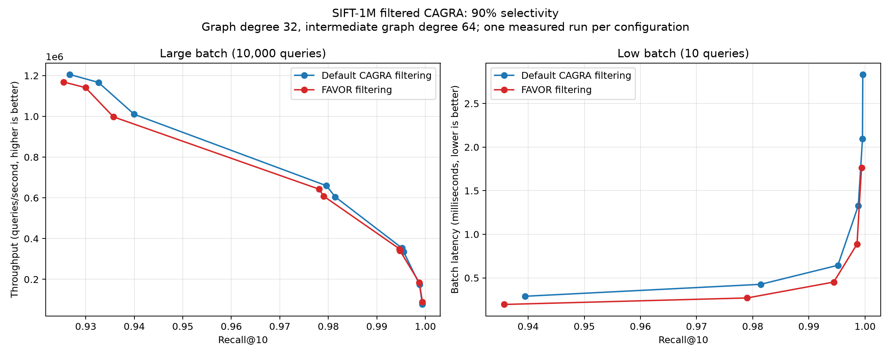

** GIST-1M

At 1%, FAVOR raises maximum recall by 0.060, but neither method reaches 0.90.
From 10% through 90%, maximum recall differs by less than 0.007. FAVOR is
slightly faster at the measured 0.90 and 0.95 QPS points and usually has lower
latency. Absolute GIST throughput should be interpreted with the repeated-query
caveat described above.

#+CAPTION: GIST-1M Pareto frontier at 1% selectivity.
#+ATTR_ORG: :width 1200
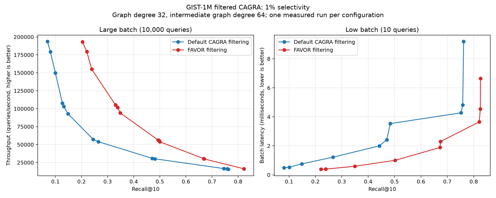

#+CAPTION: GIST-1M Pareto frontier at 10% selectivity.
#+ATTR_ORG: :width 1200
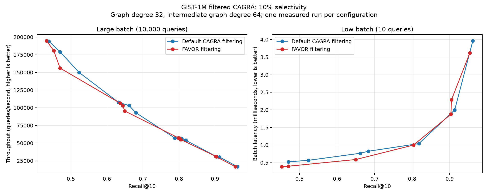

#+CAPTION: GIST-1M Pareto frontier at 50% selectivity.
#+ATTR_ORG: :width 1200
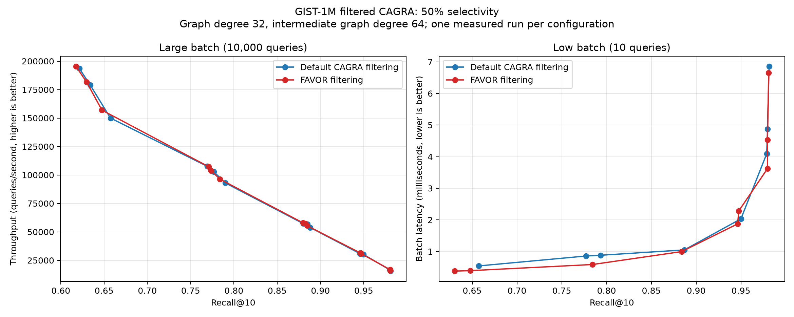

#+CAPTION: GIST-1M Pareto frontier at 90% selectivity.
#+ATTR_ORG: :width 1200
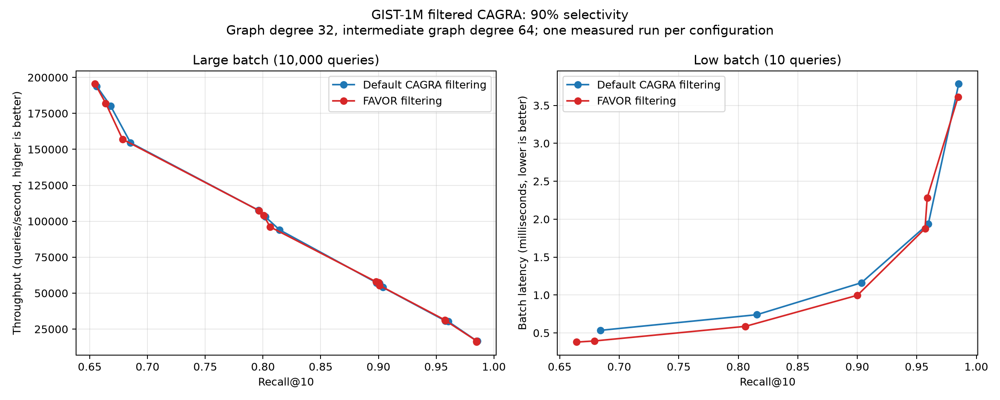

** BIGANN-1M

At 1%, FAVOR reaches 0.95282 recall and 109,974 QPS, while default cannot reach
0.90. At 10%, FAVOR cannot reach even 0.90 recall. At 50%, FAVOR eventually
reaches high recall but requires enough work that its QPS is approximately
half of default. At 90%, the methods converge in recall and FAVOR remains
roughly 8-9% slower in throughput, although it has lower low-batch latency.

#+CAPTION: BIGANN-1M Pareto frontier at 1% selectivity.
#+ATTR_ORG: :width 1200
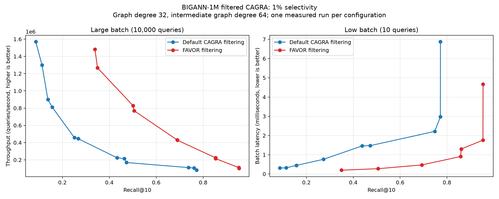

#+CAPTION: BIGANN-1M Pareto frontier at 10% selectivity.
#+ATTR_ORG: :width 1200
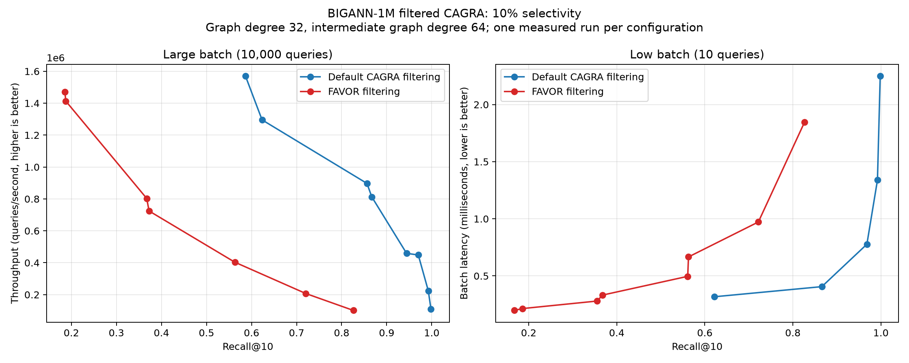

#+CAPTION: BIGANN-1M Pareto frontier at 50% selectivity.
#+ATTR_ORG: :width 1200
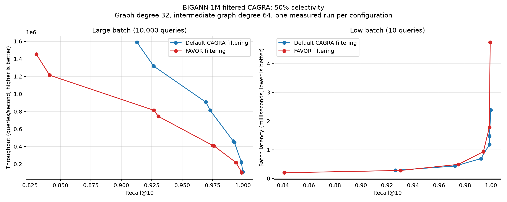

#+CAPTION: BIGANN-1M Pareto frontier at 90% selectivity.
#+ATTR_ORG: :width 1200
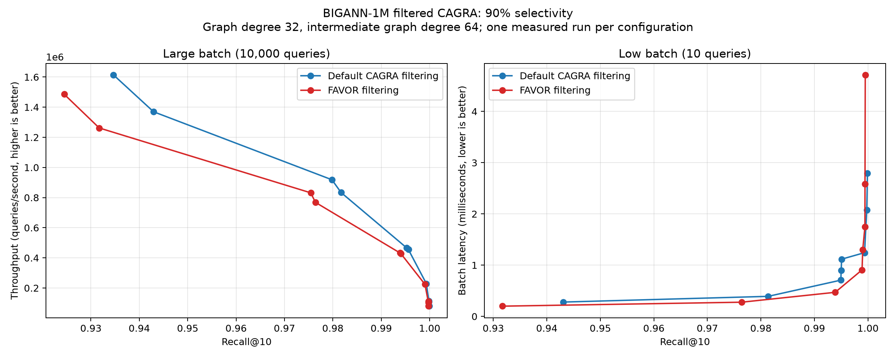

** BIGANN-10M

The 10M result reinforces the scale sensitivity of the static penalty. FAVOR
still wins at 1%, reaching 0.91130 recall when default reaches only 0.78604.
At 10%, FAVOR is limited to 0.70444 recall. At 50%, its 0.90-recall throughput
is less than half of default. By 90% selectivity both methods again reach high
recall, with FAVOR approximately 10% slower at the 0.90 target.

#+CAPTION: BIGANN-10M Pareto frontier at 1% selectivity.
#+ATTR_ORG: :width 1200
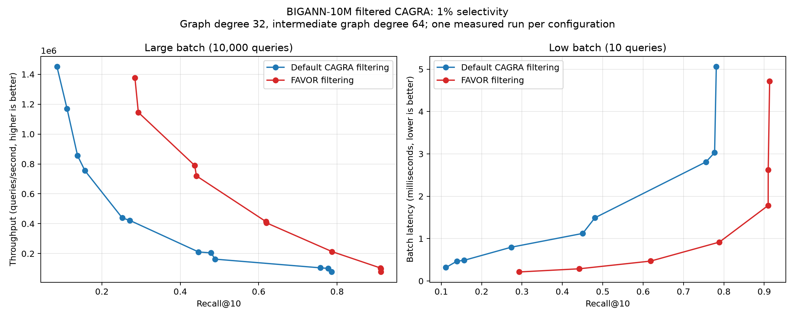

#+CAPTION: BIGANN-10M Pareto frontier at 10% selectivity.
#+ATTR_ORG: :width 1200
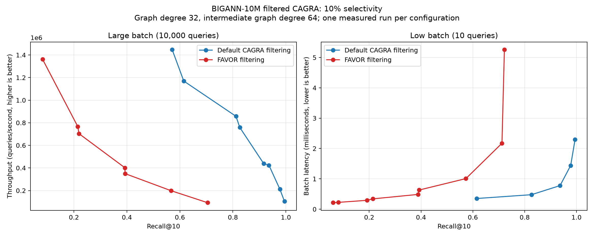

#+CAPTION: BIGANN-10M Pareto frontier at 50% selectivity.
#+ATTR_ORG: :width 1200
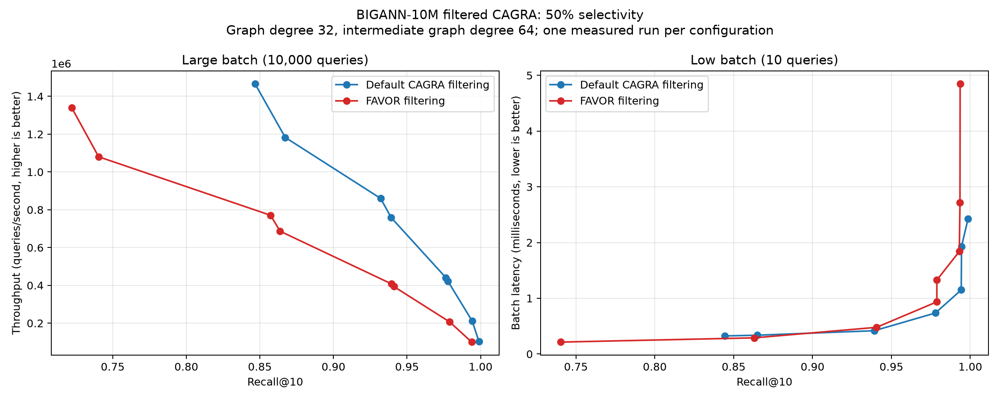

#+CAPTION: BIGANN-10M Pareto frontier at 90% selectivity.
#+ATTR_ORG: :width 1200
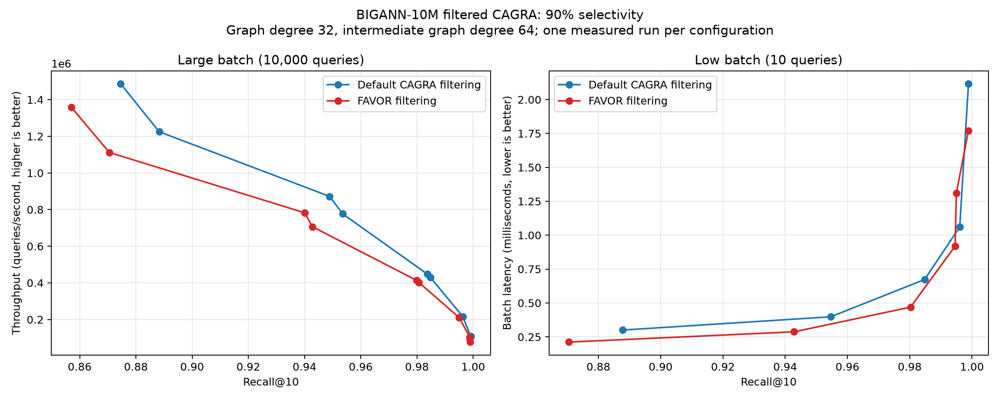

** MSTuring-1M

Neither method reaches 0.90 at 1%, and FAVOR has lower maximum recall. At
10-90%, FAVOR's maximum recall is about 0.001-0.010 below default, but it
provides approximately 5% higher QPS at the 0.90 target and lower low-batch
latency. The method therefore gives a small efficiency gain only when that
recall ceiling is acceptable.

#+CAPTION: MSTuring-1M Pareto frontier at 1% selectivity.
#+ATTR_ORG: :width 1200
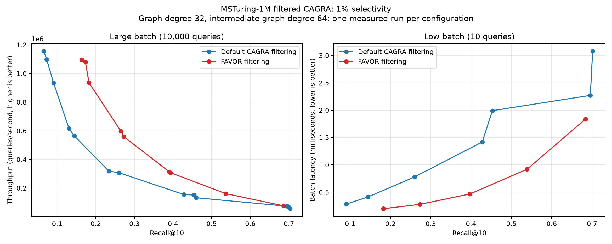

#+CAPTION: MSTuring-1M Pareto frontier at 10% selectivity.
#+ATTR_ORG: :width 1200
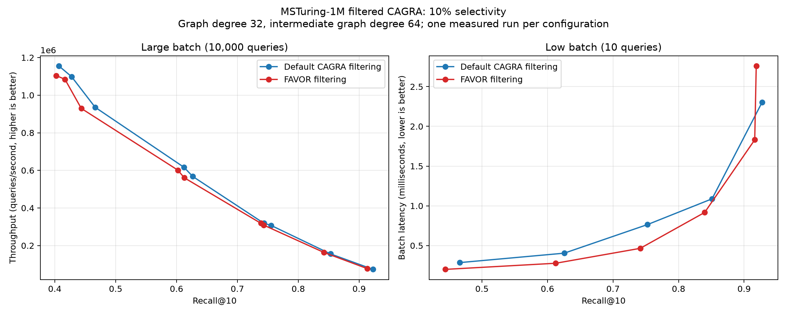

#+CAPTION: MSTuring-1M Pareto frontier at 50% selectivity.
#+ATTR_ORG: :width 1200
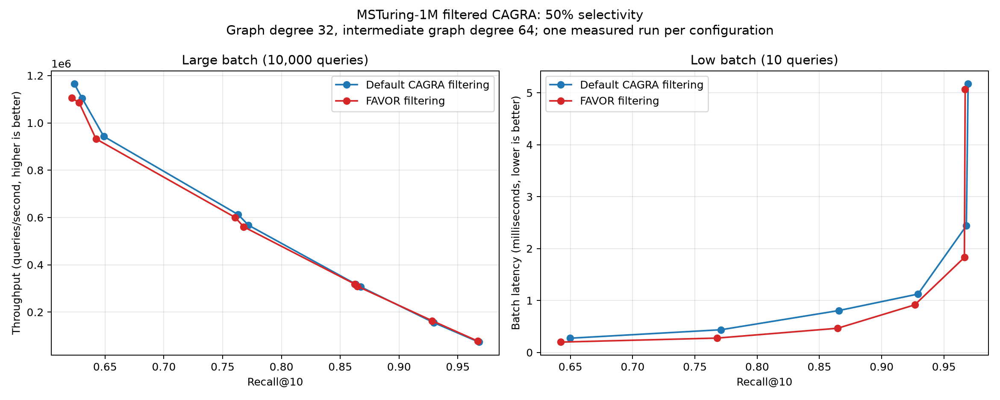

#+CAPTION: MSTuring-1M Pareto frontier at 90% selectivity.
#+ATTR_ORG: :width 1200
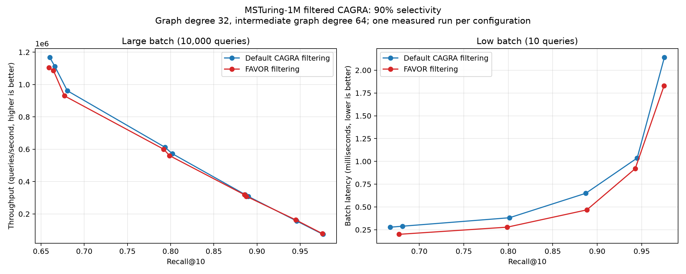

** MSTuring-10M

Scaling MSTuring from 1M to 10M does not create a BIGANN-like failure. The 1%
recall remains approximately equal and low for both methods. From 10% onward,
FAVOR again gives approximately 3-5% higher QPS at 0.90 recall and lower
latency, with a small maximum-recall deficit. The qualitative behavior is
stable across the two scales.

#+CAPTION: MSTuring-10M Pareto frontier at 1% selectivity.
#+ATTR_ORG: :width 1200
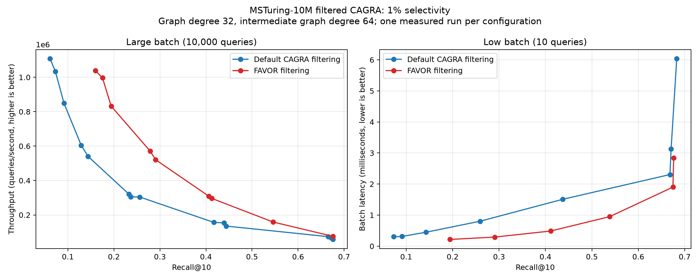

#+CAPTION: MSTuring-10M Pareto frontier at 10% selectivity.
#+ATTR_ORG: :width 1200
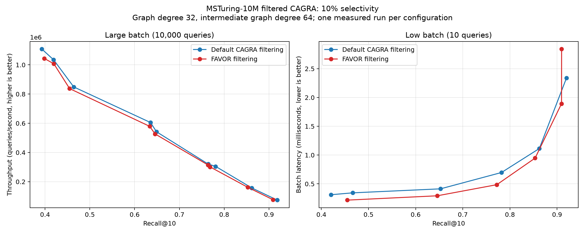

#+CAPTION: MSTuring-10M Pareto frontier at 50% selectivity.
#+ATTR_ORG: :width 1200
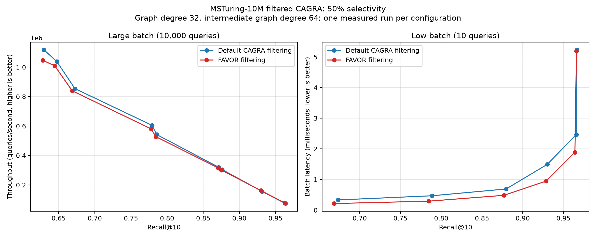

#+CAPTION: MSTuring-10M Pareto frontier at 90% selectivity.
#+ATTR_ORG: :width 1200
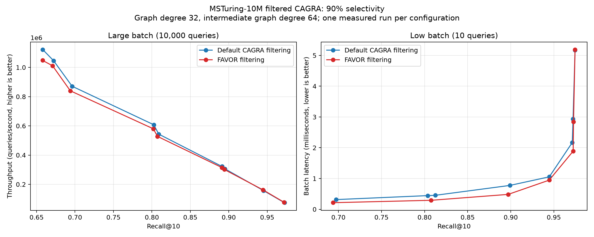

* One-to-eight-percent crossover appendix

The focused threshold sweep fixes =itopk=512= and varies
=search_width={1,2,4}=. Consequently, its maximum recalls should not be mixed
with maxima from the full core grid. It is intended to locate the
selectivity-dependent crossover under one common high-recall configuration
family.

| Dataset       | Method  | 1%      | 2%      | 3%      | 4%      | 5%      | 6%      | 7%      | 8%      |
|---------------+---------+---------+---------+---------+---------+---------+---------+---------+---------|
| SIFT-1M       | Default | 0.78369 | 0.94380 | 0.95620 | 0.95466 | 0.96607 | 0.98448 | 0.99278 | 0.99662 |
| SIFT-1M       | FAVOR   | 0.95473 | 0.98331 | 0.98958 | 0.99027 | 0.98999 | 0.99001 | 0.98983 | 0.98963 |
| GIST-1M       | Default | 0.76210 | 0.87670 | 0.89970 | 0.91930 | 0.93806 | 0.94830 | 0.95380 | 0.95750 |
| GIST-1M       | FAVOR   | 0.82210 | 0.88540 | 0.91140 | 0.92610 | 0.93890 | 0.94540 | 0.94930 | 0.95220 |
| BIGANN-1M     | Default | 0.77246 | 0.94056 | 0.95506 | 0.95252 | 0.96278 | 0.98213 | 0.99094 | 0.99556 |
| BIGANN-1M     | FAVOR   | 0.95282 | 0.96626 | 0.88743 | 0.06774 | 0.27990 | 0.46551 | 0.61377 | 0.70809 |
| BIGANN-10M    | Default | 0.78604 | 0.93135 | 0.94496 | 0.94720 | 0.96542 | 0.98091 | 0.98844 | 0.99190 |
| BIGANN-10M    | FAVOR   | 0.91130 | 0.91499 | 0.64075 | 0.02599 | 0.14810 | 0.31172 | 0.44966 | 0.55831 |
| MSTuring-1M   | Default | 0.70319 | 0.79401 | 0.83008 | 0.86179 | 0.88248 | 0.89582 | 0.90563 | 0.91250 |
| MSTuring-1M   | FAVOR   | 0.68618 | 0.76991 | 0.82302 | 0.85268 | 0.87130 | 0.88335 | 0.89417 | 0.90164 |
| MSTuring-10M  | Default | 0.67580 | 0.78199 | 0.81943 | 0.84055 | 0.86982 | 0.88717 | 0.89868 | 0.90712 |
| MSTuring-10M  | FAVOR   | 0.67602 | 0.77060 | 0.82122 | 0.84720 | 0.86748 | 0.87939 | 0.88961 | 0.89773 |

The float SIFT and GIST datasets behave smoothly. FAVOR leads at the sparsest
selectivities and then converges with default. MSTuring also behaves smoothly,
but does not show an initial FAVOR advantage. BIGANN is qualitatively
different: FAVOR is useful at 1-2%, drops below 0.90 recall at 3%, and reaches
its minimum around 4%. Increasing selectivity then produces a partial recovery,
but not enough to match default within the 1-8% window.

The following figures summarize the QPS crossover around a 0.90 recall target.
The underlying per-selectivity Pareto plots remain in each dataset's =plots/=
directory.

#+CAPTION: SIFT-1M 1-8% crossover at the 0.90-recall target.
#+ATTR_ORG: :width 1000
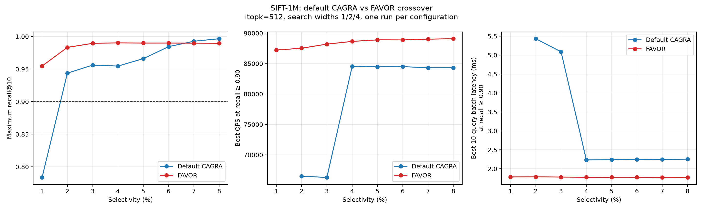

#+CAPTION: GIST-1M 1-8% crossover at the 0.90-recall target.
#+ATTR_ORG: :width 1000
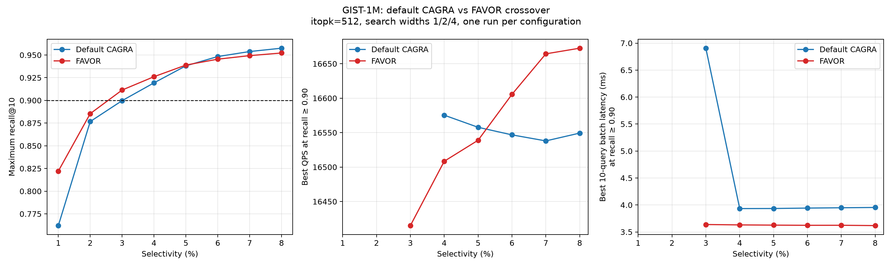

#+CAPTION: BIGANN-1M 1-8% crossover at the 0.90-recall target.
#+ATTR_ORG: :width 1000
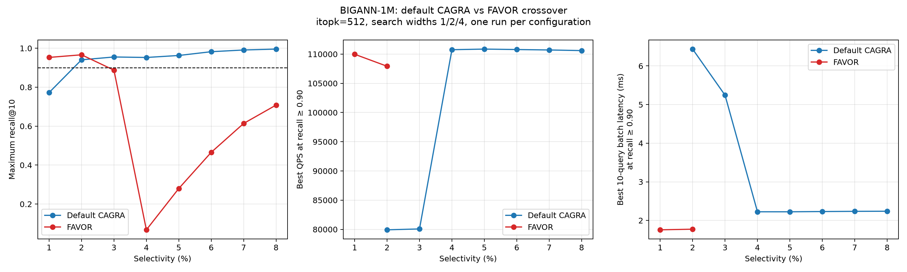

#+CAPTION: BIGANN-10M 1-8% crossover at the 0.90-recall target.
#+ATTR_ORG: :width 1000
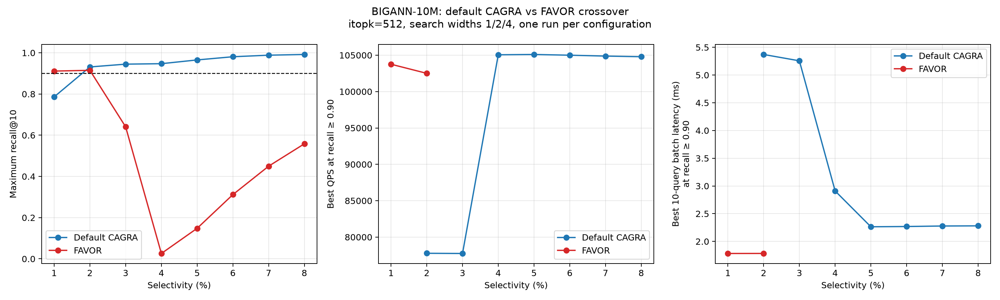

#+CAPTION: MSTuring-1M 1-8% crossover at the 0.90-recall target.
#+ATTR_ORG: :width 1000
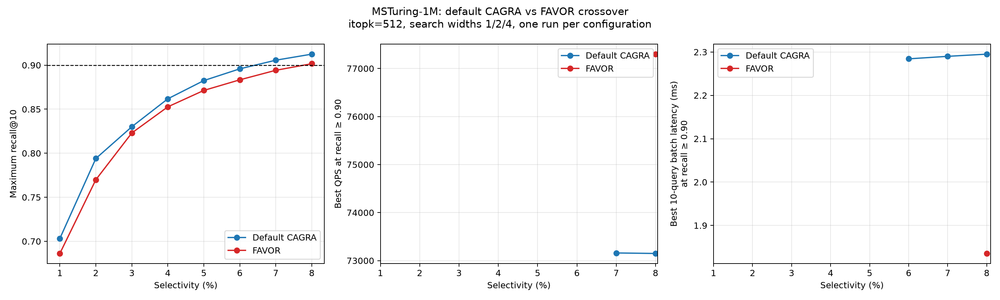

#+CAPTION: MSTuring-10M 1-8% crossover at the 0.90-recall target.
#+ATTR_ORG: :width 1000
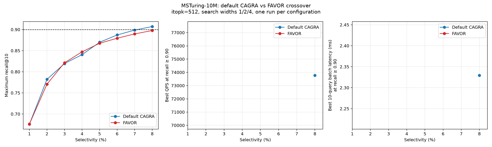

Equivalent 0.95-target summaries are available under
[[file:results_crossover_r95/][=results_crossover_r95/=]]. At that stricter
target, more sparse-filter configurations are reported as unreachable rather
than assigned an artificial throughput value.

* Scale comparison and interpretation

** BIGANN scale sensitivity

BIGANN-1M and BIGANN-10M use the same vector family and =uint8= distance path,
but independent graphs and delta-d sidecars. The shared qualitative failure at
3-4% shows that database size alone is not its cause. Scale does amplify it:
at 10% the FAVOR maximum falls from 0.82615 on 1M rows to 0.70444 on 10M rows.

Separate penalty diagnostics show that FAVOR with =D=0= can exceed 0.98 recall
on both BIGANN scales, while increasing search width or iteration count does
not fix the normal-penalty result. The graph and final filtering path can
therefore support high recall; the static penalty changes traversal ordering
so that useful passing nodes are not discovered.

** MSTuring scale stability

MSTuring-1M and MSTuring-10M have nearly identical qualitative behavior. FAVOR
does not improve 1% recall, but produces modest QPS and latency improvements at
10-90% when compared at reachable recall targets. Moving to 10M rows does not
cause a discontinuity. This contrasts with BIGANN and shows that the static
formula's behavior depends on dataset and graph geometry, not only scale or
selectivity.

** Why maximum recall and Pareto speed must both be reported

A method can be faster at a reachable target while still having a lower recall
ceiling. MSTuring is the clearest example: FAVOR is usually faster at 0.90
recall but finishes with slightly lower maximum recall. BIGANN at 10% is more
severe: FAVOR appears computationally fast at its low-recall points, but cannot
reach the operating targets at all. QPS comparisons without reachability would
therefore be misleading.

* Conclusion

The committed FAVOR implementation demonstrates that fused penalty scoring can
substantially improve CAGRA search for highly selective filters without a
separate filter-processing kernel. That improvement is real on SIFT and
BIGANN at 1%, and remains useful on BIGANN at 2%.

The static HNSW-derived penalty is not robust across CAGRA datasets. SIFT and
GIST transition smoothly toward default behavior, MSTuring provides only
modest efficiency gains with a small recall deficit, and BIGANN undergoes a
severe non-monotonic recall collapse. The committed implementation should
therefore be treated as an experimental, opt-in search mode. A conservative
cross-dataset selector is:

#+begin_src text
selectivity <= 2%  -> FAVOR may be used
selectivity >= 3%  -> use default CAGRA
#+end_src

This rule protects against every observed BIGANN failure but intentionally
forgoes some additional FAVOR benefit on SIFT. A more permissive selector
requires dataset-specific calibration or a more robust CAGRA-specific penalty.

* Reproduction and source data

The benchmark procedure, graph construction, delta-d calculation, and dataset
preparation commands are documented in [[file:README.org][README.org]].

Core raw results and figures:

- [[file:results/][SIFT-1M]]
- [[file:results_gist/][GIST-1M]]
- [[file:results_bigann_1m/][BIGANN-1M]]
- [[file:results_bigann_10m/][BIGANN-10M]]
- [[file:results_msturing_1m/][MSTuring-1M]]
- [[file:results_msturing_10m/][MSTuring-10M]]

The direct committed-versus-working-static comparison is under
[[file:results_current_vs_committed/][=results_current_vs_committed/=]].
