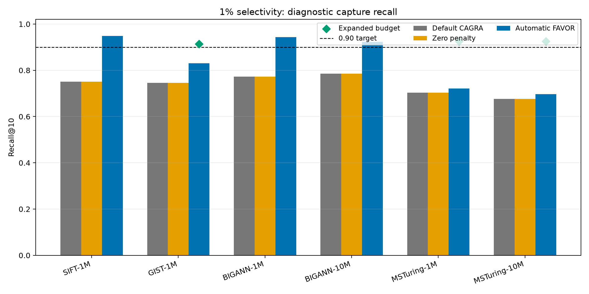
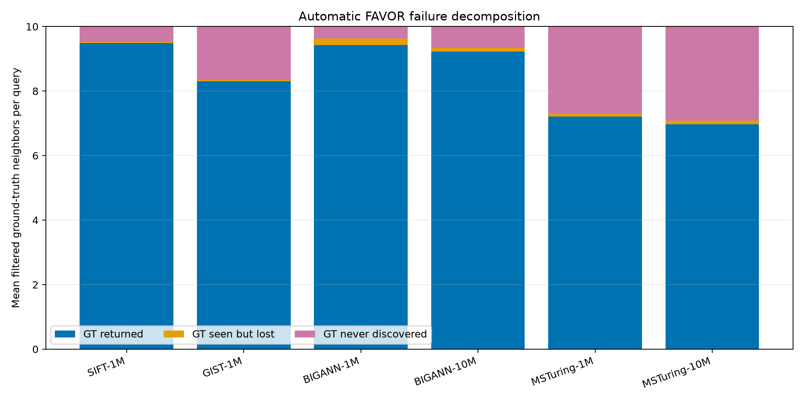
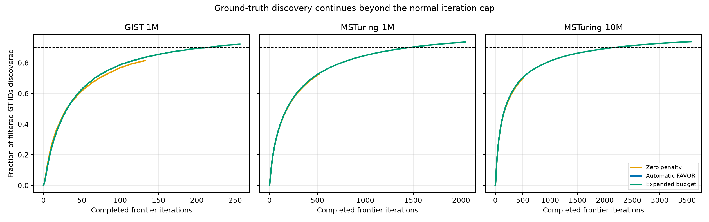

#+title: FAVOR SINGLE_CTA Deep Traversal Diagnostics

* Scope

This report diagnoses the 1% selectivity cases in which automatic retention-safe FAVOR
does not reach 0.90 recall. All captures use batch size 10,000, k=10, itopk=512, and the
existing degree-32 CAGRA graphs. Instrumented timing is intentionally invalid; these runs
measure traversal state and recall, not QPS or latency.

* Result

The primary failure is exhaustion of CAGRA's derived iteration budget, not an oversized
penalty or a full visited hash. Every automatic-FAVOR query in all six datasets stops at
=MAX_WITH_UNEXPANDED_FRONTIER=, and every exact =candidate_hash_full= counter is zero.
Zeroing the penalty does not repair the failing datasets. Giving the same method more
iterations raises GIST-1M, MSTuring-1M, and MSTuring-10M above 0.90 recall.

#+caption: Recall for the normal and control traversals. Diamonds are expanded-budget controls.

The output-loss component is small. Most missing ground-truth IDs were never discovered
before the cap; they were not discovered and later evicted from the fused frontier/result
buffer.

#+caption: Final correct results, discovered-but-lost GT IDs, and undiscovered GT IDs.

The cumulative discovery curves remain upward-sloping at the normal cap and continue to
improve under the expanded control, directly demonstrating useful unfinished traversal.

#+caption: Cumulative filtered-ground-truth discovery by iteration.

* Summary values

| Dataset | Current recall | GT seen / 10 | Expanded recall | Iterations current -> expanded |
|-
| SIFT-1M | 0.94845 | 9.530 | n/a | n/a |
| GIST-1M | 0.83008 | 8.345 | 0.91386 | 133 -> 256 |
| BIGANN-1M | 0.94318 | 9.633 | n/a | n/a |
| BIGANN-10M | 0.92304 | 9.337 | n/a | n/a |
| MSTuring-1M | 0.72162 | 7.298 | 0.92541 | 517 -> 2048 |
| MSTuring-10M | 0.69661 | 7.082 | 0.92553 | 518 -> 3584 |

For GIST-1M, MSTuring-1M, and MSTuring-10M, zero penalty changes recall by -0.0849,
-0.0184, and -0.0208 respectively relative to automatic FAVOR. Expanded traversal changes
it by +0.0838, +0.2038, and +0.2289. The evidence therefore rejects penalty suppression
as the primary explanation for these 1% failures. Penalty effects remain query-specific:
zero penalty improves 10.7% of GIST queries but worsens 49.9%, so it is not a robust fix.

* Selected low-recall traces

These deliberately selected worst-case examples are illustrative, not dataset averages:

| Dataset / query | Current recall (seen) | Zero recall (seen) | Expanded recall (seen) |
|-
| GIST-1M / 211 | 0.3 (3) | 0.5 (5) | 0.7 (7) |
| MSTuring-1M / 506 | 0.1 (1) | 0.1 (1) | 0.8 (8) |
| MSTuring-10M / 3492 | 0.0 (0) | 0.0 (0) | 0.8 (8) |

MSTuring-10M uses 3,584 rather than the requested 4,096 expanded iterations. At 4,096,
CAGRA crosses a power-of-two visited-hash boundary and requests 10.5 GB for nq=10,000,
above the 6.3 GB benchmark allocation limit. A fill target of 0.89 and 3,584 iterations
keep the exact hash-full count at zero while using the 5.2 GB allocation tier.

* Reproduce and inspect

#+begin_src sh
./benchmarks/favor/run_favor_trace_diagnostics.py --phase summary --resume
./benchmarks/favor/run_favor_trace_diagnostics.py --phase deep --resume
python benchmarks/favor/analyze_favor_trace_diagnostics.py \
  benchmarks/favor/results_deep_traversal_diagnostics
#+end_src

See [[file:TRACE_PARSING_AND_INTERPRETATION.org][TRACE_PARSING_AND_INTERPRETATION.org]] for the schema, commands,
iteration convention, and query-level decision tree. Full binary traces are compressed and
git-ignored; manifests, per-query summaries, selected-query maps, aggregate CSV, and figures
are compact reproducible artifacts.
