#+TITLE: Fair FAVOR Retention Results: SINGLE_CTA and MULTI_CTA
#+DATE: 2026-08-05
#+OPTIONS: toc:2 num:nil

All figures are fair search-only measurements on NVIDIA L4. They compare Default CAGRA, fixed retention (lambda=1, rho=0.5), and automatic retention (lambda=1, rho=auto).

* SINGLE_CTA

** GIST-1M

#+CAPTION: SINGLE_CTA, GIST-1M, 1% selectivity
#+ATTR_ORG: :width 1100
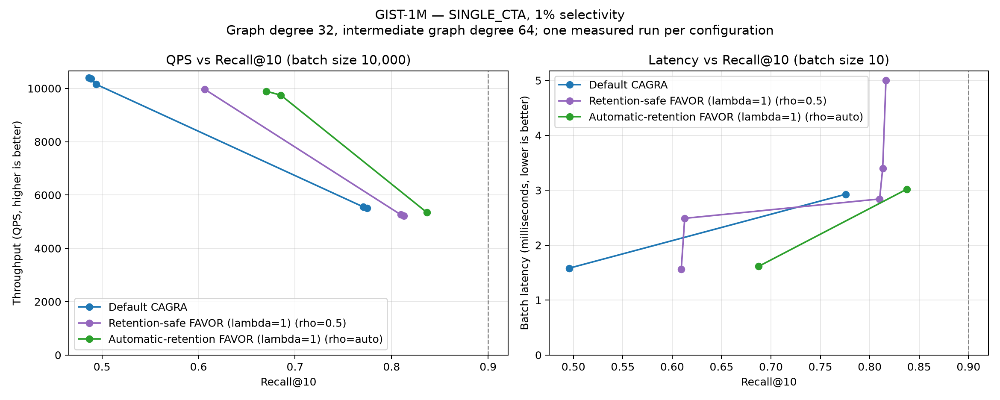

#+CAPTION: SINGLE_CTA, GIST-1M, 10% selectivity
#+ATTR_ORG: :width 1100
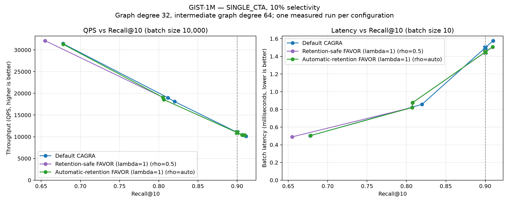

#+CAPTION: SINGLE_CTA, GIST-1M, 50% selectivity
#+ATTR_ORG: :width 1100

#+CAPTION: SINGLE_CTA, GIST-1M, 90% selectivity
#+ATTR_ORG: :width 1100
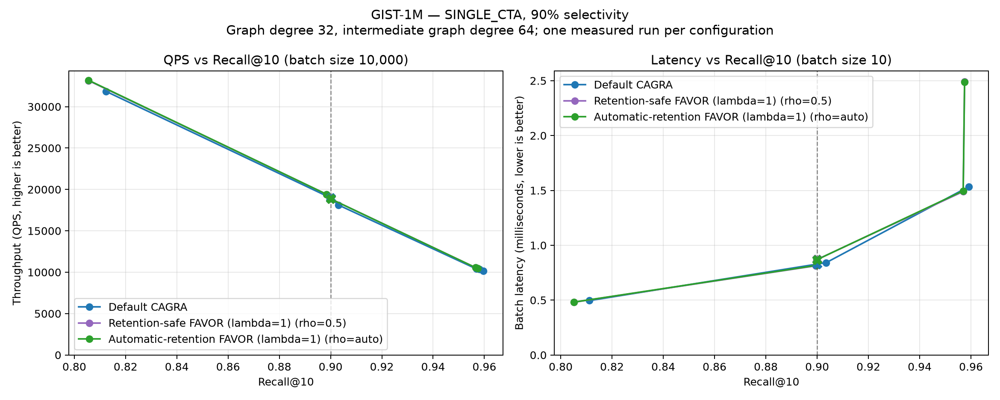

** BIGANN-1M

#+CAPTION: SINGLE_CTA, BIGANN-1M, 1% selectivity
#+ATTR_ORG: :width 1100
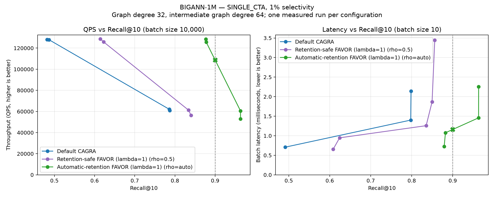

#+CAPTION: SINGLE_CTA, BIGANN-1M, 10% selectivity
#+ATTR_ORG: :width 1100
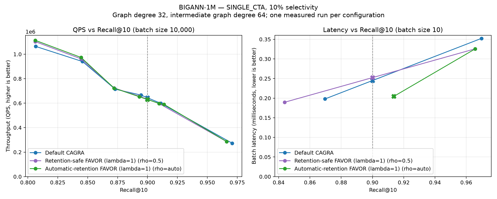

#+CAPTION: SINGLE_CTA, BIGANN-1M, 50% selectivity
#+ATTR_ORG: :width 1100
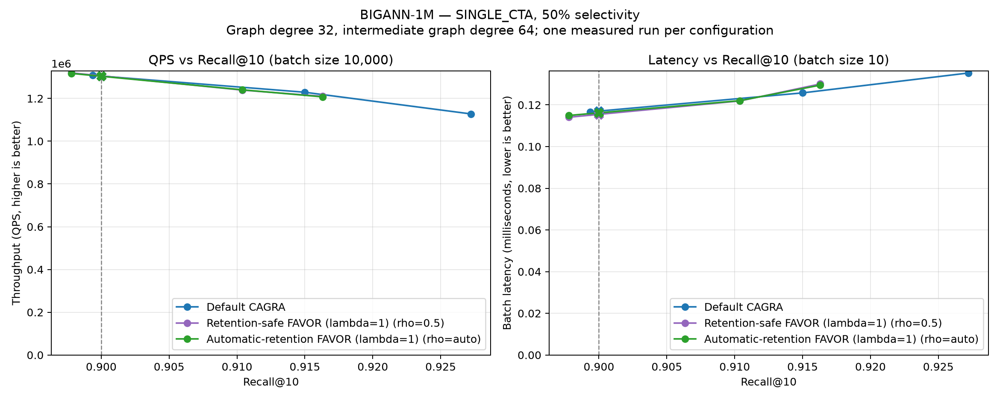

#+CAPTION: SINGLE_CTA, BIGANN-1M, 90% selectivity
#+ATTR_ORG: :width 1100
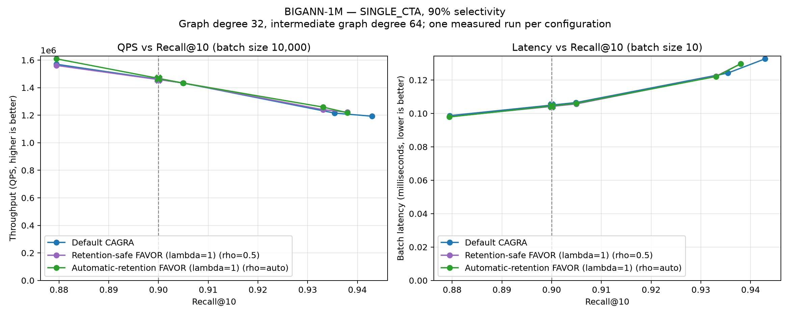

** MSTuring-1M

#+CAPTION: SINGLE_CTA, MSTuring-1M, 1% selectivity
#+ATTR_ORG: :width 1100
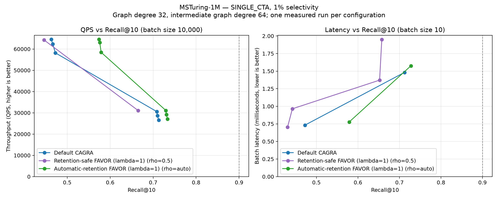

#+CAPTION: SINGLE_CTA, MSTuring-1M, 10% selectivity
#+ATTR_ORG: :width 1100
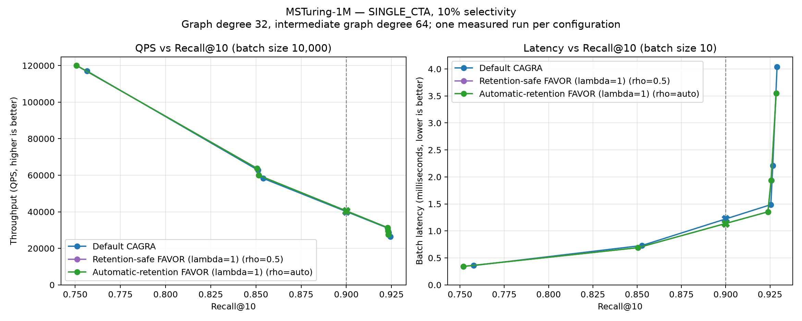

#+CAPTION: SINGLE_CTA, MSTuring-1M, 50% selectivity
#+ATTR_ORG: :width 1100
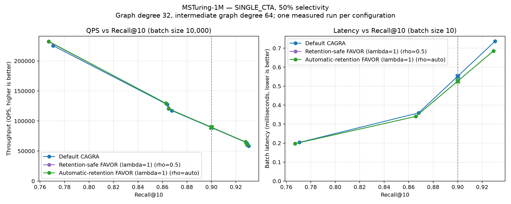

#+CAPTION: SINGLE_CTA, MSTuring-1M, 90% selectivity
#+ATTR_ORG: :width 1100
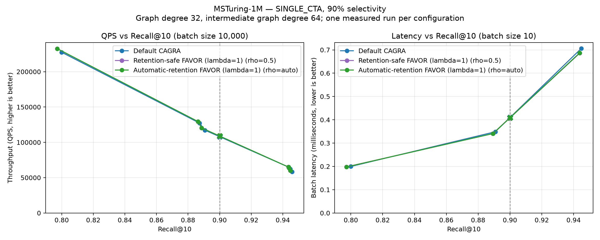

* MULTI_CTA

** GIST-1M

#+CAPTION: MULTI_CTA, GIST-1M, 1% selectivity
#+ATTR_ORG: :width 1100
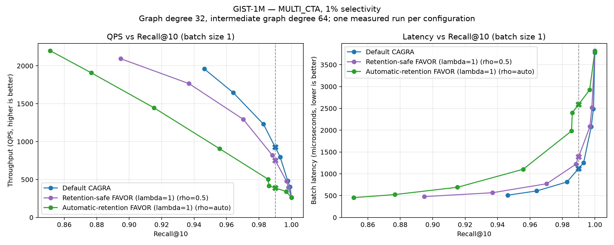

#+CAPTION: MULTI_CTA, GIST-1M, 10% selectivity
#+ATTR_ORG: :width 1100
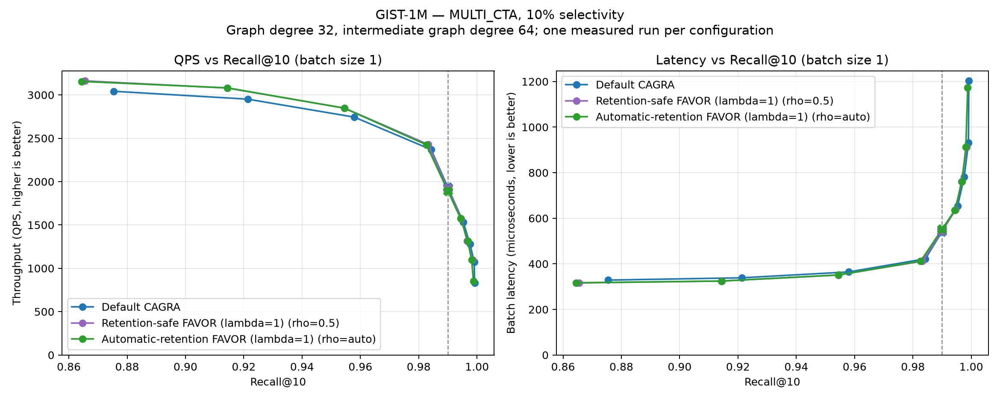

#+CAPTION: MULTI_CTA, GIST-1M, 50% selectivity
#+ATTR_ORG: :width 1100
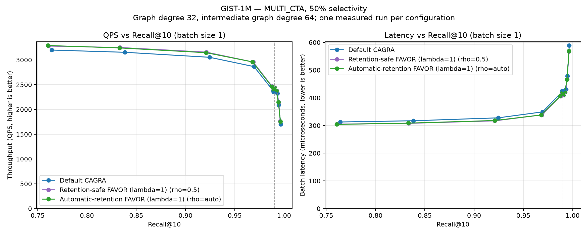

#+CAPTION: MULTI_CTA, GIST-1M, 90% selectivity
#+ATTR_ORG: :width 1100
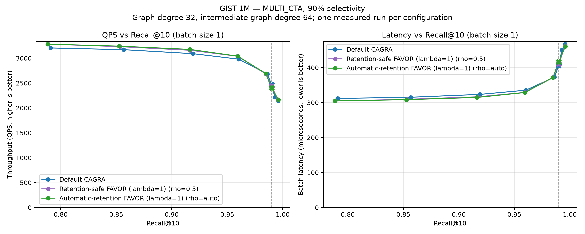

** BIGANN-1M

#+CAPTION: MULTI_CTA, BIGANN-1M, 1% selectivity
#+ATTR_ORG: :width 1100
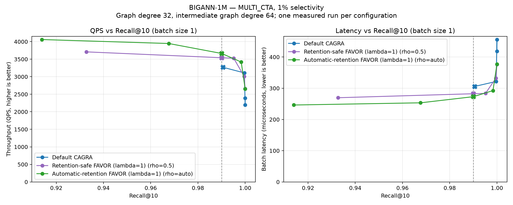

#+CAPTION: MULTI_CTA, BIGANN-1M, 10% selectivity
#+ATTR_ORG: :width 1100
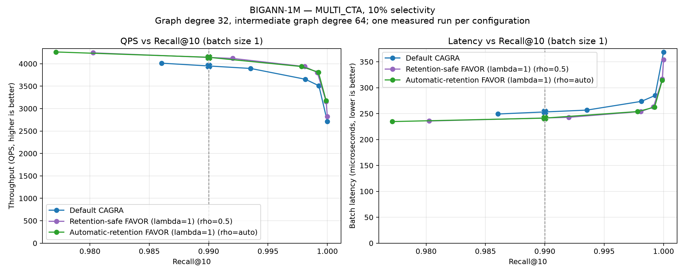

#+CAPTION: MULTI_CTA, BIGANN-1M, 50% selectivity
#+ATTR_ORG: :width 1100
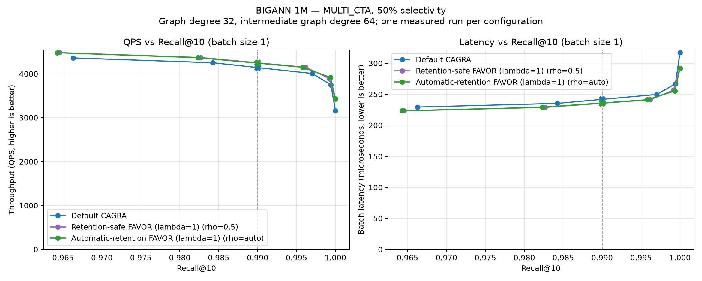

#+CAPTION: MULTI_CTA, BIGANN-1M, 90% selectivity
#+ATTR_ORG: :width 1100
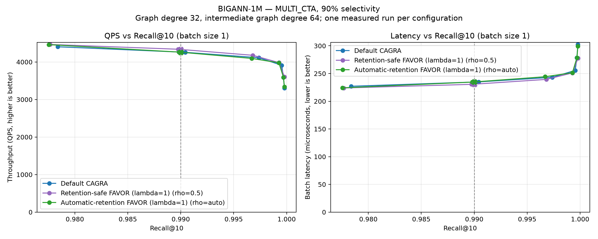

** MSTuring-1M

#+CAPTION: MULTI_CTA, MSTuring-1M, 1% selectivity
#+ATTR_ORG: :width 1100
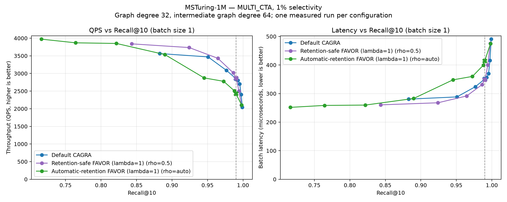

#+CAPTION: MULTI_CTA, MSTuring-1M, 10% selectivity
#+ATTR_ORG: :width 1100
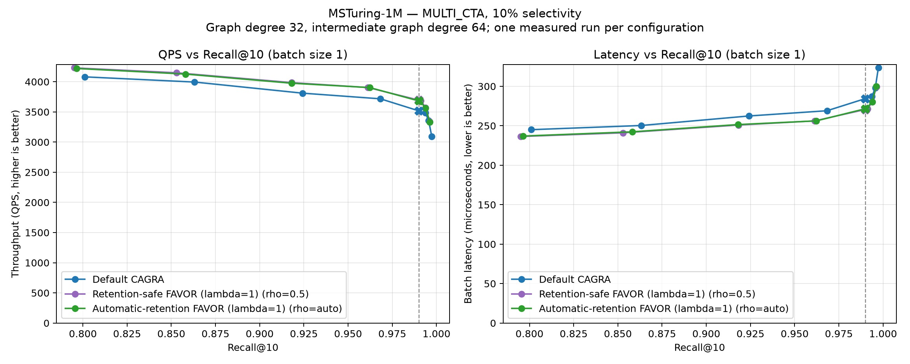

#+CAPTION: MULTI_CTA, MSTuring-1M, 50% selectivity
#+ATTR_ORG: :width 1100
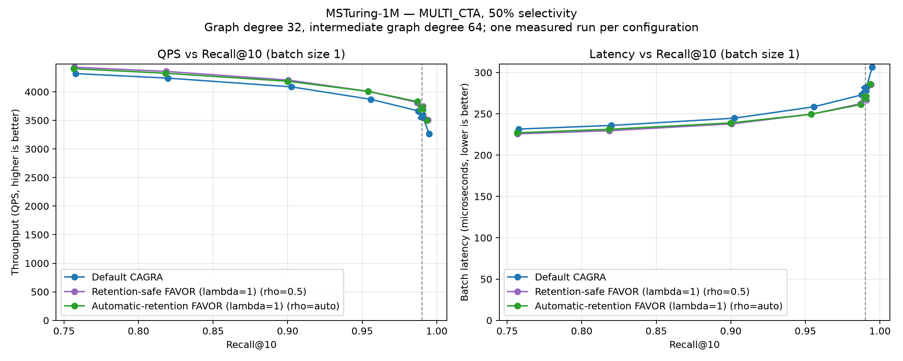

#+CAPTION: MULTI_CTA, MSTuring-1M, 90% selectivity
#+ATTR_ORG: :width 1100
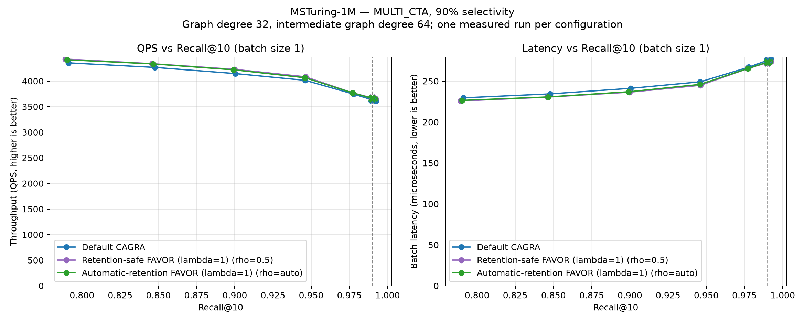
