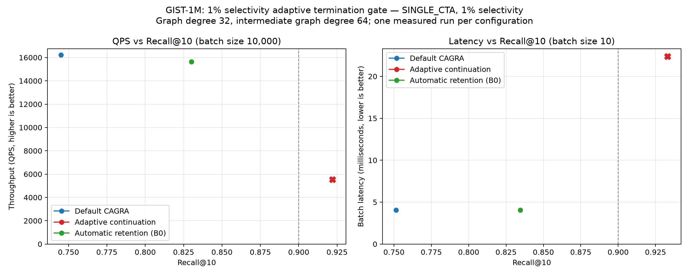
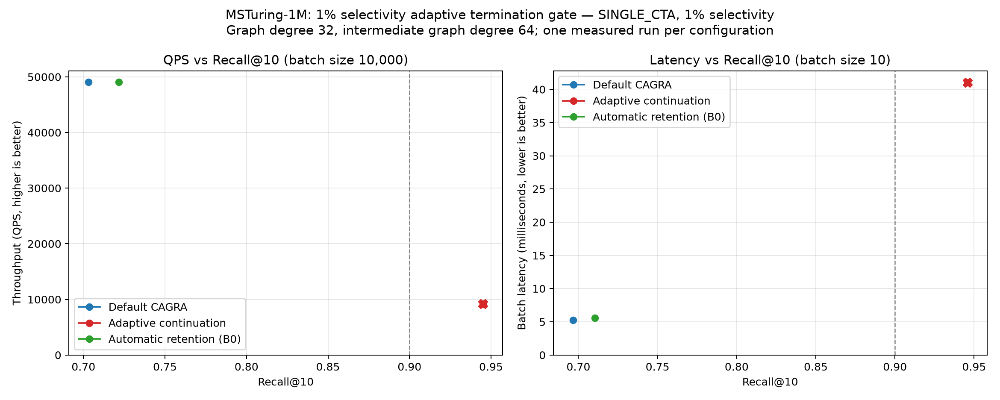
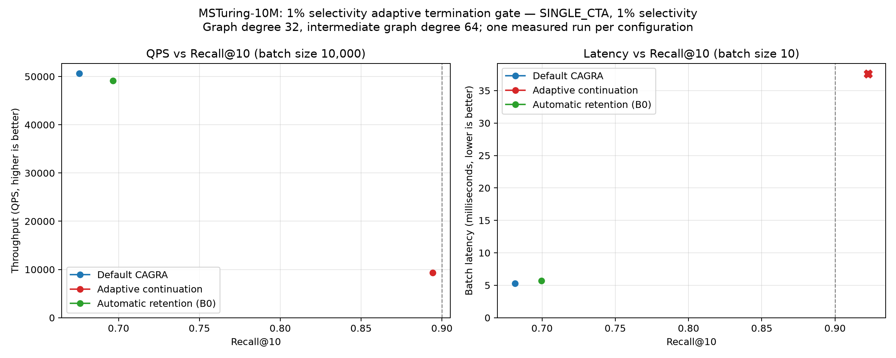

#+title: Sparse Adaptive Termination for SINGLE_CTA FAVOR
#+date: 2026-08-01
#+options: toc:2 num:t

* Executive result

This experiment tested whether sparse SINGLE_CTA FAVOR should continue beyond CAGRA's automatic
iteration budget until a FAVOR-inspired, query-local convergence condition is satisfied. The
condition recovered Recall@10 from 0.8300 to 0.9220 on GIST-1M and from 0.7216 to 0.9450 on
MSTuring-1M at 1% selectivity. It reached only 0.8942 on MSTuring-10M and reduced the measured
10,000-query QPS substantially on all three focused workloads. It therefore fails the rollout
gate and is retained only as an explicit internal experiment; normal CAGRA and FAVOR behavior is
unchanged.

The planned all-dataset Pareto sweep was intentionally not run. The agreed focused gate required
Recall@10 >= 0.90 on all three failures and higher QPS than default CAGRA near that recall. The
MSTuring-10M recall miss and the fixed-cell throughput regressions make a larger sweep unjustified.

* Method

** Why a new termination condition was tested

At 1% selectivity, the existing automatic-retention kernel frequently reaches CAGRA's derived
=max_iterations= while useful unexpanded entries remain in its fused candidate/result buffer.
Larger fixed budgets recover recall, but make every query pay the worst-case cost. Reference FAVOR
uses separate HNSW candidate and result queues; CAGRA has one fused buffer, so that condition cannot
be copied literally.

The experiment treats a short sorted prefix of CAGRA's existing buffer as a virtual result set and
keeps the remainder as frontier reserve. It adds neither a second queue nor a result accumulator.

** Query-local condition

For query =q=:

#+begin_example
m = 32 * ceil((2*k + 1) / 32)

converged(q) =
    Vq == m
    AND Pq >= ceil(m / 2)
    AND frontier_best(q) > boundary(q)
#+end_example

Variables:

- =k= is the requested output count. These runs use =k=10=.
- =m= is the warp-aligned virtual-result prefix size. For =k=10=, =m=32=.
- =Vq= is the number of valid entries in the first =m= sorted buffer positions.
- =Pq= is the number of those entries that pass the query's bitset filter. For =m=32=, at least
  16 must pass.
- =boundary(q)= is the penalized distance at rank =m-1=.
- =frontier_best(q)= is the penalized distance of the nearest unexpanded entry.

The strict distance comparison handles equal-distance candidates conservatively. The condition is
checked only after the original automatic budget =B0=, so it cannot terminate earlier than the
current automatic method.

** Safety ceiling

Continuation is bounded as follows:

#+begin_example
X = max(ceil(T / w), ceil(k / (s*w)))
Bhard = max(B0, L + 4*X)
#+end_example

- =T= is CAGRA's physical =itopk= size; these runs use =T=512=.
- =w= is =search_width=, the number of parents expanded per CAGRA iteration.
- =s= is selectivity, equal to =1 - filtering_rate=.
- =L= is CAGRA's graph-depth allowance derived from dataset size and graph degree.
- =B0= is CAGRA's existing automatically resolved iteration limit.
- =Bhard= is the experimental safety limit. The factor four is a runtime guard, not a convergence
  claim.

The extension is eligible only for bitset-filtered SINGLE_CTA automatic-retention FAVOR when the
user left =max_iterations= at zero, =s < 0.10=, and =s*T < k=. An explicitly configured iteration
limit remains strict.

** GPU implementation

The FAVOR JIT kernel reuses its existing parent-pickup pass: the first selected parent is already
the nearest unexpanded candidate. Warp 0 checks the 32-entry prefix with direct packed-bitset loads,
warp ballots, and population counts. The implementation adds no candidate buffer, post-processing
kernel, or new synchronization phase. New diagnostic stop codes distinguish query-local
convergence from the safety cap.

No public API was modified. Because the performance gate failed, activation defaults off and is
available only for reproduction through the internal
=CUVS_FAVOR_EXPERIMENTAL_ADAPTIVE_TERMINATION=1= environment switch.

* Focused benchmark results

All measurements use one serial run on the same NVIDIA A30, =k=10=, =itopk=512=, 1% selectivity,
degree-32 CAGRA graphs, a 10,000-query throughput workload, and a batch-10 latency workload. All
three methods were rerun with identical 0.1-second warmup and 0.2-second minimum benchmark time.
Latency cells report their own batch-10 recall because a ten-query sample is noisy.

| Dataset | Method | Throughput recall | QPS | Batch-10 recall | Batch latency (ms) |
|-
| GIST-1M | Default CAGRA | 0.7452 | 16,225 | 0.7514 | 4.037 |
| GIST-1M | Automatic retention at B0 | 0.8300 | 15,635 | 0.8345 | 4.070 |
| GIST-1M | Adaptive continuation | 0.9220 | 5,530 | 0.9330 | 22.384 |
| MSTuring-1M | Default CAGRA | 0.7032 | 49,102 | 0.6966 | 5.228 |
| MSTuring-1M | Automatic retention at B0 | 0.7216 | 49,102 | 0.7104 | 5.555 |
| MSTuring-1M | Adaptive continuation | 0.9450 | 9,204 | 0.9457 | 41.010 |
| MSTuring-10M | Default CAGRA | 0.6758 | 50,664 | 0.6815 | 5.295 |
| MSTuring-10M | Automatic retention at B0 | 0.6966 | 49,148 | 0.6996 | 5.674 |
| MSTuring-10M | Adaptive continuation | 0.8942 | 9,339 | 0.9225 | 37.584 |

The values are fixed-configuration observations, not claimed speedups at matched recall. Only the
adaptive points approach the target in these cells, while their much larger traversal cost makes
them unsuitable as the supported default.

#+caption: GIST-1M focused throughput and latency comparison; every y-axis starts at zero.

#+caption: MSTuring-1M focused throughput and latency comparison; every y-axis starts at zero.

#+caption: MSTuring-10M focused throughput and latency comparison; every y-axis starts at zero.

* Diagnostic interpretation

Instrumented 10,000-query captures were run on all six available dataset/scale combinations.
Diagnostic timings are invalid; the table is for traversal behavior only.

| Dataset | Recall@10 | Mean iterations | p50 / p90 / p99 iterations | Converged | Hit Bhard | Mean terminal passes | Hash-full events |
|-
| SIFT-1M | 0.9546 | 240.9 | 133 / 612 / 1,005 | 98.41% | 1.59% | 46.28 | 0 |
| GIST-1M | 0.9220 | 398.2 | 360 / 727 / 1,005 | 98.20% | 1.80% | 39.65 | 0 |
| BIGANN-1M | 0.9759 | 2,243.8 | 2,259 / 3,070 / 3,787 | 99.51% | 0.49% | 35.65 | 0 |
| BIGANN-10M | 0.9776 | 1,729.1 | 1,749 / 2,700 / 3,483 | 99.79% | 0.21% | 36.38 | 0 |
| MSTuring-1M | 0.9450 | 2,649.6 | 2,617 / 3,469 / 4,005 | 98.11% | 1.89% | 36.69 | 0 |
| MSTuring-10M | 0.8942 | 2,488.8 | 2,469 / 3,320 / 4,006 | 98.62% | 1.38% | 36.87 | 0 |

The condition does not merely run every query to =Bhard=: 98.1--99.8% stop by the virtual-prefix
condition. It nevertheless converges too late. The hard ceiling also sizes CAGRA's exact visited
hash before launch, so even queries that stop earlier pay for a larger per-query table. The
combination of deeper traversal and worst-case hash sizing explains the throughput loss.

The 32-entry virtual prefix requires 16 passing entries and finishes with roughly 36--46 passing
entries in the full =itopk= buffer. In contrast, applying the paper's 50%-of-=itopk= requirement
literally would require 256 passing entries for =T=512= and would be unusable for these captures.

* Reproduction

Build with all available CPU threads, then run the opt-in experiment:

#+begin_src sh
PARALLEL_LEVEL=$(nproc) ./build.sh libcuvs bench-ann -n

FAVOR_ADAPTIVE_TERMINATION=1 \
FAVOR_SELECTIVITIES=1 \
FAVOR_ITOPK_VALUES=512 \
FAVOR_RETENTION_FRACTIONS=0 \
FAVOR_MAX_QUERIES=2048 \
FAVOR_BENCHMARK_REPETITIONS=1 \
./benchmarks/favor/run_benchmarks.sh DATA_DIR RESULT_DIR DATASET_NAME PREFIX TITLE QUERY BASE DTYPE
#+end_src

The diagnostic matrix is reproduced with:

#+begin_src sh
./benchmarks/favor/run_favor_trace_diagnostics.py \
  --output benchmarks/favor/results_adaptive_termination_diagnostics \
  --phase summary --resume
#+end_src

* Verdict

The experiment validates the original diagnosis: the fixed automatic budget is too short for
several sparse workloads, and query-local continuation recovers many missing neighbors. This
specific one-pass policy is not a performance solution. It should remain disabled; a future
attempt should avoid sizing every query for =Bhard=, for example by compacting and continuing only
the hard-query subset in a second pass.
