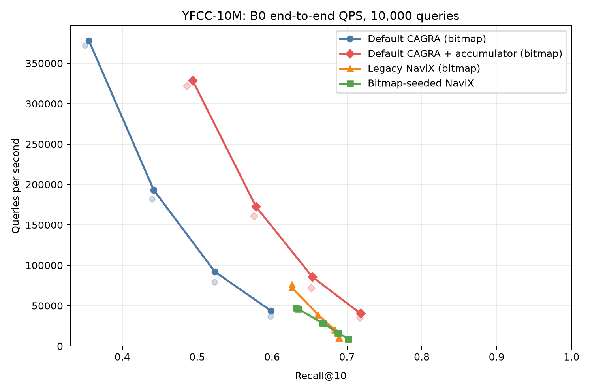
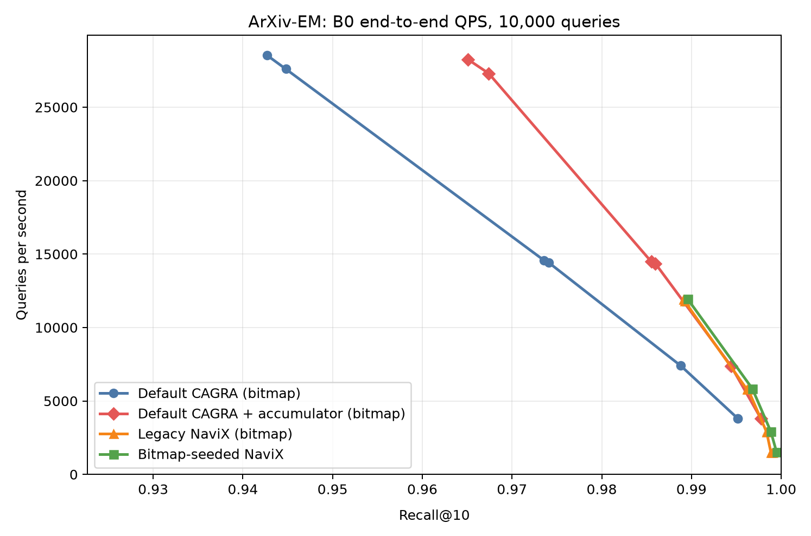
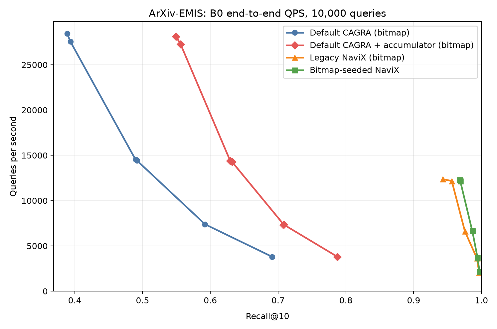
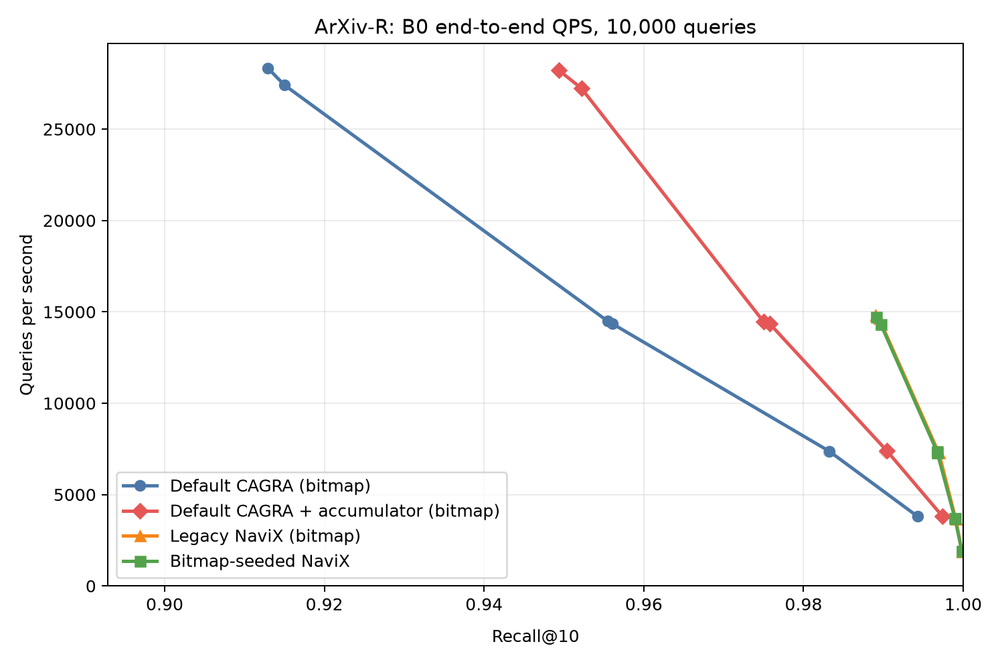

#+title: Bitmap filtering and bitmap-seeded NaviX SINGLE_CTA report

* Verdict

This experiment compares four bitmap-filtered paths at the automatic B0 traversal budget:
default CAGRA, default CAGRA with a bounded passing-result accumulator, legacy
in-kernel-seeded NaviX, and strict bitmap-seeded NaviX.  The bitmap seed prepass is
included in end-to-end QPS.  No FAVOR mode, exact-scan fallback, or public-API change is
involved.

Across all recorded rows, filter violations = 0 and invalid-sentinel
errors = 0.

The accumulator consistently improves default CAGRA recall without materially changing
throughput.  At L=64, W=1 it raises ArXiv-EM recall from
0.9427 to 0.9651 at
28535 versus 28254 QPS, and raises ArXiv-EMIS
from 0.3889 to 0.5496 at
28434 versus 28105 QPS.  On YFCC, its
maximum B0 recall is 0.7179, versus
0.5984 without the accumulator.  This confirms that ordinary
default CAGRA loses useful passing candidates through bounded frontier eviction, but also
shows that retention alone does not solve sparse or negatively correlated exploration.

The implementation is correct and useful, but bitmap seeds are not a complete YFCC
solution.  Strict seeding guarantees a legal passing start and removes avoidable
underfill; after that, the kernel executes the existing adaptive-local NaviX traversal.
On YFCC, the best B0 recall rises only from 0.6894 to
0.7020, while QPS at those maximum-recall points changes from
10222 to 8950.  Since exact passing seeds and
the full B0 graph budget still do not approach 0.95 recall, the remaining bottleneck is
post-seed graph exploration under the sparse predicate, not seed availability.

The strongest gain is ArXiv-EMIS.  At L=64, W=1, strict seeding improves recall from
0.9427 to 0.9681 at essentially unchanged
throughput (12377 versus 12317 QPS), and removes
legacy handoff underfill.  ArXiv-EM and R are nearly parity, indicating that legacy
in-kernel seed discovery was already effective for those workloads.

* Best B0 result at 0.95 recall

| workload | method | result |
|----------+--------+--------|
| YFCC-10M | Default CAGRA (bitmap) | not reached; best 0.5984 @ 43755 QPS (L=512, W=2) |
| YFCC-10M | Default CAGRA + accumulator (bitmap) | not reached; best 0.7179 @ 40451 QPS (L=512, W=2) |
| YFCC-10M | Legacy NaviX (bitmap) | not reached; best 0.6894 @ 10222 QPS (L=512, W=1) |
| YFCC-10M | Bitmap-seeded NaviX | not reached; best 0.7020 @ 8950 QPS (L=512, W=2) |
| ArXiv-EM | Default CAGRA (bitmap) | 0.9736 @ 14566 QPS (L=128, W=1) |
| ArXiv-EM | Default CAGRA + accumulator (bitmap) | 0.9651 @ 28254 QPS (L=64, W=1) |
| ArXiv-EM | Legacy NaviX (bitmap) | 0.9891 @ 11925 QPS (L=64, W=1) |
| ArXiv-EM | Bitmap-seeded NaviX | 0.9896 @ 11944 QPS (L=64, W=1) |
| ArXiv-EMIS | Default CAGRA (bitmap) | not reached; best 0.6912 @ 3803 QPS (L=512, W=2) |
| ArXiv-EMIS | Default CAGRA + accumulator (bitmap) | not reached; best 0.7875 @ 3799 QPS (L=512, W=2) |
| ArXiv-EMIS | Legacy NaviX (bitmap) | 0.9563 @ 12165 QPS (L=64, W=2) |
| ArXiv-EMIS | Bitmap-seeded NaviX | 0.9681 @ 12317 QPS (L=64, W=1) |
| ArXiv-R | Default CAGRA (bitmap) | 0.9555 @ 14485 QPS (L=128, W=1) |
| ArXiv-R | Default CAGRA + accumulator (bitmap) | 0.9522 @ 27240 QPS (L=64, W=2) |
| ArXiv-R | Legacy NaviX (bitmap) | 0.9890 @ 14833 QPS (L=64, W=1) |
| ArXiv-R | Bitmap-seeded NaviX | 0.9891 @ 14719 QPS (L=64, W=1) |

* Matched L=64, W=1 evidence

| workload | method | recall | QPS | underfilled-query fraction |
|----------+--------+--------+-----+----------------------------|
| YFCC-10M | Default CAGRA (bitmap) | 0.3502 | 372290 | 0.752700 |
| YFCC-10M | Default CAGRA + accumulator (bitmap) | 0.4862 | 321710 | 0.456600 |
| YFCC-10M | Legacy NaviX (bitmap) | 0.6264 | 76321 | 0.305100 |
| YFCC-10M | Bitmap-seeded NaviX | 0.6316 | 47636 | 0.000000 |
| ArXiv-EM | Default CAGRA (bitmap) | 0.9427 | 28535 | 0.049700 |
| ArXiv-EM | Default CAGRA + accumulator (bitmap) | 0.9651 | 28254 | 0.006700 |
| ArXiv-EM | Legacy NaviX (bitmap) | 0.9891 | 11925 | 0.001000 |
| ArXiv-EM | Bitmap-seeded NaviX | 0.9896 | 11944 | 0.000100 |
| ArXiv-EMIS | Default CAGRA (bitmap) | 0.3889 | 28434 | 0.677200 |
| ArXiv-EMIS | Default CAGRA + accumulator (bitmap) | 0.5496 | 28105 | 0.186500 |
| ArXiv-EMIS | Legacy NaviX (bitmap) | 0.9427 | 12377 | 0.025800 |
| ArXiv-EMIS | Bitmap-seeded NaviX | 0.9681 | 12317 | 0.000000 |
| ArXiv-R | Default CAGRA (bitmap) | 0.9129 | 28350 | 0.093500 |
| ArXiv-R | Default CAGRA + accumulator (bitmap) | 0.9494 | 28213 | 0.003100 |
| ArXiv-R | Legacy NaviX (bitmap) | 0.9890 | 14833 | 0.000400 |
| ArXiv-R | Bitmap-seeded NaviX | 0.9891 | 14719 | 0.000000 |

ArXiv-EM has one query with only one legal database item (the manifest minimum is
one), so its 0.0001 strict-seeding underfill is required behavior rather than a search
failure.  All YFCC bitmap rows have at least 58 passing items.

* Throughput Pareto frontiers

** YFCC-10M

** ArXiv-EM

** ArXiv-EMIS

** ArXiv-R

* Predicate materialization validation

Every non-sentinel ground-truth ID was tested against the generated bitmap before a
shard was accepted.  The predicates exactly match the UDF adapters: YFCC contains all
query tags; ArXiv EM matches subcategory, EMIS contains the query category, and R uses
an inclusive date interval.

| workload | queries | mean selectivity | min passing | max passing |
|----------+---------+------------------+-------------+-------------|
| YFCC-10M | 10000 | 0.018510 | 58 | 1915985 |
| ArXiv-EM | 10000 | 0.384696 | 1 | 52817 |
| ArXiv-EMIS | 10000 | 0.152429 | 16 | 27645 |
| ArXiv-R | 10000 | 0.445524 | 254 | 95090 |

* Design and implementation

The private benchmark path stores a versioned, tightly packed row-major bitmap.  A
one-warp-per-query prepass reads bitmap words coalescently and returns the first k
passing graph IDs in ascending internal-ID order.  Source-index-remapped CAGRA indexes
are handled by scanning internal IDs while testing the mapped source ID.

The prepass and search launch on the same CUDA stream.  Seed IDs and counts are
preallocated before timing; only valid seeds receive distance calculations and visited
hash insertions.  All remaining shared itopk/candidate slots are initialized to invalid
ID and infinite distance.  Empty rows return the normal invalid sentinels without graph
work.  Seed selection does not consume a graph iteration, so the full B0 budget remains
available to NaviX.

After initialization, the kernel is the existing adaptive-local NaviX implementation:
the persistent frontier contains passing nodes only, rejected nodes can be transient
one-/two-hop bridges, and no extra degree-squared shared-memory buffer is allocated.
YFCC throughput uses four 2,048-query bitmap shards plus one 1,808-query shard; aggregate
QPS is total queries divided by the sum of shard times.

The default-CAGRA accumulator is an independent output-retention option; it does not
change traversal order, candidate selection, or the graph budget.  During SINGLE_CTA
search it observes passing initial candidates and expanded children and maintains a
bounded raw-distance top-k.  When enabled, the final neighbors and distances come from
that accumulator instead of the fused traversal buffer.  The implementation reuses
the existing private runtime-state filter wrapper and benchmark configuration flag,
so no public search parameter or filter API was added.

* Reproduction

These measurements were collected on NVIDIA L4
(58 SMs) with cuVS v1.9.5.
Search timing includes the GPU bitmap-seed prepass and graph traversal, but excludes
offline bitmap materialization, file loading, and one-time device upload.

#+begin_src sh
ninja -C cpp/build NEIGHBORS_ANN_CAGRA_FILTER_BITMAP_TEST CUVS_CAGRA_ANN_BENCH
cpp/build/gtests/NEIGHBORS_ANN_CAGRA_FILTER_BITMAP_TEST
benchmarks/favor/navix_bitmap/run_experiment.sh all
#+end_src

The sweep is B0-only: L in {64,128,256,512}, W in {1,2}, k=10, degree=32,
correctness batches of 1,000 queries, and throughput over 10,000 queries.
