#+title: NaviX GPU optimization and CPU baseline report
#+options: toc:3 num:t

* Status

This report is the canonical implementation and evaluation artifact.  The implementation is
complete.  GPU correctness, the complete primary and five-policy B0 sweeps, two
optimization-ablation gates, all native CPU graphs, the =8/16/32=-thread scaling gate,
deterministic-seed ablations, and every conditional deep sweep are complete.  The original plan is
retained so deviations and rejected optimizations remain auditable.

* Research questions

1. Can strict bitmap-seeded NaviX be made materially faster on GPU without changing its traversal
   semantics, result set, graph budget, or public cuVS API?
2. Which costs dominate the current kernel: generic bitmap dispatch, eager bridge setup,
   two-hop synchronization, distance work, registers, or shared-memory occupancy?
3. How does optimized GPU NaviX compare with default CAGRA, default CAGRA plus its passing-result
   accumulator, CPU FAISS-NaviX, ACORN-1, and ACORN-gamma?
4. How much of ACORN's recall and underfill gap is caused by its lack of the deterministic passing
   seeds used by both NaviX implementations, rather than its graph or traversal policy?

* Original implementation plan

** Scope and semantic contract

- Optimize strict bitmap-seeded, non-persistent, degree-32 NaviX for CAGRA =SINGLE_CTA=.
- Keep strict bitmap seeding: select the first =k= passing internal graph IDs in ascending order;
  never add random or rejected seeds.
- Preserve the degree-32 adaptive-local policy.  If =P= of the 32 first-hop neighbors pass, use
  one hop for =P >= 13=, blind two-hop for =P <= 4=, and directed two-hop otherwise.
- Persist only passing nodes in CAGRA's fused =itopk=.  Rejected nodes may be transient bridges but
  never persistent frontier entries.
- Preserve raw squared-L2 ordering, the fused =itopk + W*D= candidate tail, parent selection,
  merging, expansion tags, deterministic bridge order, and B0/max-iteration accounting.
- Retain the existing =W*D= bridge-ID buffer.  Grandchildren remain warp-local register values;
  never allocate a =D*D= shared-memory buffer.
- Include the bitmap seed prepass in end-to-end timing, but do not charge it graph iterations.
- Preserve query offsets, source-index remapping, invalid sentinels, and underfilled-row behavior.
- Add no public cuVS search field, overload, filter type, fallback mode, or accumulator behavior.

** Isolated reference and optimized kernels

- Work on branch =navix-single-cta-kernel-opt= in a clean worktree, leaving the dirty
  =favor-filtered-search= checkout untouched.
- Add benchmark-private selection between =reference= and =optimized= NaviX kernels.
- Compile separate JIT specializations so reference code does not inflate the optimized kernel's
  register count.  Keep the existing serial/tiled scheduler control orthogonal.
- Freeze current strict-bitmap outputs as the golden reference.

** CTA-local bitmap lookup

- Hoist the bitmap pointer, dimensions, native packing flag, effective query row, 64-bit row start,
  aligned row pointer, and source-map status once per CTA.
- For a native, word-aligned row with identity IDs, test
  =row_words[source_id >> 5] & (1u << (source_id & 31))= through the read-only cache.
- For unaligned rows, non-native =original_nbits=, or source-index remapping, use an exact fallback
  matching RAFT's =bitmap_view.test(row, source)=.
- Use the direct lookup in both first- and second-hop traversal.  Leave UDF and other filter types
  on the generic linked path.
- Test warp grouping for repeated bitmap-word addresses with =__match_any_sync=, retaining it only
  if its measured benefit exceeds its instruction/register cost.

** Lazy bridge lifecycle

1. Clear only the mandatory =W*D= output IDs and distances.
2. Load/filter first-hop rows, ballot =P=, resolve policies, and publish a two-hop-parent mask.
3. For one-hop parents, insert and compact passing children without touching bridge state.
4. For blind/directed parents, initialize only their bridge count and stably compact rejected
   first-hop nodes.
5. If every parent is one-hop, skip the bridge phase and its CTA barriers entirely.

Only the initialized =bridge_count= prefix may be read, so stale unused bridge entries are safe.

** Distance-work reduction

- Compute passing-node distance only after successful visited admission.
- Never compute rejected one-hop or rejected second-hop distance.
- Blind mode computes no rejected-node distance.
- Directed mode necessarily computes one raw distance for each unique, previously unvisited
  rejected first-hop bridge so it can order bridge expansion.
- Use a read-only visited check before directed bridge distance and never recompute an available
  value.
- Test separating passing compaction from rejected directed sorting.  Keep it only when final IDs
  and distances remain exactly identical.

** Warp-cooperative two-hop producer/consumer scheduler

For each two-hop parent and bridge tile:

1. Assign consecutive bridge rows to resident warps.
2. Each producer warp performs one coalesced 32-ID graph-row load, maps IDs if required, applies
   direct bitmap tests, ballots passing lanes, and retains IDs/mask in registers.
3. Publish one 32-bit pass mask per producer warp.
4. Consume nonempty producer rows in original bridge order.  The owner warp applies visited
   insertion, stable lane compaction, and appends up to the =D= cap.

- Reserve masks for at most eight warps, matching the 256-thread tuning ceiling.
- Skip commit turns for empty pass masks.
- Keep CTA synchronization between nonempty ordered commits so later rows observe earlier hash
  insertions and the current output count.
- Remove only demonstrably redundant pre-commit synchronization.
- Use the actual active-warp count in a partial tile and uniformly stop loading new tiles at the
  candidate cap.
- Do not parallelize semantic commits across bridge rows or introduce degree-squared staging.

** Launch and occupancy tuning

- Compile/test 64, 128, and 256 threads per CTA.
- Record registers/thread, static/dynamic shared memory, active blocks/threads/warps per SM, the
  limiting resource, kernel time, and end-to-end time.
- Profile representative configurations for active warps, barrier stalls, long-scoreboard stalls,
  graph/bitmap traffic, and branch efficiency.
- Use three repetitions and median QPS for small optimization gates; use one repetition for the
  complete sweep.
- Retain an optimization only if outputs are exact, correctness counters remain zero, hard-workload
  median QPS improves by at least 2 percent (or the change enables a combined improvement), no
  representative EM/R configuration regresses by more than 2 percent, and resource growth does not
  create a harmful residency tier.

** CPU baselines

*** FAISS-NaviX

- Build standard HNSW graphs.  The completed ArXiv graphs and the exploratory YFCC graph use
  =M=32= and =efConstruction=200=.  Every subsequent YFCC build used for the final comparison must
  instead use the [[https://arxiv.org/html/2602.10258][JAG Appendix D.5]] NaviX setting: =M=64= and
  =efConstruction=200=.
- Set =index.hnsw.efSearch= directly for every sweep point.
- Replace the fixed 4,096-ID two-hop scratch with degree-derived per-worker storage of =D + D^2=
  IDs.  The exploratory =M=32= graph has level-zero degree =D=64= and needs 4,160 entries; the
  JAG-aligned =M=64= YFCC graph has =D=128= and needs 16,512.  This allocation is derived from the
  loaded graph, so changing =M= cannot silently overflow the NaviX workspace.
- Preserve native mask semantics, source-order IDs, and squared L2.

*** ACORN

- Run paper-faithful ACORN-1 with =gamma=1= and =M_beta=M=.  Its construction corresponds to
  original HNSW construction *without pruning*, not to the separately built heuristic-pruned
  FAISS HNSW graph.  Its search performs full one-hop plus two-hop neighbor expansion, predicate
  filtering, and truncation back to =M=.  Do not use the repository demo's =M_beta=2M= setting
  under the ACORN-1 label.
- Build workload-specific ACORN-gamma graphs:
  - ArXiv EM: =M=16=, =M_beta=24=, =gamma=10=, =efConstruction=160=.
  - ArXiv R: =M=32=, =M_beta=24=, =gamma=12=, =efConstruction=384=.
  - ArXiv EMIS: =M=16=, =M_beta=24=, =gamma=15=, =efConstruction=240=.
  - YFCC: every subsequent graph used for the final comparison must use the
    [[https://arxiv.org/html/2602.10258][JAG Appendix D.5]] ACORN setting =M=64=, =gamma=30=, and
    =M_beta=64=.  The paper does not list a separate
    ACORN =efConstruction= value in that parameter table, so the actual constructor value must be
    recorded as an implementation setting rather than attributed to JAG.  The obsolete
    =M=32=, =M_beta=32=, =gamma=100= exploratory build was terminated before serialization and
    produces no result or graph used by this report.
- Sweep =efSearch={10,15,20,25,30,50,100,250,500,750}= and set
  =index.acorn.efSearch= directly.
- Test upstream ACORN first and apply a labeled correctness patch only if a concrete test fails.
- Configure CMake 4.4 with =CMAKE_POLICY_VERSION_MINIMUM=3.5= and system zlib headers.

Convert YFCC uint8 coordinates exactly to float32; use native ArXiv float32.  Use CPU masks exactly
matching the GPU predicate.  Test YFCC mask chunks of 128/256/512 queries and select the smallest
within 2 percent of the best throughput; ArXiv may process 10,000 queries in one call.

*** Parameter provenance

This table is the normative provenance record for the comparison.  A paper citation applies only
to the values named in its row; derived and experiment-local values are labeled separately.

| Scope | Workload/method | Values used | Source and status |
|-------+-----------------+-------------+-------------------|
| CPU graph | ArXiv FAISS-NaviX | =M=32=, =efConstruction=200= | FAISS-NaviX repository example and runner baseline; *not specified by the arxiv-for-fanns paper*. |
| CPU graph | YFCC FAISS-NaviX | =M=64=, =efConstruction=200= | [[https://arxiv.org/html/2602.10258#A1.SS5][JAG Appendix D.5]], YFCC NaviX row. |
| CPU graph | ArXiv/YFCC ACORN-1 | =M=32=, =gamma=1=, =M_beta=32=, =efConstruction=200= | =gamma=1= and =M_beta=M= follow [[https://arxiv.org/html/2403.04871#S5.SS3][ACORN Section 5.3]]; =M=32= and =efConstruction=200= are this experiment's fixed HNSW-like control values.  The repository demo's =M_beta=2M= example is deliberately not used because it differs from the paper definition. |
| CPU graph | ArXiv EM ACORN-gamma | =M=16=, =M_beta=24=, =gamma=10= | [[https://arxiv.org/html/2507.21989#S5.SS2][Benchmarking FANNS, Table 4]], =arxiv-medium, EM filter=. |
| CPU graph | ArXiv R ACORN-gamma | =M=32=, =M_beta=24=, =gamma=12= | [[https://arxiv.org/html/2507.21989#S5.SS2][Benchmarking FANNS, Table 4]], =arxiv-medium, R filter=. |
| CPU graph | ArXiv EMIS ACORN-gamma | =M=16=, =M_beta=24=, =gamma=15= | [[https://arxiv.org/html/2507.21989#S5.SS2][Benchmarking FANNS, Table 4]], =arxiv-medium, EMIS filter=. |
| CPU graph | ArXiv ACORN-gamma construction breadth | =efConstruction={160,384,240}= for EM/R/EMIS | *Implementation-derived*, respectively =M*gamma=; Table 4 does not specify =efConstruction=. |
| CPU graph | YFCC ACORN-gamma | =M=64=, =M_beta=64=, =gamma=30= | [[https://arxiv.org/html/2602.10258#A1.SS5][JAG Appendix D.5]], YFCC ACORN row. |
| CPU graph | YFCC ACORN-gamma construction breadth | =efConstruction=1920= | *Implementation-derived* as =M*gamma=; JAG does not list a separate =efConstruction=. |
| CPU search | Base =efSearch= sweep | ={10,15,20,25,30,50,100}= | Prefix of the ACORN sweep in [[https://arxiv.org/html/2507.21989#S5.SS2][Benchmarking FANNS, Table 4]], reused for all CPU methods for matched points and truncated by this study's approximately 0.95-recall stopping rule. |
| CPU search | Conditional deep sweep | ={250,500,750}= | Remaining values from the same Table 4; executed only for a method/workload that has not reached approximately 0.95 recall. |
| CPU search | ACORN seed ablation | =filtered_seed_count={0,10}= | *This study's non-reference control*: ten reproduces FAISS-NaviX's deterministic first-passing-ID initialization on the same ACORN graph; zero preserves reference ACORN. |
| CPU search | Metric and result count | squared Euclidean, =k=10= | The dataset ground truth and [[https://arxiv.org/html/2507.21989#S5.SS3][Benchmarking FANNS Section 5.3]]; squared L2 preserves Euclidean neighbor order. |
| CPU execution | Search threads | ={8,16,32}= | *This study's hardware-scaling gate* for comparison with one L4; these are not the paper's query-execution setting.  Benchmarking FANNS used one query thread on its medium dataset. |
| CPU execution | Build threads | =24= for new YFCC graphs | *This study's local resource control* on a 32-logical-CPU host; build time is excluded from search QPS. |
| CPU execution | Query chunking | ArXiv =10000=; YFCC gate ={128,256,512}= | *This study's adapter design*; choose the smallest YFCC chunk within 2 percent of the clean best QPS. |
| GPU graph | Both datasets | NN-descent, graph degree =32=, intermediate degree =64= | Existing cuVS experiment graph configuration; not imported from any CPU paper. |
| GPU search | Primary B0 sweep | =k=10=, =max_queries=512=, =max_iterations=0=, =(L,W)={(64,1),(128,1),(128,2),(256,1),(256,2),(512,2)}= | *This study's matched CAGRA sweep*; zero selects CAGRA's automatic B0 formula. |
| GPU NaviX | Policy and scheduler | =adaptive_kuzu=, tiled, strict bitmap seeds | Adaptive-local policy from the reference Kuzu NaviX implementation; tiled scheduling and strict bitmap seeding are this GPU implementation. |
| GPU launch gate | Threads/CTA | ={64,128,256}= | *This study's CUDA resource/performance gate*; the main sweep otherwise uses the planner-selected launch. |
| Evaluation | Query counts | correctness =1000=; throughput =10000= | *This study's runtime-control choice*. |

The ArXiv EM/R/EMIS ACORN-gamma values therefore come from
[[https://arxiv.org/html/2507.21989][=Benchmarking Filtered Approximate Nearest Neighbor Search Algorithms on
Transformer-based Embedding Vectors= (arXiv:2507.21989)]], not from JAG.  JAG is used here only for
the final YFCC CPU graph choices named above.

** Validation and throughput protocol

- Exhaustively test aligned/unaligned rows, source-ID permutations, query offsets,
  native/non-native packing, empty rows, fewer-than-k rows, all-pass rows, and sparse random rows.
- Compare direct lookup against RAFT for every fixture bit.
- Compare reference/optimized seeds, final IDs, and distances for forced one-hop, directed, blind,
  adaptive-Kuzu, and adaptive-paper modes at 64/128/256 threads.
- Require zero filter violations and correct invalid sentinels.
- Correctness uses 1,000 queries; throughput covers 10,000 queries with =k=10=, degree 32,
  =L={64,128,256,512}=, =W={1,2}=, and B0 (=max_iterations=0=).
- ArXiv uses one 10,000-query host call.  YFCC uses four 2,048-query calls and one 1,808-query call.
  With =max_queries=512= both workloads execute 20 internal CAGRA chunks.  YFCC aggregate QPS is
  =10000 / sum(the five end-to-end call times)=.
- Do not add deeper settings after approximately 0.95 recall is reached.

GPU plots compare default CAGRA, default plus accumulator, reference strict-bitmap NaviX, and
optimized strict-bitmap NaviX.  CPU plots compare FAISS-NaviX, ACORN-1, ACORN-gamma, and explicitly
labeled ACORN variants given the same ten deterministic passing seeds as NaviX.  CPU and GPU receive
separate primary panels; an absolute-QPS overlay is appendix-only.  QPS axes begin at zero and
important parameter values are annotated.

* Implementation

** GPU experiment isolation

Work is isolated in =/home/ubuntu/cuvs-filter-navix-opt= on branch
=navix-single-cta-kernel-opt=.  The original dirty =/home/ubuntu/cuvs-filter= checkout was not
modified.  Commit =7897dc27= records this plan before implementation.

The GPU experiment adds only benchmark-private machinery:

- =navix_kernel_variant={reference,optimized}= is accepted by cuVS-bench, not by the public CAGRA
  search API.
- Reference and experimental NaviX use distinct JIT tags and kernel fragments, preventing the
  experiment from silently changing the reference binary.
- =CUVS_NAVIX_LOG_RESOURCES=1= reports CUDA function attributes and occupancy.
- A reduced generator separates 1,000-query correctness, a small 10,000-query acceptance gate,
  the complete B0 frontier, and conditional deeper runs.

The first experimental specialization hoisted bitmap-row metadata, used an aligned direct packed
word lookup, skipped unused bridge initialization, and initially tested a per-parent scheduler
counter.  The counter was removed after it introduced hot-path serialization.  The direct lookup
was subsequently removed after its CTA setup barrier and row-descriptor traffic produced a stable
regression.  The final isolated ablation differs from reference only by omitting eager writes to
bridge slots and per-parent counters that are overwritten before their bounded prefixes are read.
It is performance-neutral and is therefore not proposed for merge.

** CPU baselines

The native FAISS-NaviX runner is on branch =faiss-navix-native-benchmark=.  It:

- consumes the same packed query-by-database bitmap as GPU;
- sets =index.hnsw.efSearch= directly for each point;
- replaces the unsafe fixed 4,096-ID two-hop workspace with =D + D^2= IDs (4,160 at level-zero
  degree 64);
- uses native float ArXiv vectors and exact float conversion of YFCC bytes; and
- writes graph-build time/size sidecars independently of search timing.

The ACORN runner is on branch =acorn-gamma-benchmark=.  It builds independent ACORN-1 and
workload-specific ACORN-gamma graphs, sets =index.acorn.efSearch= directly, fixes invalid neighbor
reads, prevents a rejected entry point from leaking into results, and makes save/load own safe
zero-valued construction metadata.  A fixture proves graph topology is unchanged when construction
metadata values change.  The query bitmap remains the only search predicate.

A follow-up branch, =acorn-navix-seeds=, adds a benchmark-only =filtered_seed_count= search
parameter whose default of zero is output-identical to the reference path.  At ten seeds it matches the
corrected FAISS-NaviX initialization order: preserve the HNSW upper-layer nearest node as a traversal
candidate; admit it to results only if it passes; scan source IDs in ascending order until the first
ten passing IDs have been observed; skip an already visited overlap; compute exact distances; add
each new seed to the independent result heap before the bounded traversal heap can evict it; and
mark every admitted seed visited.  The subsequent ACORN-1 or ACORN-gamma traversal is unchanged.
Thus these curves isolate seeding on the *same serialized ACORN graph* and are labeled
=ACORN-* + NaviX seeds=, never as reference ACORN.

The runner synchronizes both =index.acorn.efSearch= and the per-call
=SearchParametersACORN::efSearch=.  The fork uses the former to size its bounded candidate heap and
the latter for termination; setting only one silently changes the intended sweep.  Seed distance
work occurs inside the timed native search call.  Predicate cardinalities used only for correctness
classification are cached once in parallel after search, outside reported QPS, rather than
serially rescanning the 10M-bit row for every =efSearch= value.

The initial CPU measurements use eight OpenMP threads as the lower endpoint of the local scaling
gate.  The arxiv-for-fanns paper executed queries with one thread on a machine that had eight
hardware threads, so our eight-thread QPS is *not* labeled a paper reproduction.  For the final
resource comparison, one complete L4 is compared against the best measured local CPU setting,
not against an arbitrary CUDA/CPU thread equivalence.
The runners therefore expose independent build/search thread counts.  Final CPU search uses an
=8/16/32=-thread scaling gate and selects the best setting; the new YFCC graphs use 24 OpenMP
construction threads, which is outside timed search.  Both counts are recorded separately.  The
eight-thread results remain a local scaling reference rather than the primary speedup denominator.

* Correctness

The complete bitmap GTest suite passes: *42/42 tests*.  The optimized/reference test covers an
unaligned 769-column bitmap, source-ID remapping, one-hop, directed two-hop, and blind two-hop
policies.  For every case, final IDs and distances are exact, not merely equal in aggregate recall.

The 1,000-query real-data sweep covers YFCC, ArXiv-EM, ArXiv-EMIS, and ArXiv-R under all five NaviX
policies.  Reference and the corrected experimental kernels have zero filter violations, zero
invalid-sentinel errors, and equal outputs.  The first full-sweep direct-lookup prototype changed
three YFCC =W=2= cells by at most 0.00014 recall; it was therefore rejected on semantics as well as
performance.  A subsequent corrected direct-lookup gate and the final lazy-initialization gate are
bit-for-bit identical to the reference outputs.

The matched 10,000-query GPU policy sweep contributes 120 aggregates: five policies times six
=(L,W)= cells on each of four workloads.  Every aggregate covers exactly 10,000 queries (five
disjoint YFCC shards or one ArXiv shard) and has zero filter violations and zero invalid-sentinel
errors.  Intrinsic underfill is preserved and reported rather than treated as malformed output.

Both CPU runners pass their native self-tests.  The FAISS test proves the degree-derived workspace,
an unaligned 3-by-37 bitmap, and the regression where a passing upper-layer entry point also occurs
in the deterministic ten-ID seed prefix without producing a duplicate result.  The ACORN test
proves metadata-independent topology, entry-point filtering, serialization, and the same unaligned
bitmap.  Its seeded fixtures additionally prove an exact zero-seed reference path, passing-entry
overlap without duplication, a rejected zero-distance entry that evicts a seed from the bounded
candidate heap without losing it from results, fewer-than-ten passing rows, and empty rows.
Across all 347 final CPU aggregate points, every point contains exactly 10,000 queries and
has zero filter violations, zero malformed-sentinel rows, and zero duplicate-output rows.  Every
YFCC aggregate combines exactly five disjoint shards; every ArXiv aggregate contains its one
10,000-query set.  Algorithmic underfill is reported separately: for example ACORN-gamma underfills
130 EMIS queries even though at least ten database rows pass, which is a search-reachability result
rather than a sentinel-format failure.

* GPU resource and profiler analysis

The NVIDIA L4 has 58 SMs and 23,034 MiB memory.  CUDA function attributes for the reference and
experimental kernels are identical after removing the per-parent counter:

| Threads/CTA | Registers/thread | Dynamic shared memory | Static shared memory | Active CTAs/SM |
|-------------+------------------+-----------------------+----------------------+----------------|
|          64 |               64 |              17,876 B |                  0 B |              5 |
|         128 |               64 |              17,876 B |                  0 B |              5 |
|         256 |               64 |              17,876 B |                  0 B |              4 |

Thus neither rejected optimization changed an occupancy tier.  At =L=128, =W=1=, adaptive tiled
NaviX, 256 threads is 1.7% faster than 128 threads on EM, 1.1% on EMIS, and 3.0% on R despite one
fewer resident CTA.  The existing tiled scheduler is 0.50%, 0.67%, and 1.61% faster than the serial
scheduler on EMIS, EM, and R respectively at 256 threads.

Nsight Compute and Nsight Systems are not installed in this environment.  Consequently this report
does not invent stall-reason or memory-throughput counters; conclusions about the rejected direct
lookup are limited to exact output, CUDA resources, and repeated end-to-end timing.

* Optimization ablations

** Direct bitmap specialization: rejected

The first full-sweep direct-lookup prototype was systematically slower: YFCC -0.482%, EM -0.542%,
EMIS -0.455%, and R -0.602% mean QPS versus reference.  Its minimum/maximum cell deltas on YFCC
were -0.837%/-0.075%.  It also changed aggregate recall by 0.00005--0.00014 in three YFCC =W=2=
cells, so those measurements are retained only as a rejected ablation and excluded from the
primary Pareto figures.

After removing the experimental counter and using a smaller 10,000-query gate, all eight matched
points remained slower:

| Workload | L=128 QPS delta | L=256 QPS delta | Recall delta |
|----------+-----------------+-----------------+--------------|
| YFCC     |         -0.773% |         -0.686% |     0.000000 |
| EM       |         -0.594% |         -0.725% |     0.000000 |
| EMIS     |         -0.512% |         -0.555% |     0.000000 |
| R        |         -0.750% |         -0.765% |     0.000000 |

The generic bitmap device call is already optimized effectively by device LTO.  Hoisting its row
descriptor added a per-query CTA barrier and readback without reducing graph, hash, or distance
traffic, so the specialization fails the acceptance gate.

** Lazy bridge/count initialization: performance-neutral

With the direct descriptor removed, the experimental kernel only skips initialization of bridge
slots outside the compacted prefix and counts overwritten by every parent lane.  Exact output still
passes.  Deltas are -0.096%/+0.218% on
YFCC, -0.078%/-0.010% on EM, -0.022%/-0.115% on EMIS, and -0.071%/+0.049% on R for =L=128/256=.
This is timing noise, far below the 2% retention threshold.  It is not promoted as an optimization.

** Scheduler and distance work

The reference already coalesces one 32-ID graph row per warp, retains grandchildren in registers,
commits bridge rows deterministically, computes distance only for admitted passing nodes (plus
rejected first-hop nodes required for directed ordering), and avoids a =D^2= shared buffer.  The
attempted more aggressive producer/consumer rewrite deadlocked under divergent early exits and was
discarded before measurement.  Preserving the reference synchronization schedule is required for
both correctness and stable performance.

* End-to-end GPU results

All values below include strict bitmap seed selection and search.  B0 means =max_iterations=0=;
the normal CAGRA formula selects the graph budget.  The sweep contains six cells:
=(L,W)={(64,1),(128,1),(128,2),(256,1),(256,2),(512,2)}=.

| Workload | Method | Maximum B0 recall | QPS at maximum | Best QPS at recall >= 0.95 |
|----------+--------+-------------------+----------------+----------------------------|
| YFCC | Default CAGRA | 0.59844 | 43,735 | -- |
| YFCC | CAGRA + accumulator | 0.71795 | 40,602 | -- |
| YFCC | NaviX reference | 0.70188 | 8,916 | -- |
| EM | Default CAGRA | 0.99516 | 3,805 | 14,555 |
| EM | CAGRA + accumulator | 0.99774 | 3,796 | 28,283 |
| EM | NaviX reference | 0.99949 | 1,509 | 11,919 |
| EMIS | Default CAGRA | 0.69117 | 3,789 | -- |
| EMIS | CAGRA + accumulator | 0.78755 | 3,777 | -- |
| EMIS | NaviX reference | 0.99725 | 2,140 | 12,284 |
| R | Default CAGRA | 0.99427 | 3,796 | 14,478 |
| R | CAGRA + accumulator | 0.99741 | 3,790 | 14,402 |
| R | NaviX reference | 0.99982 | 1,921 | 14,611 |

The algorithmic result is workload-dependent.  The accumulator is best on EM and improves YFCC,
whereas strict bitmap-seeded NaviX is the only B0 method that solves negatively correlated EMIS.
NaviX does not solve YFCC: its two-hop predicate subgraph is too sparse, and at B0 its frontier lies
below the accumulator frontier.  YFCC's mean query selectivity is 1.851%, but individual rows range
from only 58 passing vectors out of ten million to 1,915,985; the mean therefore hides its extreme
sparse tail.

#+caption: YFCC-10M GPU B0 Pareto frontier.
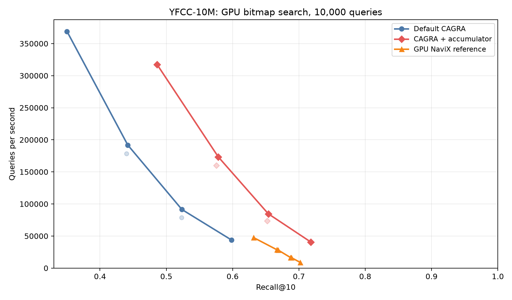

#+caption: ArXiv-EM GPU B0 Pareto frontier.
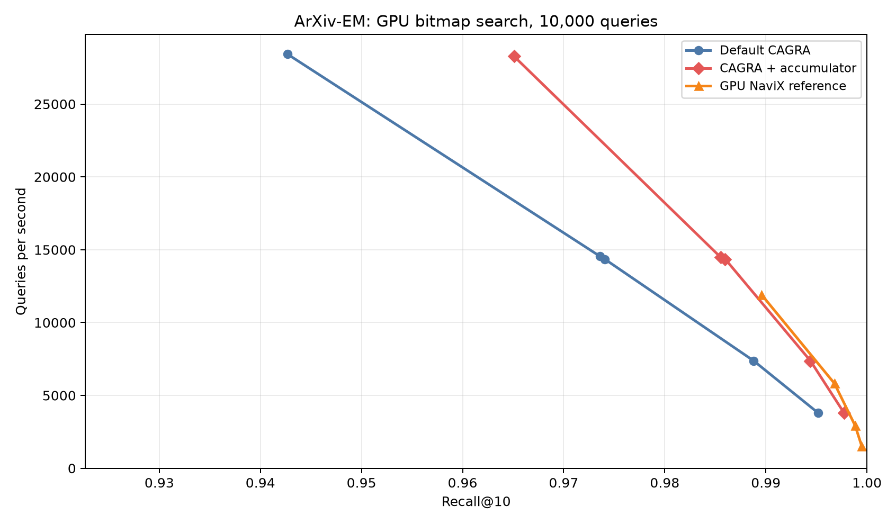

#+caption: ArXiv-EMIS GPU B0 Pareto frontier.
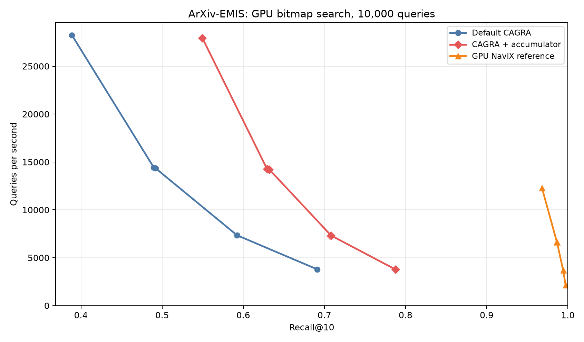

#+caption: ArXiv-R GPU B0 Pareto frontier.
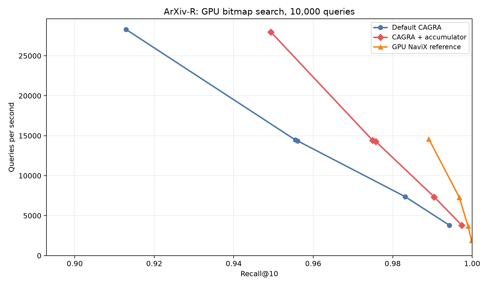

** GPU NaviX policy comparison

This matched sweep uses the accepted reference kernel, tiled scheduler, strict bitmap seeds, B0,
and the same six =(L,W)= cells for every policy.  The earlier 1,000-query policy points remain
correctness evidence only and are excluded from these throughput frontiers.

| Workload | Fastest useful high-recall policy | Highest-recall policy point | Verdict |
|----------+------------------------------------+-----------------------------+---------|
| YFCC | Blind: 9,036 QPS at 0.70380 | Directed: 0.70395 at 8,137 QPS | Blind obtains effectively the same ceiling 11.0% faster; no policy reaches 0.90. |
| EM | Adaptive Kuzu: 11,909 QPS at 0.98957 | Blind/directed: 0.99960; blind is 2,033 QPS versus 800 | Adaptive Kuzu leads near 0.99; blind dominates the extreme-recall endpoint. |
| EMIS | Blind: 12,966 QPS at 0.97275 | Directed: 0.99901 at 849 QPS | Blind dominates through 0.99873; directed buys only the final 0.00028 recall at large cost. |
| R | Adaptive Kuzu: 14,643 QPS at 0.98907 | Blind/directed: 0.99987; blind is 2,137 QPS versus 844 | Adaptive Kuzu leads near 0.99 and blind dominates the highest-recall region. |

Forced one hop provides the fast, lower-recall end of every frontier.  Across the useful
high-recall region, blind two hop is the strongest general policy.  Adaptive Kuzu reduces work and
wins at intermediate recall on EM and R, while directed two hop is justified only when the last
small recall increment matters.  Adaptive-paper thresholds do not produce a universal advantage.

#+caption: YFCC-10M GPU NaviX policy B0 Pareto frontiers.
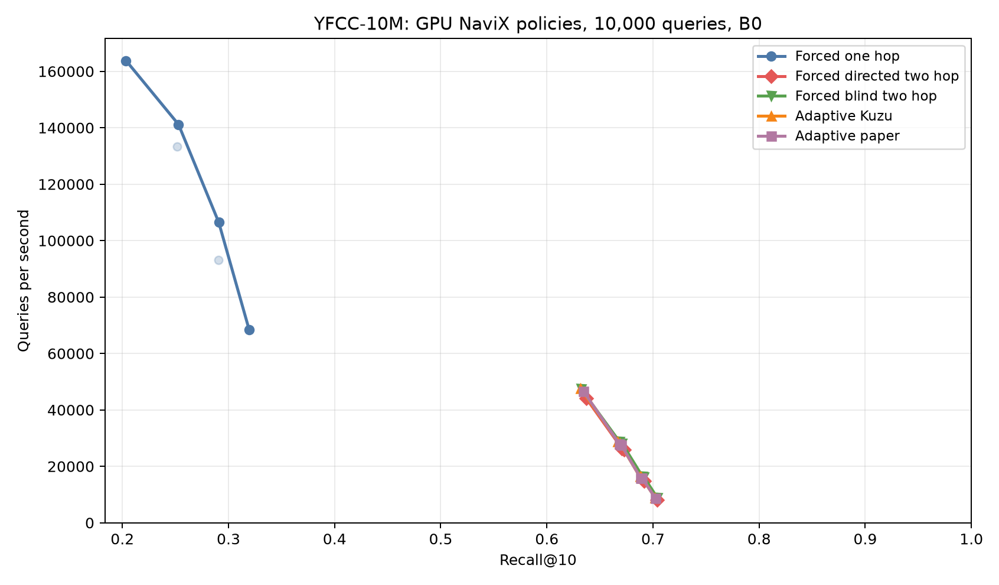

#+caption: ArXiv-EM GPU NaviX policy B0 Pareto frontiers.
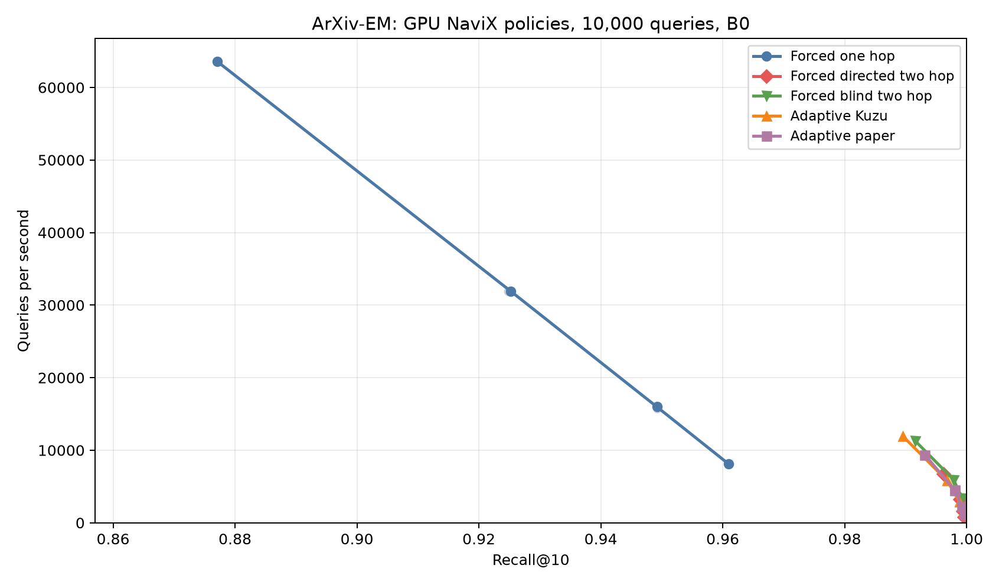

#+caption: ArXiv-EMIS GPU NaviX policy B0 Pareto frontiers.
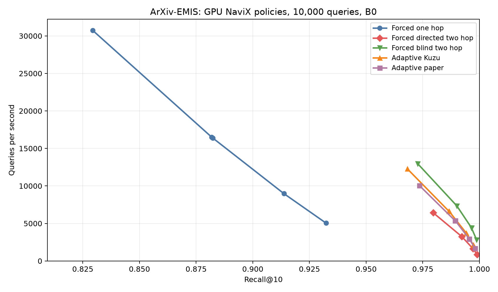

#+caption: ArXiv-R GPU NaviX policy B0 Pareto frontiers.
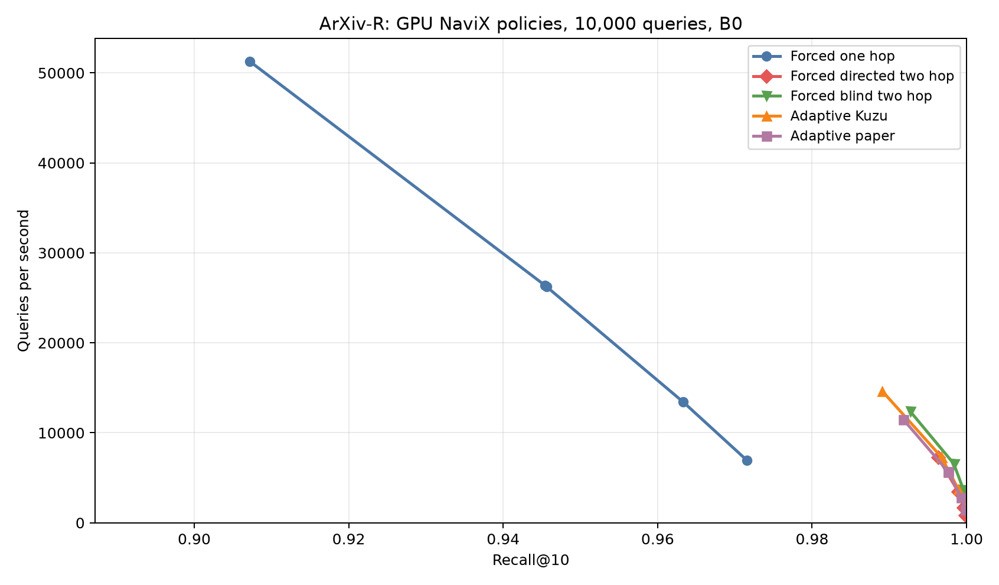

* CPU baseline implementation and results

The completed graph artifacts are:

| Graph | Parameters | Build time | Serialized size |
|-------+------------+------------+-----------------|
| ArXiv FAISS HNSW | =M=32=, =efConstruction=200= | 59.30 s | 1,665,620,834 B |
| ArXiv ACORN-1 | =M=32=, =gamma=1=, =M_beta=32=, =efConstruction=200= | 6.46 s | 1,672,020,878 B |
| ArXiv ACORN-gamma EM | =M=16=, =gamma=10=, =M_beta=24=, =efConstruction=160= | 70.99 s | 1,663,130,542 B |
| ArXiv ACORN-gamma EMIS | =M=16=, =gamma=15=, =M_beta=24=, =efConstruction=240= | 112.75 s | 1,665,295,662 B |
| ArXiv ACORN-gamma R | =M=32=, =gamma=12=, =M_beta=24=, =efConstruction=384= | 159.35 s | 1,673,447,566 B |
| YFCC FAISS HNSW | =M=64=, =efConstruction=200= | 1,505.26 s | 12,960,704,214 B |
| YFCC ACORN-1 | =M=32=, =gamma=1=, =M_beta=32=, =efConstruction=200= | 184.78 s | 11,041,292,174 B |
| YFCC ACORN-gamma | =M=64=, =gamma=30=, =M_beta=64=, =efConstruction=1920= | 22,533 s | 15,421,120,254 B |

The same FAISS HNSW graph is used by all three FAISS-NaviX query sets.  ACORN-1 likewise uses one
independent ArXiv ACORN-1 graph.  ACORN-gamma uses different construction parameters and therefore
different graphs for EM, EMIS, and R.  The final YFCC FAISS and ACORN-gamma graphs use the
JAG-aligned values in the provenance table; obsolete exploratory YFCC graphs are not consumed by
the final CSVs.

Both CPU forks accept dense byte masks, so packed-bitmap-to-byte-mask conversion is performed before
the timed search call.  This measures each native CPU search API rather than an adapter conversion.
GPU timing begins with an already resident packed bitmap and includes its strict seed-selection
kernel.  For this reason CPU/GPU overlay figures are descriptive hardware comparisons, not claims
that mask-representation overhead is identical.

The clean YFCC chunk gate measured 1,444.09, 1,496.35, and 1,533.65 QPS for chunks 128, 256, and
512 respectively at =efSearch=100= with eight threads.  Only 512 lies within two percent of the
best, so all final YFCC CPU sweeps use chunks of 512 queries.  Five native calls collectively cover
the same 10,000 queries; aggregate QPS is =10000 / sum(search_seconds)=.

The complete =8/16/32=-thread gate shows that CPU scaling is method dependent.  At
=efSearch=100=, 32 threads is fastest for every YFCC method and every ACORN method; 16 threads is
slightly faster for FAISS-NaviX on each ArXiv workload.  Accordingly, conditional deep search uses
32 threads.  Tables and Pareto curves choose the fastest measured resource setting at each recall
point rather than assuming that 32 threads always wins.

The paired 32-thread =efSearch=100= seed ablation gives the most direct causal comparison because
each pair uses the same graph, query order, mask, and search budget:

| Workload | Graph/search | Reference recall | Seeded recall | Recall delta | Seeded QPS delta | Underfilled queries |
|----------+--------------+------------------+---------------+--------------+------------------+---------------------|
| EM | ACORN-1 | 0.61921 | 0.62175 | +0.00254 | -0.22% | 6 -> 1 |
| EM | ACORN-gamma | 0.95227 | 0.95390 | +0.00163 | +0.88% | 39 -> 1 |
| EMIS | ACORN-1 | 0.56922 | 0.57219 | +0.00297 | -0.13% | 40 -> 0 |
| EMIS | ACORN-gamma | 0.86782 | 0.87705 | +0.00923 | -2.74% | 130 -> 0 |
| R | ACORN-1 | 0.59835 | 0.60364 | +0.00529 | +1.58% | 3 -> 0 |
| R | ACORN-gamma | 0.98120 | 0.98192 | +0.00072 | -2.44% | 8 -> 0 |
| YFCC | ACORN-1 | 0.17087 | 0.22515 | +0.05428 | -15.33% | 4,422 -> 0 |
| YFCC | ACORN-gamma | 0.58614 | 0.72524 | +0.13910 | -18.25% | 3,274 -> 0 |

The sole remaining EM underfill is intrinsic: that query has only one passing database row.  On
YFCC the seeded ACORN-gamma point closes 74.1% of its =efSearch=100= recall gap to FAISS-NaviX
(0.58614 -> 0.72524 versus 0.77396), while eliminating every underfilled query.  Therefore missing
passing initialization was the dominant cause of ACORN-gamma's YFCC underfill and much of its
recall gap, but not all of it.  The cost is real: finding and distance-evaluating seeds for very
sparse masks reduces YFCC QPS by 15--18%.  ACORN-1 gains much less, showing that its remaining
limitation is not merely initialization.

Final results through the conditional =efSearch={250,500,750}= sweep are:

| Workload | Method | Fastest QPS at recall >= 0.90 | Fastest QPS at recall >= 0.95 | Maximum recall |
|----------+--------+--------------------------------+--------------------------------+----------------|
| YFCC | FAISS-NaviX | -- | -- | 0.79664 |
| YFCC | ACORN-1 | -- | -- | 0.32283 |
| YFCC | ACORN-1 + NaviX seeds | -- | -- | 0.38798 |
| YFCC | ACORN-gamma | -- | -- | 0.61513 |
| YFCC | ACORN-gamma + NaviX seeds | -- | -- | 0.76141 |
| EM | FAISS-NaviX | 13,149 (0.91824) | 8,733 (0.95801) | 0.99559 |
| EM | ACORN-1 | -- | -- | 0.89392 |
| EM | ACORN-1 + NaviX seeds | -- | -- | 0.89410 |
| EM | ACORN-gamma | 10,833 (0.90195) | 6,140 (0.95227) | 0.95227 |
| EM | ACORN-gamma + NaviX seeds | 10,759 (0.90313) | 6,194 (0.95390) | 0.95390 |
| EMIS | FAISS-NaviX | 9,216 (0.90374) | 5,445 (0.95165) | 0.97782 |
| EMIS | ACORN-1 | -- | -- | 0.84046 |
| EMIS | ACORN-1 + NaviX seeds | -- | -- | 0.84350 |
| EMIS | ACORN-gamma | 2,862 (0.92168) | 1,312 (0.95226) | 0.95226 |
| EMIS | ACORN-gamma + NaviX seeds | 2,923 (0.93204) | 1,756 (0.95411) | 0.96301 |
| R | FAISS-NaviX | 16,214 (0.90640) | 9,563 (0.96024) | 0.99413 |
| R | ACORN-1 | -- | -- | 0.86886 |
| R | ACORN-1 + NaviX seeds | -- | -- | 0.86901 |
| R | ACORN-gamma | 9,499 (0.90944) | 6,480 (0.95239) | 0.98120 |
| R | ACORN-gamma + NaviX seeds | 9,458 (0.91130) | 6,426 (0.95318) | 0.98192 |

The bitmap statistics distinguish intrinsic from algorithmic underfill.  EM has mean selectivity
38.47% but one query has only one passing row; EMIS has mean 15.24% and at least 16 passing rows per
query; R has mean 44.55% and at least 254.  Therefore the 130 ACORN-gamma EMIS underfills and eight
ACORN-gamma R underfills cannot be blamed on a predicate with fewer than =k=10= answers.

The low ACORN-1 values are not parser errors: predicates are satisfied, sentinels are valid, and
even =efSearch=750= reaches only 0.89392/0.84046/0.86886 recall on EM/EMIS/R and 0.32283 on YFCC.
Giving ACORN-1 NaviX seeds changes those maxima only to 0.89410/0.84350/0.86901 and 0.38798.
Initialization is therefore not its main limitation.  Increasing YFCC FAISS-NaviX from
=efSearch=100= to 750 moves aggregate recall only from 0.77396 to 0.79664; reference ACORN-gamma
moves from 0.58614 to 0.61513 and seeded ACORN-gamma from 0.72524 to 0.76141.  The deep points rule
out an accidentally shallow base sweep.

The comparison also has an important seeding asymmetry.  Bitmap GPU NaviX extracts up to =k=
guaranteed-passing seeds before graph traversal, and FAISS-NaviX deterministically scans the byte
mask for its first ten passing IDs inside the native search call.  Reference ACORN starts from its
ordinary hierarchical entry point and has no global passing-seed prepass or exact fallback.  For
=gamma=1= it blindly examines first- and second-hop neighbors, but only passing nodes persist in
the candidate queue.  A sparse query can therefore drain that queue before it finds ten results.
The 4,422 ACORN-1 and 3,274 ACORN-gamma YFCC underfills persist at =efSearch=750=.  They must not be
attributed solely to two-hop expansion or graph topology, because reference ACORN lacks the global
passing-seed prepass used by both NaviX implementations.  The implemented non-reference ablation
settles that ambiguity: ten deterministic seeds reduce both YFCC underfill counts to zero.
At =efSearch=750=, seeding raises ACORN-gamma from 0.61513 to 0.76141, closing 80.6% of its recall
gap to FAISS-NaviX's 0.79664 on the same masks.  The remaining 0.03523 gap despite matched seeding is
evidence for traversal and/or graph-topology differences.  ACORN-1's much smaller 0.06515 gain
likewise shows that seeds are necessary for sparse-result completeness but not sufficient to make
every ACORN graph/search variant competitive.

#+caption: YFCC-10M native CPU Pareto frontier, including conditional deep points.
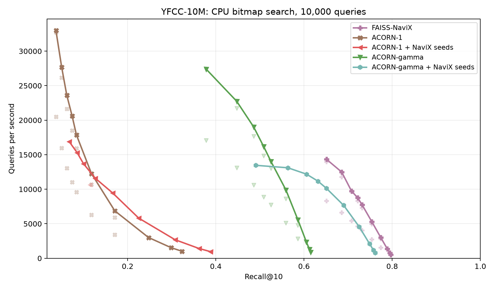

#+caption: ArXiv-EM native CPU Pareto frontier, including conditional deep points.
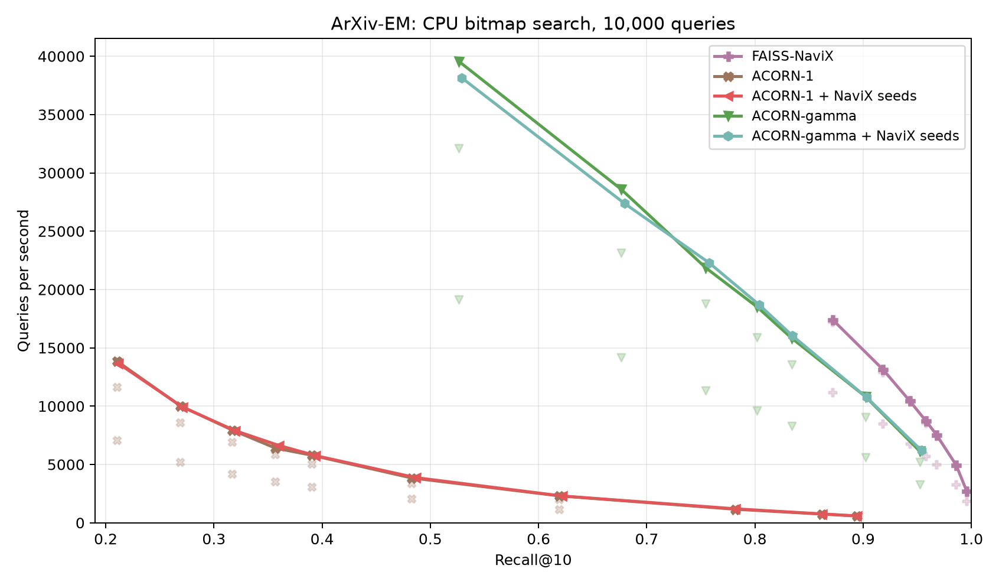

#+caption: ArXiv-EMIS native CPU Pareto frontier, including conditional deep points.
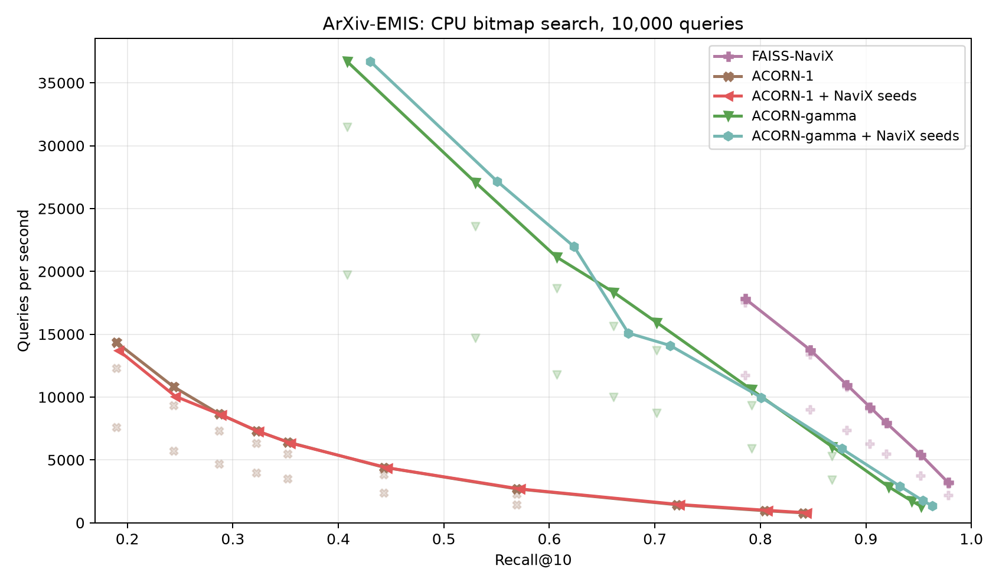

#+caption: ArXiv-R native CPU Pareto frontier, including conditional deep points.
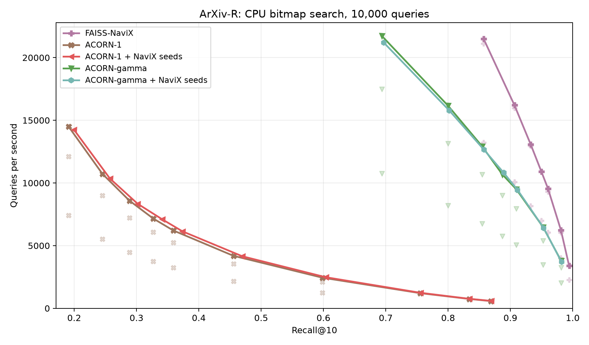

** Deterministic passing-seed ablation plots

These panels remove FAISS-NaviX from the visual comparison and show only paired reference/seeded
ACORN curves.  Seeded variants are non-reference controls and reuse the exact same graph files.

#+caption: YFCC-10M ACORN deterministic-seed ablation.
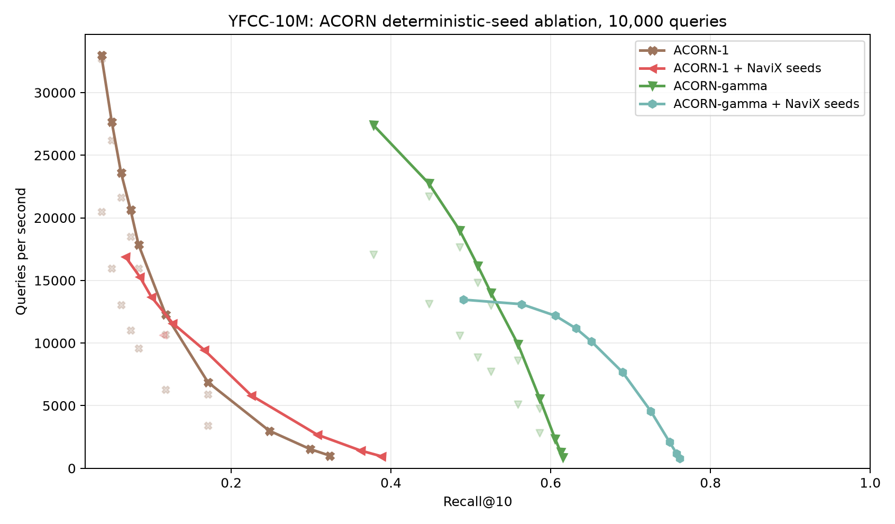

#+caption: ArXiv-EM ACORN deterministic-seed ablation.
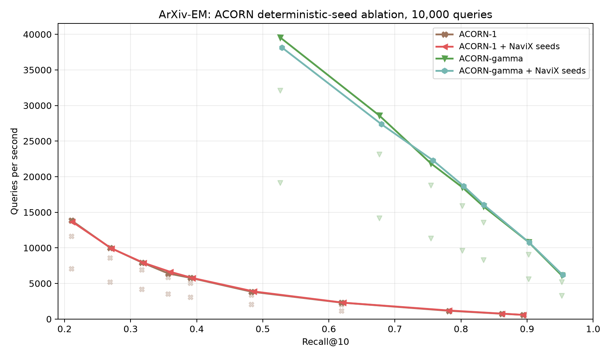

#+caption: ArXiv-EMIS ACORN deterministic-seed ablation.
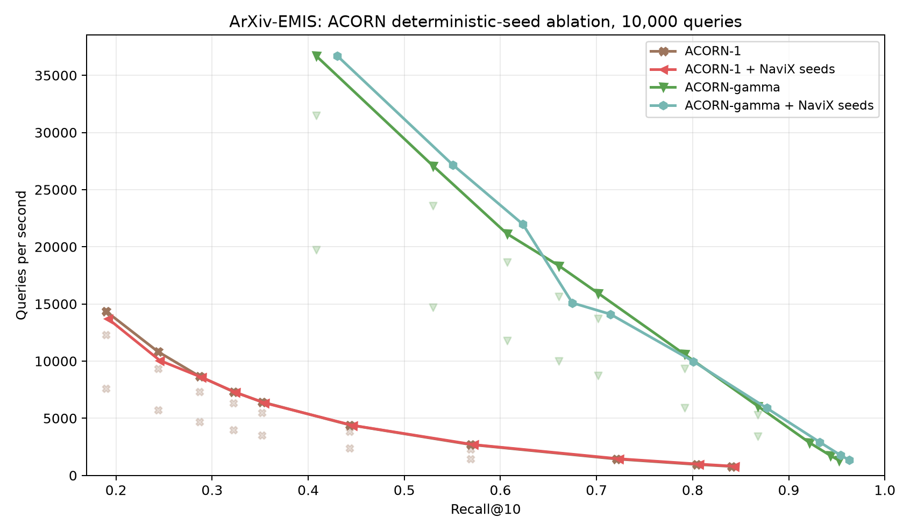

#+caption: ArXiv-R ACORN deterministic-seed ablation.
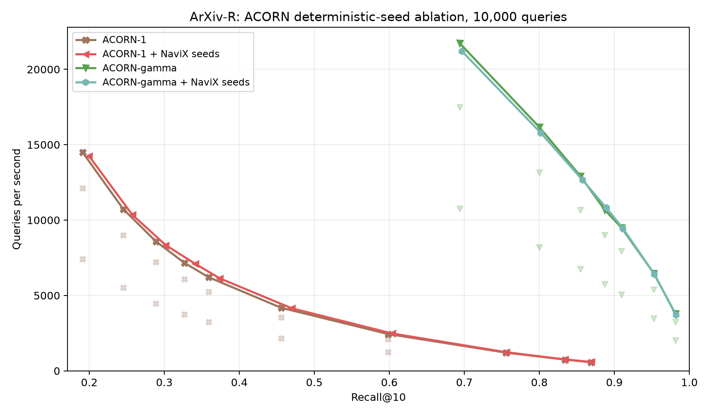

** Absolute CPU/GPU overlays

These appendix plots put absolute QPS on one axis, but they are descriptive rather than controlled
hardware speedup claims: CPU and GPU use different graph families, different execution resources,
and different native mask representations.

#+caption: YFCC-10M absolute CPU/GPU QPS overlay.
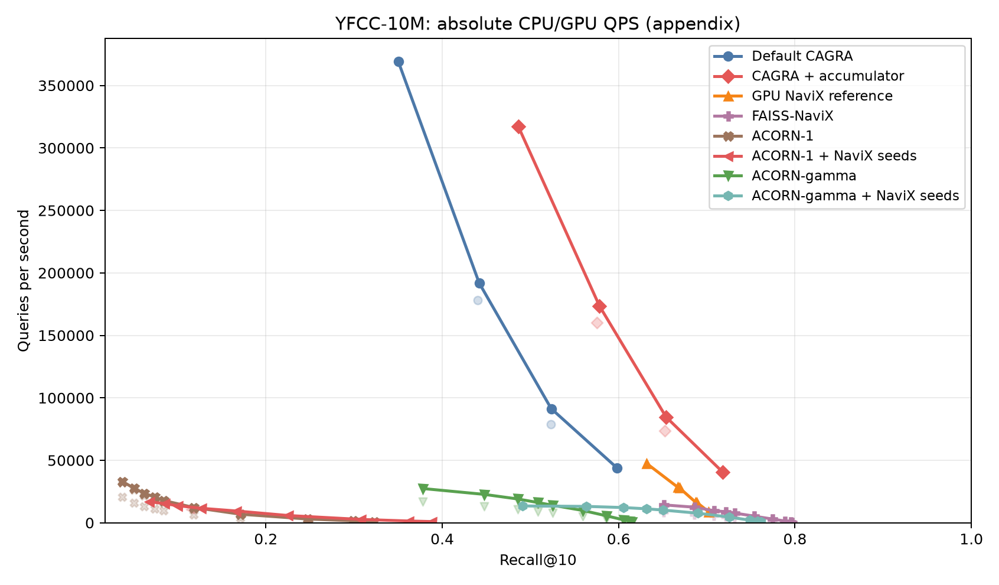

#+caption: ArXiv-EM absolute CPU/GPU QPS overlay.
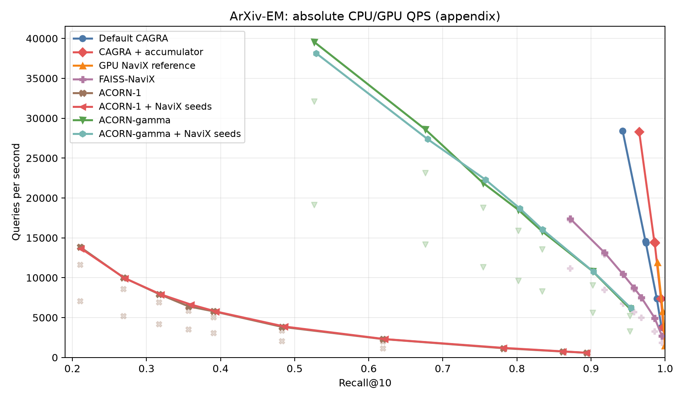

#+caption: ArXiv-EMIS absolute CPU/GPU QPS overlay.
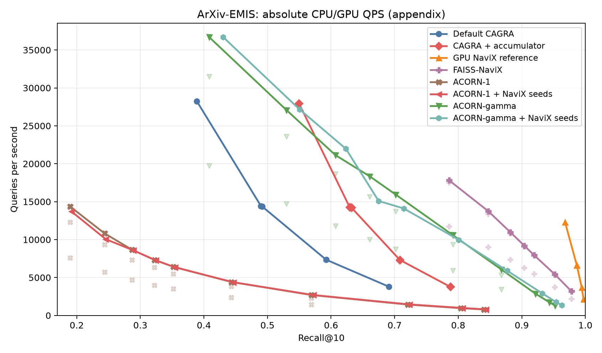

#+caption: ArXiv-R absolute CPU/GPU QPS overlay.
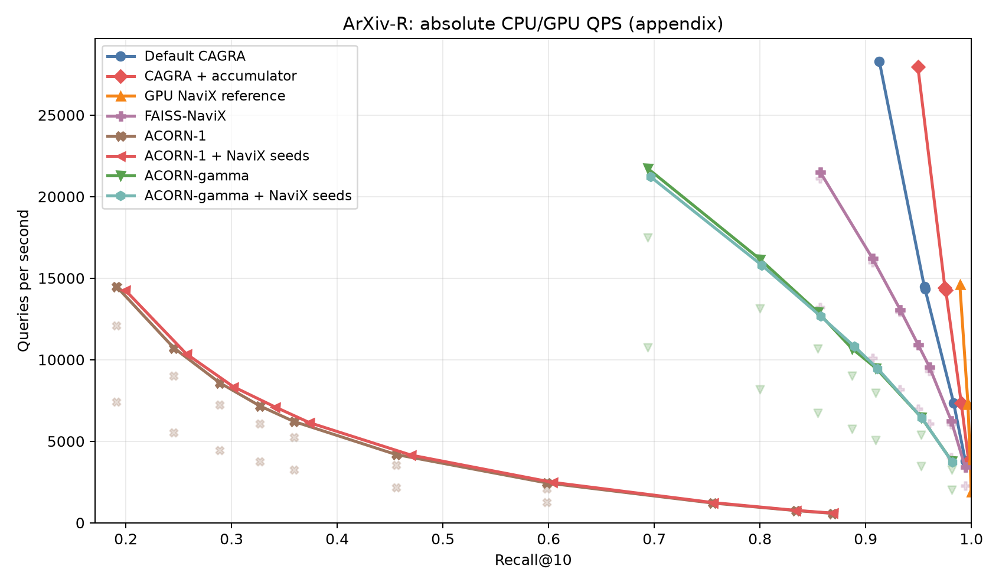

* Limitations and conclusion

The GPU optimization result is negative but useful: the current reference kernel is already within
measurement noise of the safe implementation-level improvements tested here.  Bitmap predicate
evaluation and unused bridge initialization are not material bottlenecks.  Larger gains require an
algorithmic reduction in graph/hash/distance work, not a direct rewrite of the packed-bit test.

The algorithmic data also rejects a universal winner.  Strict bitmap seeding plus NaviX solves
EMIS's correlation failure under B0, while the simpler accumulator is substantially faster on EM
and reaches slightly higher recall than NaviX on YFCC.  YFCC remains a reachability problem for the
predicate-only traversal at B0.  The native CPU controls strengthen rather than weaken that
conclusion.  Reference ACORN-gamma's apparent 0.615 YFCC ceiling was substantially a seeding
artifact: matched deterministic seeds raise it to 0.761 and eliminate all underfill.  However,
deeper FAISS-NaviX still reaches 0.797, and neither method reaches 0.90 despite the ACORN graph being
15.42 GB and taking 6.26 hours to construct.  ACORN-1 remains noncompetitive even after matched
seeding.

The GPU policy sweep further shows that the adaptive decision is a throughput optimization, not a
recall requirement.  Forced blind two hop is the strongest general high-recall policy and is much
faster than forced directed expansion at comparable recall.  Adaptive Kuzu improves the
intermediate-recall frontier on EM and R, but policy selection barely changes YFCC's approximately
0.704 ceiling.  YFCC is therefore not failing because the adaptive thresholds choose the wrong
two-hop variant.

Therefore the actionable GPU conclusion is twofold.  First, there is no retained low-level NaviX
kernel optimization from this study: the reference fused kernel is already efficient for the safe
changes tested.  Second, filter-aware traversal is highly valuable on correlated EMIS but neither
adaptive two-hop traversal nor ACORN-style neighborhood enrichment universally solves YFCC's
extremely sparse predicate connectivity.  Deterministic passing seeds are necessary to prevent
sparse-query frontier underfill and explain most of ACORN-gamma's gap, but the residual deep-search
gap proves that seeds alone are insufficient.  Progress on that regime requires a fallback or a
more information-rich data structure, rather than another packed-bit-test micro-optimization.

* Reproduction

GPU build and exact bitmap tests:

#+begin_src sh
cd /home/ubuntu/cuvs-filter-navix-opt
cmake --build cpp/build --target CUVS_CAGRA_ANN_BENCH \
  NEIGHBORS_ANN_CAGRA_FILTER_BITMAP_TEST -j8
LD_PRELOAD=$PWD/cpp/build/libcuvs.so \
  ./cpp/build/gtests/NEIGHBORS_ANN_CAGRA_FILTER_BITMAP_TEST
#+end_src

GPU configurations and stages:

#+begin_src sh
./benchmarks/navix_single_cta/run_optimization_experiment.sh correctness
./benchmarks/navix_single_cta/run_optimization_experiment.sh performance_gate
./benchmarks/navix_single_cta/run_optimization_experiment.sh b0
NAVIX_RESULT_ROOT=$PWD/benchmarks/navix_single_cta/results_gpu_navix_policy_20260819_193657 \
  ./benchmarks/navix_single_cta/run_optimization_experiment.sh policy_b0
#+end_src

CPU self-tests and baselines:

#+begin_src sh
./benchmarks/navix_single_cta/run_cpu_baselines.sh self_test
NAVIX_CPU_BUILD_THREADS=24 \
  ./benchmarks/navix_single_cta/run_cpu_baselines.sh thread_sweep
NAVIX_CPU_THREADS=32 NAVIX_CPU_BUILD_THREADS=24 NAVIX_CPU_DEEPER_EF=250 \
  ./benchmarks/navix_single_cta/run_cpu_baselines.sh arxiv_deeper
NAVIX_CPU_THREADS=32 NAVIX_CPU_BUILD_THREADS=24 NAVIX_CPU_DEEPER_EF=500,750 \
  ./benchmarks/navix_single_cta/run_cpu_baselines.sh arxiv_deeper
NAVIX_CPU_THREADS=32 NAVIX_CPU_BUILD_THREADS=24 NAVIX_CPU_DEEPER_EF=250,500,750 \
  ./benchmarks/navix_single_cta/run_cpu_baselines.sh yfcc_deeper
NAVIX_CPU_THREADS=32 ACORN_REPO=/home/ubuntu/ACORN-gamma-benchmark \
  ./benchmarks/navix_single_cta/run_cpu_baselines.sh acorn_seed_ablation
NAVIX_CPU_THREADS=32 ACORN_REPO=/home/ubuntu/ACORN-gamma-benchmark \
  ./benchmarks/navix_single_cta/run_cpu_baselines.sh acorn_seeded_deeper
#+end_src

Plotting and DOCX export:

#+begin_src sh
python benchmarks/navix_single_cta/analyze_optimization.py \
  --gpu-results benchmarks/navix_single_cta/results_gpu_opt_20260818_0100 \
  --gpu-results benchmarks/navix_single_cta/results_gpu_navix_policy_20260819_193657 \
  --cpu-artifacts /home/ubuntu/navix_cpu_artifacts \
  --output benchmarks/navix_single_cta/results_gpu_opt_20260818_0100/analysis
pandoc benchmarks/navix_single_cta/NAVIX_GPU_OPT_CPU_BASELINES_REPORT.org \
  --resource-path=benchmarks/navix_single_cta \
  -o benchmarks/navix_single_cta/NAVIX_GPU_OPT_CPU_BASELINES_REPORT.docx
#+end_src

* Artifact policy

- Commit benchmark code, configurations, curated data, plots, this Org report, and its DOCX export.
- Exclude copied datasets, generated graph binaries, caches, and bulky transient profiler output.
- Export with Pandoc using this directory as the resource path so figures are embedded.
- Validate the DOCX archive contains =word/media= images and that headings, tables, equations, and
  conclusions match the Org source.
- Do not merge into =favor-filtered-search= until correctness and performance gates pass.
