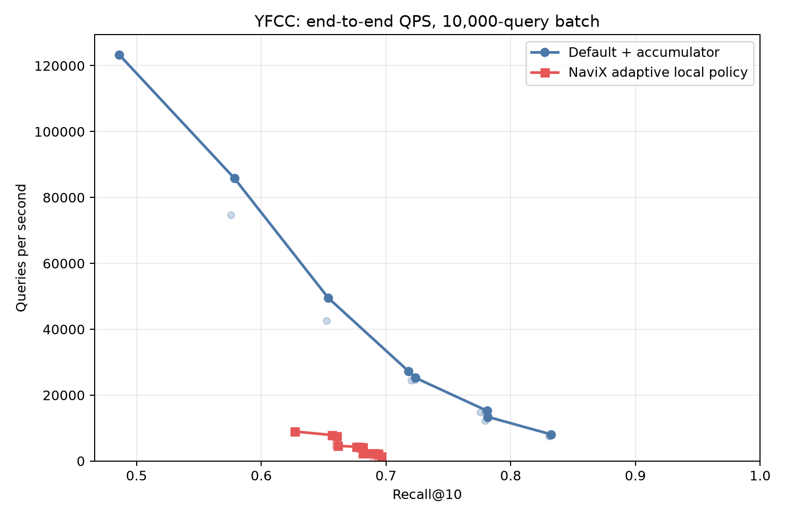
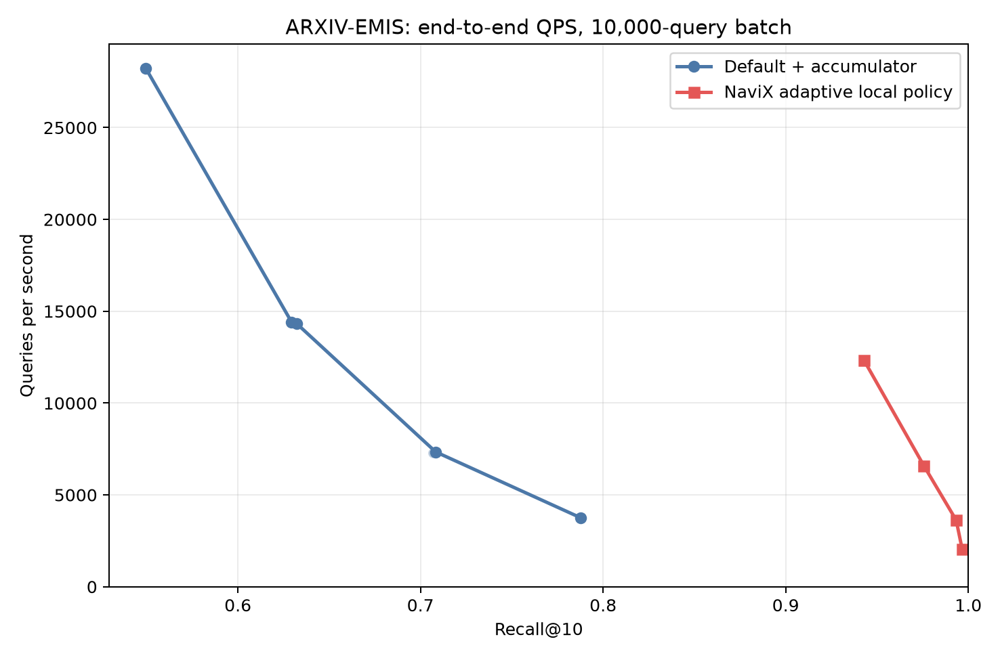
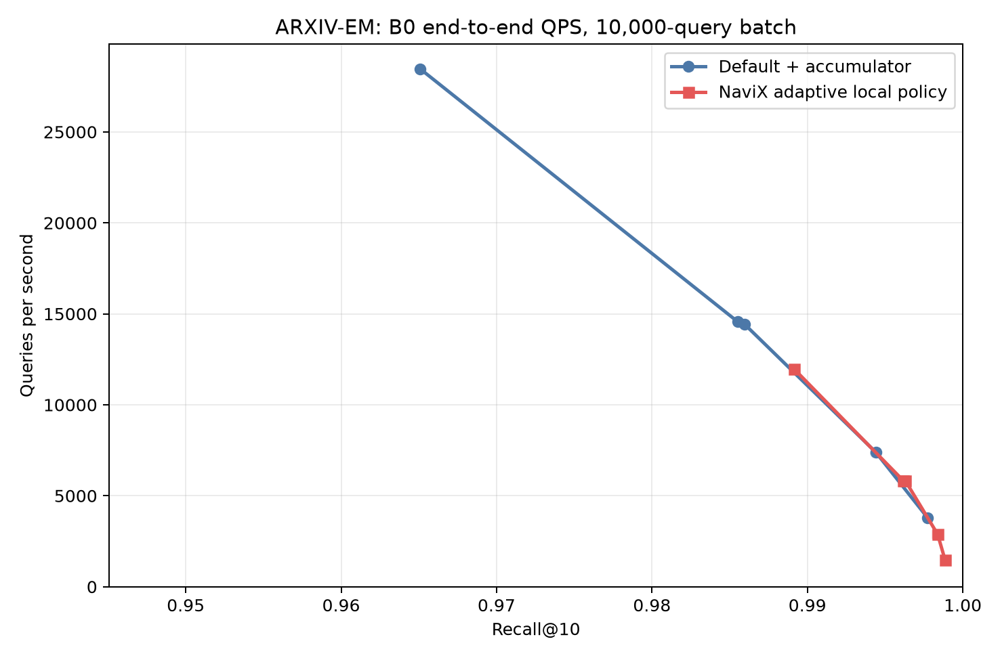
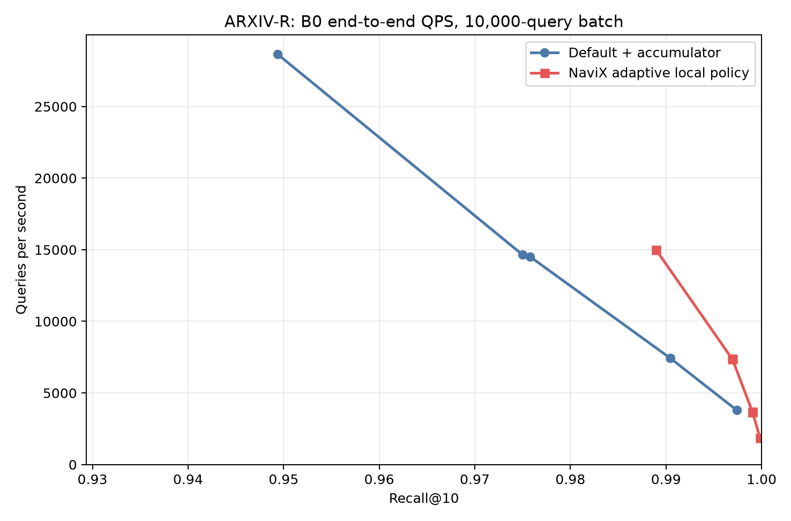

#+TITLE: In-kernel-seeded NaviX SINGLE_CTA filtered CAGRA experiment

* Verdict

The in-kernel design validates passing-only adaptive one-/two-hop traversal for the negative-correlation case, but not as a universal filtered-search replacement. On ARXIV-EMIS at L=64/W=1/B0, adaptive NaviX reaches 0.9428 recall versus 0.5496 for default CAGRA plus a passing-result accumulator. At L=128/W=2/B0, NaviX crosses the 0.95 target with 0.9756 recall at 6,596 QPS; no default point in the B0 sweep reaches 0.95.

The result is workload-dependent. Default plus accumulator already reaches 0.9651 recall at 28,466 QPS on ARXIV-EM, so NaviX's extra adjacency and predicate work is unnecessary there. ARXIV-R is nearly a tie at the 0.95 target: NaviX reaches 0.9890 at 14,988 QPS, while default reaches 0.9750 at 14,651 QPS. The default L=64 point is also just below the target (0.9494) at 28,650 QPS, making that conclusion threshold-sensitive.

YFCC remains seed/connectivity limited. Even after the deeper 522- and 1044-iteration stages, adaptive NaviX reaches only 0.6962; default plus accumulator reaches 0.8325. Once NaviX hands off to a passing-only frontier it cannot use rejected nodes to cross sparse regions, and additional passing-only work does not repair that limitation.

* Implementation

- This is a benchmark-private, non-persistent, degree-32 SINGLE_CTA specialization. It does not add or modify a public CAGRA search parameter.
- Each query starts inside the same kernel with ordinary default-CAGRA raw-distance traversal. There is no external row scan and no extra seed kernel.
- The first candidate batch containing at least one passing node is the handoff point. All passing nodes in that batch are retained; the rejected frontier is cleared; the visited set is reset to the passing seeds; and those seeds remain expandable.
- Seed discovery and NaviX continuation consume one shared resolved max_iterations budget. With max_iterations=0, both phases use the normal CAGRA B0 resolution. If no passing seed appears before termination, the kernel returns the normally post-filtered seed-phase result rather than launching a fallback pass.
- After handoff, only passing nodes enter CAGRA's fused internal top-k and can become persistent parents. Rejected first-hop nodes are transient bridge tasks.
- The kernel reuses the existing W*D candidate tail, adds W*D bridge IDs plus 3*W counters, and keeps each bridge row's D grandchildren in warp registers. It never allocates D*D shared memory.
- A warp-tiled scheduler loads several bridge rows concurrently and commits them in deterministic bridge order. Each parent admits at most D passing candidates.
- Persistent candidates use raw query distance. The NaviX specialization uses neither a FAVOR penalty nor a passing-result accumulator.

* Adaptive policy

In this report, unqualified 'NaviX' in headline comparisons and Pareto plots means the adaptive local policy (=adaptive_kuzu=). One-hop, always-directed, always-blind, and paper-threshold variants are labeled explicitly and serve only as controls.

For each expanded degree-32 parent, P is the number of passing first-hop neighbors. The Kuzu-derived policy selects one hop for P >= 13, blind capped two hop for P <= 4, and directed capped two hop otherwise. The paper thresholds (P >= 16 and P <= 2) are retained only as a sensitivity control.

* Correctness gate

- Filter violations across available runs: 0
- Invalid-sentinel errors across available runs: 0
- Seed discovery and traversal execute in the same timed kernel and are both included in reported end-to-end QPS.
- NaviX uses no FAVOR penalty and no passing-result accumulator.
- Existing CAGRA UDF regression suite: 30 passed, 12 configuration-specific skips.
- Existing CAGRA FAVOR search regression suite: 35 passed, 0 failed.

* Benchmark protocol

- Policy-isolation correctness and scheduler gates use 1,000 queries.
- Every QPS-versus-recall sweep point uses one full 10,000-query batch and one timing repetition. The figures do not copy or extrapolate 1,000-query correctness timings.
- The sweep compares only default CAGRA plus its passing-result accumulator against adaptive NaviX. Both use the same L, W, and max_iterations value at each matched cell.
- YFCC and EMIS begin at max_iterations=0 (B0). A workload continues to 522 and then 1044 only while no NaviX point reaches 0.95. EM and R use B0 only.
- All displayed QPS values use the benchmark's end-to-end search-call timing.

* Policy isolation at L=64, W=1, B0

** ARXIV-EMIS

| Method | Recall@10 | End-to-end QPS | Underfilled-query fraction |
|--------+-----------+----------------+----------------------------|
| default + accumulator | 0.5393 | 25721 | 0.191 |
| one hop | 0.7888 | 29022 | 0.029 |
| directed capped | 0.9502 | 6335 | 0.028 |
| blind capped | 0.9448 | 12528 | 0.028 |
| adaptive (Kuzu) | 0.9396 | 11833 | 0.028 |
| adaptive (paper) | 0.9456 | 9651 | 0.028 |

The one-hop control already rises from 0.5393 to 0.7888, isolating the value of explicit passing seeds and a passing-only frontier. Adaptive two hop supplies the remaining gain to 0.9396, so the correlation result is not explained by seeding alone.
At this cell, however, always-blind capped two hop slightly dominates the adaptive Kuzu-threshold policy in both recall and QPS. The experiment therefore validates the passing-only two-hop mechanism, but does not establish that Kuzu's CPU thresholds are optimal for GPU CAGRA.

** YFCC

| Method | Recall@10 | End-to-end QPS | Underfilled-query fraction |
|--------+-----------+----------------+----------------------------|
| default + accumulator | 0.4511 | 109636 | 0.522 |
| one hop | 0.2197 | 48347 | 0.597 |
| directed capped | 0.5805 | 8852 | 0.364 |
| blind capped | 0.5800 | 9077 | 0.364 |
| adaptive (Kuzu) | 0.5785 | 9111 | 0.364 |
| adaptive (paper) | 0.5795 | 9045 | 0.364 |

Capped two hop improves YFCC over one hop (0.2197 recall), but every two-hop policy retains the same 0.364 underfilled fraction. This identifies seed/reachable-component availability, rather than bridge-row ordering, as the first bottleneck on this workload.

* Scheduler gate

| Policy | Threads | Serial recall | Tiled recall | Serial QPS | Tiled QPS | QPS ratio |
|--------+---------+---------------+--------------+------------+-----------+-----------|
| directed_capped | 64 | 0.9780 | 0.9780 | 3126 | 3143 | 1.006x |
| directed_capped | 128 | 0.9780 | 0.9780 | 3161 | 3180 | 1.006x |
| blind_capped | 64 | 0.9767 | 0.9767 | 6789 | 6877 | 1.013x |
| blind_capped | 128 | 0.9767 | 0.9767 | 6981 | 7085 | 1.015x |

The ratio above is an end-to-end conservative gate; kernel-level occupancy is checked separately with the compiled resource report/profiler.

The tiled and serial schedulers are recall-identical. At 128 threads, tiling changes blind two-hop throughput by +1.5% and preserves the same active-block occupancy tier, so tiled scheduling is retained.

* Compiled resource gate

| Policy | Scheduler | Threads | Dynamic smem (B) | Static smem (B) | Registers/thread | Active blocks/SM |
|--------+-----------+---------+------------------+-----------------+------------------+------------------|
| blind | serial | 64 | 17876 | 0 | 64 | 5 |
| blind | serial | 128 | 17876 | 0 | 64 | 5 |
| blind | tiled | 64 | 17876 | 0 | 64 | 5 |
| blind | tiled | 128 | 17876 | 0 | 64 | 5 |
| directed | serial | 64 | 17876 | 0 | 64 | 5 |
| directed | serial | 128 | 17876 | 0 | 64 | 5 |
| directed | tiled | 64 | 17876 | 0 | 64 | 5 |
| directed | tiled | 128 | 17876 | 0 | 64 | 5 |

The resource table verifies that tiling preserves the active-block occupancy tier. The bridge design therefore avoids the prohibitive D*D shared-memory growth.

* Recall 0.95 target

** ARXIV-EMIS

| Method | Best target result |
|--------+--------------------|
| Default + accumulator | not reached; best 0.7875 @ 3762 QPS (L=512, W=2, max_iterations=0) |
| NaviX (adaptive_kuzu) | 0.9756 @ 6596 QPS (L=128, W=2, max_iterations=0) |

** YFCC

| Method | Best target result |
|--------+--------------------|
| Default + accumulator | not reached; best 0.8325 @ 8068 QPS (L=128, W=2, max_iterations=1044) |
| NaviX (adaptive_kuzu) | not reached; best 0.6962 @ 1387 QPS (L=512, W=2, max_iterations=1044) |

** ARXIV-EM

| Method | Best target result |
|--------+--------------------|
| Default + accumulator | 0.9651 @ 28466 QPS (L=64, W=1, max_iterations=0) |
| NaviX (adaptive_kuzu) | 0.9891 @ 11979 QPS (L=64, W=1, max_iterations=0) |

** ARXIV-R

| Method | Best target result |
|--------+--------------------|
| Default + accumulator | 0.9750 @ 14651 QPS (L=128, W=1, max_iterations=0) |
| NaviX (adaptive_kuzu) | 0.9890 @ 14988 QPS (L=64, W=1, max_iterations=0) |

* QPS versus recall

** YFCC

** ARXIV-EMIS

** ARXIV-EM

** ARXIV-R

* Reproduction

#+begin_src bash
ninja -C cpp/build -j16 cuvs CUVS_CAGRA_ANN_BENCH
NAVIX_RESULT_ROOT=benchmarks/navix_single_cta/results_in_kernel_seed_20260809 \
  benchmarks/navix_single_cta/run_experiment.sh all
# Or rerun only the ARXIV-EM and ARXIV-R B0 parameter sweeps:
NAVIX_RESULT_ROOT=benchmarks/navix_single_cta/results_in_kernel_seed_20260809 \
  benchmarks/navix_single_cta/run_experiment.sh arxiv_b0
python benchmarks/navix_single_cta/analyze.py --result-root benchmarks/navix_single_cta/results_in_kernel_seed_20260809
#+end_src

* Limitations and next decision

- The result is NaviX-style rather than a byte-for-byte port of Kuzu's CPU HNSW implementation: it preserves CAGRA's bounded fused queue and caps each parent's admitted passing candidates at D.
- Two-hop expansion buys recall by issuing substantially more predicate and adjacency work, so it is slower when default CAGRA already reaches the target (notably ARXIV-EM).
- A passing-only frontier cannot repair disconnected or sparse passing regions. YFCC needs a different fallback strategy, not merely more passing-only iterations.
- The strongest next use is a correlation-aware dispatch: retain default+accumulator for easy/sparse-seed-limited queries and invoke adaptive two hop for queries whose local yield shows negative correlation.
