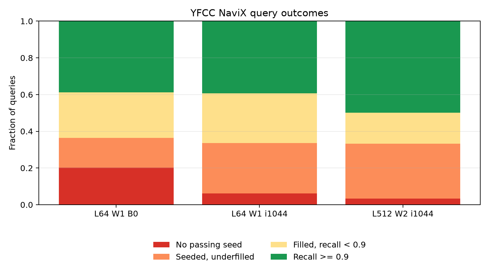
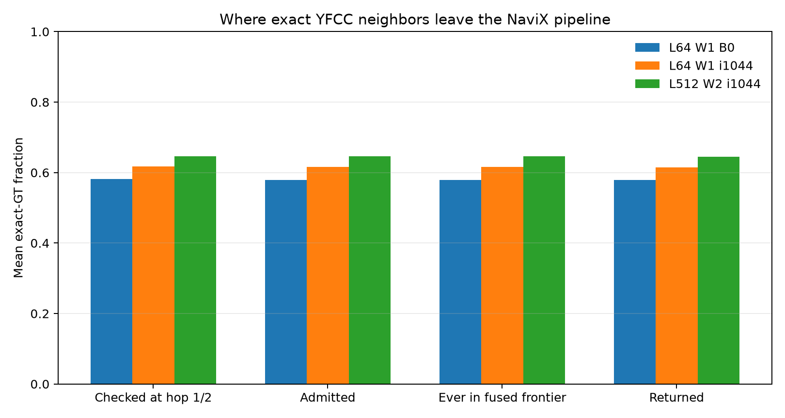
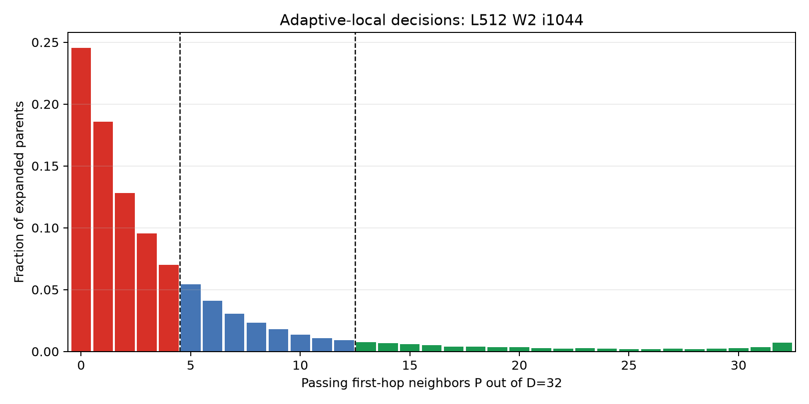
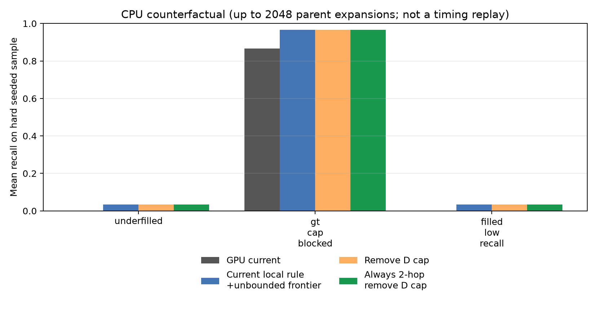

#+TITLE: YFCC NaviX SINGLE_CTA root-cause diagnostic
#+OPTIONS: toc:2 num:nil

* Scope

This report diagnoses the current GPU variant: the benchmark-only adaptive-local NaviX implementation fused into CAGRA SINGLE_CTA. Instrumented captures are deliberately untimed and do not change the public cuVS API or the production/default CAGRA path.

The adaptive thresholds match the released Kuzu degree-32 policy (blind at P<=4, directed at 5<=P<=12, one hop at P>=13), but this is not claimed to be an exact Kuzu traversal: it retains CAGRA's fused bounded frontier, CAGRA seeding and termination, and a D=32 passing-candidate cap per parent.

* Verdict

The dominant YFCC failure is local passing-only reachability on the CAGRA graph, not insufficient max_iterations, fused-frontier retention, the D cap, or the visited hash. After a seed is found, many query predicates lead to a tiny passing component whose one-/two-hop closure contains neither ten results nor the exact neighbors.

- The widest deep run ends 96.4% of queries by frontier exhaustion, while only 3.4% remain in seed discovery. It still underfills 33.3% of queries, including 29.9% that did find a seed.
- NaviX checks only 0.6462 of exact GT. Once checked, retention is nearly lossless: 0.6460 is admitted, 0.6460 ever reaches the fused frontier, and 0.6447 is returned. Thus 35.4% of GT is never locally exposed at all.
- The current rule is already in its maximal blind-two-hop region for 72.5% of parents, and P=0 alone accounts for 24.5%. Changing the adaptive thresholds therefore has little room to repair the sparse cases.
- Hash-full occurs for 0.0% of queries. The checked-to-admitted GT loss is only 0.0002, so the per-parent D cap is visible but not the aggregate bottleneck. Only 6 of 1000 queries are simultaneously seeded, below 0.9 recall, and observed with an exact-GT candidate beyond that cap.
- Increasing from L64/W1 B0 to L512/W2/i1044 reduces seedless queries from 20.3% to 3.4%, but recall moves only from 0.5784 to 0.6447 and underfill only from 36.4% to 33.3%.

* GPU results

| configuration | recall | no seed | underfilled | seeded underfilled | frontier exhausted | hard cap | first-hop yield | second-hop yield | cap-blocked queries | hash-full queries |
|-
| L64 W1 B0 | 0.5784 | 0.203 | 0.364 | 0.161 | 0.339 | 0.661 | 0.13709 | 0.06462 | 0.330 | 0.000 |
| L64 W1 i1044 | 0.6149 | 0.061 | 0.335 | 0.274 | 0.939 | 0.061 | 0.13239 | 0.06101 | 0.331 | 0.000 |
| L512 W2 i1044 | 0.6447 | 0.034 | 0.333 | 0.299 | 0.964 | 0.036 | 0.12567 | 0.05928 | 0.358 | 0.000 |

#+CAPTION: Query-level failure decomposition.

#+CAPTION: Cumulative exact-ground-truth visibility through the traversal pipeline.

#+CAPTION: Local-yield distribution and adaptive policy regions for the widest deep run.

* Counterfactual oracle

The CPU oracle starts each query from the exact passing seed batch saved by the GPU. It uses an unbounded raw-distance best-first passing frontier. The first variant keeps the current adaptive local policy and D cap; the second removes only the D cap; the third also forces every parent to use two hops. These are favorable attribution controls, not QPS measurements and not a bit-exact replay of CAGRA's merge order. Each variant is allowed up to 2048 parent expansions.

| sample group | variant | recall | GT seen | mean expanded |
|-
| underfilled | adaptive_cap_unbounded_frontier | 0.0333 | 0.0333 | 2.5 |
| underfilled | adaptive_uncapped_unbounded_frontier | 0.0333 | 0.0333 | 2.5 |
| underfilled | always_two_hop_uncapped_unbounded_frontier | 0.0333 | 0.0333 | 2.5 |
| gt_cap_blocked | adaptive_cap_unbounded_frontier | 0.9667 | 0.9667 | 2048.0 |
| gt_cap_blocked | adaptive_uncapped_unbounded_frontier | 0.9667 | 0.9667 | 2048.0 |
| gt_cap_blocked | always_two_hop_uncapped_unbounded_frontier | 0.9667 | 0.9667 | 2048.0 |
| filled_low_recall | adaptive_cap_unbounded_frontier | 0.0333 | 0.0333 | 1172.0 |
| filled_low_recall | adaptive_uncapped_unbounded_frontier | 0.0333 | 0.0333 | 1172.0 |
| filled_low_recall | always_two_hop_uncapped_unbounded_frontier | 0.0333 | 0.0333 | 1172.0 |

#+CAPTION: Counterfactual recall on stratified hard seeded queries from the widest deep run.

* Interpretation

The controls support the GPU-stage attribution:

- Queries ending in seed discovery isolate a seed-availability failure; no NaviX policy ran for them.
- A max-cap stop with an unexpanded passing frontier is a budget failure. Frontier exhaustion after seeding is instead a passing-connectivity/local-expansion failure.
- GT checked at hop 1/2 but not admitted attributes loss to the per-parent cap, visited suppression, or hash saturation; the explicit cap/hash masks disambiguate them.
- GT admitted but never retained attributes loss to the fused L-sized CAGRA frontier. GT retained but not returned attributes final bounded selection/order.
- If the unbounded-frontier oracle recovers recall while retaining the current local rule, queue retention is implicated. Gains only after removing D implicate the per-parent cap. Gains only after forced two-hop implicate the adaptive threshold.
- In the observed underfilled group, all three controls exhaust after only a few passing parents and are identical. In the filled-but-wrong group, even the always-two-hop uncapped control exposes almost no GT within the expanded budget. The targeted cap-blocked group can benefit from a larger frontier/deeper work, but those queries are rare and already high recall; that is not the aggregate YFCC gap.

The design implication is that increasing L, max_iterations, or the D cap cannot by itself solve YFCC. A robust method must cross more than one rejected bridge hop, obtain predicate-aware seeds, or invoke a fallback that can inspect nodes outside the local passing component. Under an opaque scalar UDF, that fallback has inherently less predictable work than a predicate index.

* Validation

- All 3000 query summaries passed schema, phase, policy-histogram, candidate-accounting, GT-mask, and output recall invariants.
- All 13214 captured passing seed slots were reevaluated against the CPU order-independent YFCC contains-all predicate, as were all 21121 valid output slots; there were zero violations or duplicate output IDs.
- Each diagnostic capture's aggregate recall and underfilled fraction agrees with its ordinary non-instrumented benchmark invocation within 0.0002.
- The dedicated instrumentation is untimed; its QPS is intentionally invalid. Only the ordinary benchmark row is used for the equivalence check.

* Reproduction

#+begin_src sh
ninja -C cpp/build -j8 cuvs CUVS_CAGRA_ANN_BENCH
NAVIX_RESULT_ROOT=benchmarks/navix_single_cta/results_yfcc_diagnosis_$(date +%Y%m%d_%H%M%S) \
  benchmarks/navix_single_cta/run_experiment.sh diagnosis
python benchmarks/navix_single_cta/diagnose_yfcc.py \
  --result-root <result-root> --data-root datasets --oracle-sample 18 \
  --oracle-max-expanded 2048
#+end_src
